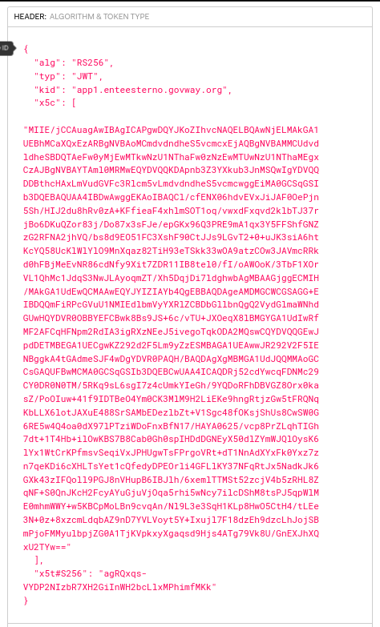

.. _scenari_erogazione_rest_modipa_auth_esecuzione:

Esecuzione
----------

.. note::

  Al fine di avere una consultazione immediata delle informazioni di interesse per lo scenario si consiglia di impostare, nella console 'govwayMonitor', nel menù in alto a destra il Profilo di Interoperabilità 'ModI'. Si suggerisce inoltre di selezionare il soggetto 'Ente' per visualizzare solamente le transazioni di interesse allo scenario e ignorare le transazioni "di servizio" necessarie ad implementare la controparte.

  .. figure:: ../../../_figure_scenari/modipa_profilo_monitor.png
   :scale: 80%
   :align: center
   :name: modipa_profilo_monitor_fig

   Profilo ModI della govwayMonitor

L'esecuzione dello scenario si basa sui seguenti elementi:

- una API REST di esempio (PetStore) definita con pattern di interazione 'CRUD' e pattern di sicurezza "ID_AUTH_CHANNEL_02" e "ID_AUTH_REST_01";
- un'istanza Govway per la gestione del profilo ModI nel dominio dell'erogatore;
- un client del dominio esterno che invoca la risorsa "POST /pet" dell'erogazione esposta da Govway;
- il server PetStore di esempio che riceve le richieste inoltrate dal Govway e produce le relative risposte. Per questo scenario viene utilizzato il server disponibile on line all'indirizzo 'https://petstore.swagger.io/'.

Per eseguire e verificare lo scenario si può utilizzare il progetto Postman a corredo con la request "Profilo ModI REST - IDAuth - IN App1" che è stata preconfigurata per il funzionamento con le caratteristiche descritte sopra.

 Pattern IDAuth - Erogazione API REST, esecuzione da Postman

Dopo aver eseguito la "Send" e verificato il corretto esito dell'operazione è possibile andare a verificare cosa è accaduto, nel corso dell'elaborazione della richiesta, andando a consultare la console 'govwayMonitor'.

1. Lo scambio del messaggio con il dominio fruitore (comunicazione interdominio) avviene in accordo al pattern "ID_AUTH_CHANNEL_02" e quindi con protocollo SSL e autenticazione client. Dal dettaglio della transazione si possono consultare i messaggi diagnostici dove è visibile la fase di autenticazione del client con i dati di validazione del certificato ricevuto (:numref:`modipa_ssl_auth_fig`).

.. figure:: ../../../_figure_scenari/modipa_ssl_auth.png
 :scale: 80%
 :align: center
 :name: modipa_ssl_auth_fig

 Sicurezza canale "ID_AUTH_CHANNEL_02"

2. Dal dettaglio della richiesta si può visualizzare il messaggio che è stato inviato dal fruitore, come in :numref:`modipa_erogazione_messaggio_richiesta_fig`. Come si nota, al payload JSON è associato un insieme di header HTTP tra i quali "Authorization", che contiene il token di sicurezza.

 Messaggio inviato dal fruitore

3. Grazie alle configurazioni presenti nell'erogazione, ed in particolare alla relazione di trust stabilita con il fruitore, Govway è in grado di validare i dati di sicurezza ricevuti andando a decodificare il token. Nella fase di validazione del token si può notare come la sezione header (:numref:`modipa_jwtio_header_fig`) riporti l'identità del fruitore e il suo certificato X.509, mentre la sezione payload (:numref:`modipa_jwtio_payload_fig`) contenga i riferimenti temporali (iat, nbf, exp) e l'audience (aud).

 Sezione "Header" del Token di sicurezza

.. figure:: ../../../_figure_scenari/modipa_jwtio_payload.png
 :scale: 80%
 :align: center
 :name: modipa_jwtio_payload_fig

 Sezione "Payload" del Token di sicurezza

4. Il messaggio ricevuto dal Govway viene quindi validato, sulla base dei pattern di sicurezza previsti nello scambio, verificando in questo caso l'identità del fruitore, la validità temporale, la corrispondenza dell'audience ricevuto con quello atteso. Solo in caso di superamento dell'intero processo di validazione, il messaggio viene inoltrato al servizio erogatore.
Le evidenze del processo di validazione sono visibili sulla govwayMonitor, andando a consultare la traccia del messaggio di richiesta (:numref:`modipa_traccia_richiesta_fig`). Nella sezione "Sicurezza Messaggio" sono riportate le informazioni estratte dal token di sicurezza presente nel messaggio.

 Traccia della richiesta elaborata dall'erogatore

5. Dopo l'inoltro al servizio erogatore, Govway riceve la risposta e la elabora producendo il relativo token di sicurezza utilizzando le impostazioni di firma fornite nell'ambito dell'erogazione relativamente all'elaborazione della risposta. Sulla console govwayMonitor è possibile visualizzare il messaggio di risposta in uscita, dove si rileva la presenza del token prodotto nell'header HTTP "Authorization" (analogamente a :numref:`modipa_erogazione_messaggio_richiesta_fig`).

6. Lo scenario è preconfigurato per autorizzare puntualmente l'applicativo 'App1-ModI' identificato grazie al certificato X.509 presente all'interno del token. È possibile utilizzare il progetto Postman a corredo con la request "Profilo ModI REST - IDAuth - IN App2 - Error" per verificare che una richiesta proveniente da un differente applicativo non viene autorizzata.

 Pattern IDAuth - Erogazione API REST - Autorizzazione negata, esecuzione da Postman

**Conformità ai requisiti ModI**

I requisiti iniziali, legati alla comunicazione basata su uno scenario ModI, sono verificati dalle seguenti evidenze:

1. la trasmissione è basata sul pattern "ID_AUTH_CHANNEL_02", riguardo la sicurezza canale, come evidenziato nei messaggi diagnostici dalla presenza degli elementi dell'handshake SSL e relativi dati dei certificati scambiati (:numref:`modipa_ssl_auth_fig`);

2. la sicurezza messaggio applicata è quella dei pattern "ID_AUTH_REST_01" come ampiamente mostrato nelle tracce dei messaggi di richiesta e risposta, dove sono presenti i certificati degli applicativi e le firme dei payload (e le relative validazioni);

3. l'identificazione del fruitore avviene rispetto al certificato X.509 presente all'interno del token. È stato anche mostrato come sia possibile configurare criteri autorizzativi puntuali.
