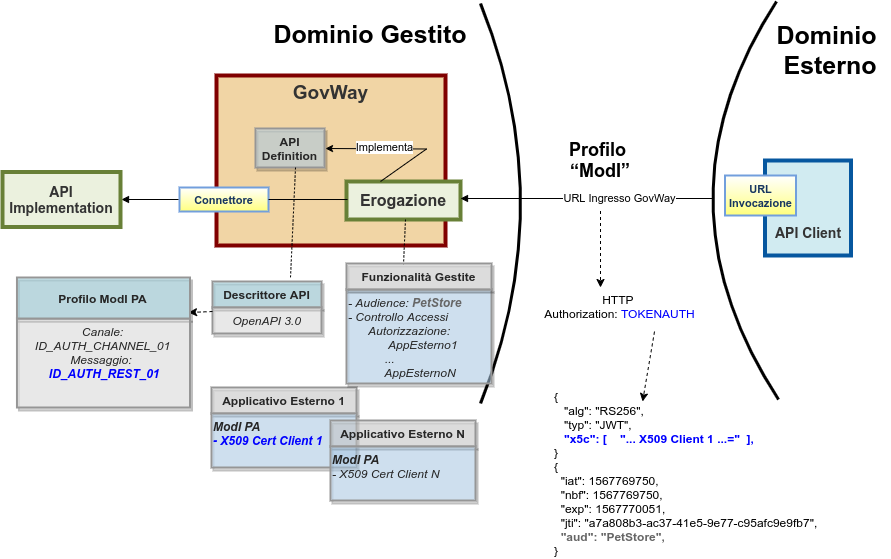

.. _scenari_erogazione_rest_modipa_auth:

Erogazione API REST
=======================

**Obiettivo** 

Esporre un servizio, definito tramite una API REST (OpenAPI 3.0), accessibile in accordo al pattern di sicurezza 'ID_AUTH_REST_01' descritto nella sezione :ref:`modipa_idar01`.

**Sintesi**

Mostriamo in questa sezione come procedere per l'esposizione di un servizio REST da erogare nel rispetto della normativa italiana alla base dell'interoperabilità tra i sistemi della pubblica amministrazione. In particolare andiamo ad illustrare lo scenario, tra quelli prospettati nel Modello di Interoperabilità di AGID, che prevede il trust del certificato X.509 in modo da assicurare sia a livello di canale che a livello di messaggio l'autenticazione e autorizzazione del fruitore.

La figura seguente descrive graficamente questo scenario.

 Erogazione di una API REST con profilo 'ModI', pattern ID_AUTH_REST_01

Le caratteristiche principali di questo scenario sono:

1. un applicativo eroga un servizio, rivolto a fruitori di domini esterni, in conformità al Modello di Interoperabilità AGID;
2. la comunicazione con i domini esterni avviene su un canale gestito con il pattern di sicurezza canale "ID_AUTH_CHANNEL_02";
3. l'autenticità della comunicazione tra il servizio erogato e ciascun fruitore è garantita tramite sicurezza a livello messaggio con pattern "ID_AUTH_REST_01".

.. toctree::
    :maxdepth: 2

    esecuzione
    configurazione
