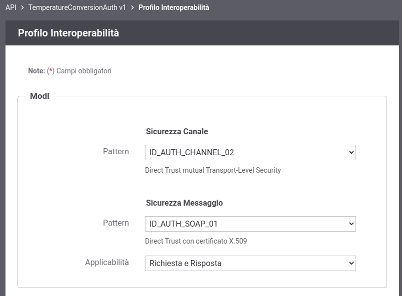

.. _scenari_erogazione_soap_modipa_auth_configurazione:

Configurazione
--------------

.. note::

  Per operare con la govwayConsole in modo conforme a quanto previsto dalla specifica del Modello di Interoperabilità si deve attivare, nella testata dell'interfaccia, il Profilo di Interoperabilità 'ModI'. Si suggerisce inoltre di selezionare il soggetto 'Ente' per visualizzare solamente le configurazioni di interesse allo scenario e nascondere le configurazioni "di servizio" necessarie ad implementare la controparte.

  .. figure:: ../../../_figure_scenari/modipa_profilo.png
   :scale: 80%
   :align: center
   :name: modipa_profilo_soap_fig

   Profilo ModI della govwayConsole

Il processo di configurazione per questo scenario è del tutto analogo a quello descritto per lo scenario :ref:`scenari_erogazione_rest_modipa_auth_configurazione`. Nel seguito sono evidenziate le sole differenze. 

L'interfaccia wsdl del servizio soap è ottenibile all'indirizzo 'https://www.w3schools.com/xml/tempconvert.asmx?wsdl'.

**Registrazione API**

Viene registrata l'API "TemperatureConversionAuth" con il relativo descrittore WSDL. Vengono selezionati i pattern "ID_AUTH_CHANNEL_02" (sicurezza canale) e "ID_AUTH_SOAP_01" (sicurezza messaggio) nella sezione "ModI" (:numref:`modipa_profili_api_soap_fig`).

 Configurazione Pattern ModI "ID_AUTH_SOAP_01" sulla API SOAP

**Erogazione**

Si registra l'erogazione SOAP 'TempConvertSoapAuth', relativa all'API precedentemente inserita, indicando i dati specifici nella sezione "ModI Richiesta" (:numref:`modipa_erogazione_richiesta_soap_fig`). In questo contesto vengono inseriti i dati necessari per validare le richieste in ingresso.

   .. figure:: ../../../_figure_scenari/modipa_erogazione_richiesta_soap.png
    :scale: 80%
    :align: center
    :name: modipa_erogazione_richiesta_soap_fig

    Configurazione richiesta dell'erogazione

La sezione "ModI Risposta" si utilizza per indicare i parametri per la produzione del token di sicurezza da inserire nel messaggio di risposta (:numref:`modipa_erogazione_risposta_soap_fig`).

   .. figure:: ../../../_figure_scenari/modipa_erogazione_risposta_soap.png
    :scale: 80%
    :align: center
    :name: modipa_erogazione_risposta_soap_fig

    Configurazione risposta dell'erogazione
