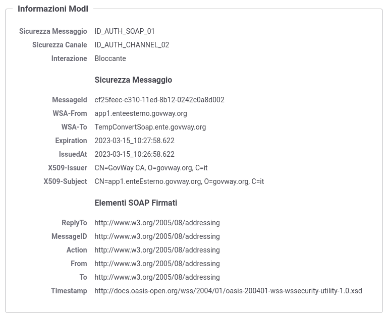
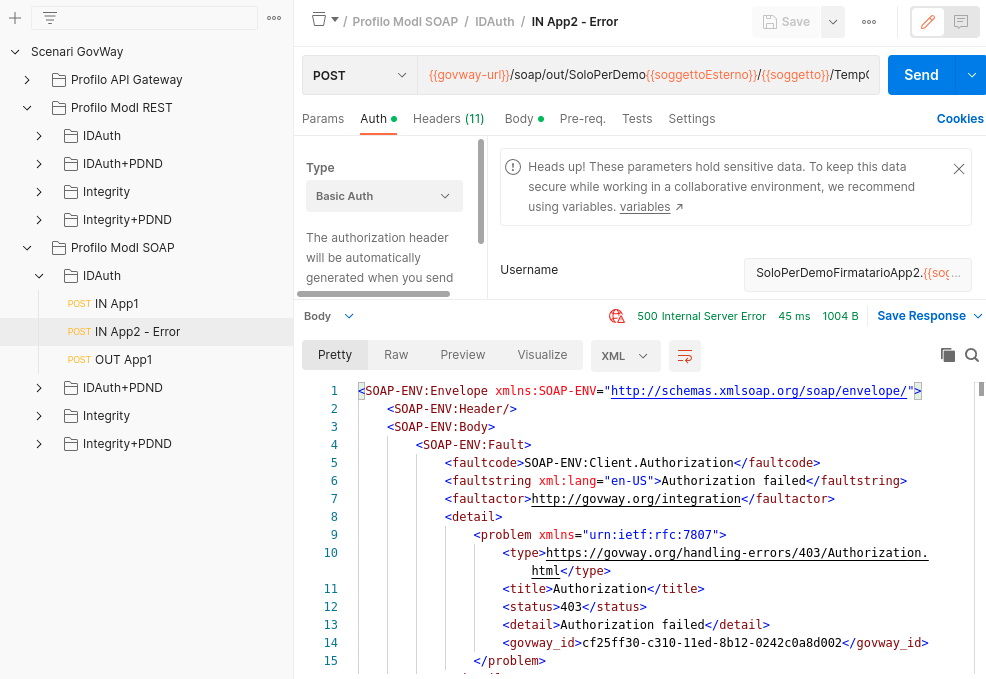

.. _scenari_erogazione_soap_modipa_auth_esecuzione:

Esecuzione
----------

.. note::

  Al fine di avere una consultazione immediata delle informazioni di interesse per lo scenario si consiglia di impostare, nella console 'govwayMonitor', nel menù in alto a destra il Profilo di Interoperabilità 'ModI'. Si suggerisce inoltre di selezionare il soggetto 'Ente' per visualizzare solamente le transazioni di interesse allo scenario e ignorare le transazioni "di servizio" necessarie ad implementare la controparte.

  .. figure:: ../../../_figure_scenari/modipa_profilo_monitor.png
   :scale: 80%
   :align: center
   :name: modipa_profilo_monitor_soap_fig

   Profilo ModI della govwayMonitor

L'esecuzione dello scenario si basa sui seguenti elementi:

- una API SOAP di esempio (Credit Card Verification) definita con pattern di interazione Bloccante e pattern di sicurezza "ID_AUTH_CHANNEL_02" e "ID_AUTH_SOAP_01"";
- un'istanza Govway per la gestione del profilo ModI nel dominio dell'erogatore;
- un client del dominio esterno che invoca l'azione di esempio "CheckCC" dell'erogazione esposta da Govway;
- il server 'Credit Card Verification' di esempio che riceve le richieste inoltrate dal Govway e produce le relative risposte. Per questo scenario viene utilizzato il server disponibile on line all'indirizzo 'https://ws.cdyne.com/creditcardverify/luhnchecker.asmx'.

Per eseguire e verificare lo scenario si può utilizzare il progetto Postman a corredo con la request "Profilo ModI SOAP - IDAuth - IN App1" che è stata preconfigurata per il funzionamento con le caratteristiche descritte sopra.

 Pattern IDAuth - Erogazione API SOAP, esecuzione da Postman

Dopo aver eseguito la "Send" e verificato il corretto esito dell'operazione è possibile andare a verificare cosa è accaduto, nel corso dell'elaborazione della richiesta, andando a consultare la console govwayMonitor.

1. Per verificare l'utilizzo del canale SSL, in accordo al pattern "ID_AUTH_CHANNEL_02", si procede come già illustrato per :ref:`scenari_erogazione_rest_modipa_auth_esecuzione`

2. Dal dettaglio della richiesta si può visualizzare il messaggio che è stato inviato dal fruitore, come in :numref:`modipa_erogazione_messaggio_richiesta_soap_fig`. Come si nota, il messaggio SOAP contiene nell'header WS-Security sia il token di sicurezza (elemento "BinarySecurityToken") sia l'elemento "WSAddressing - To" prodotti dal fruitore con la relativa firma digitale (elemento "SignatureValue").

.. figure:: ../../../_figure_scenari/modipa_erogazione_messaggio_richiesta_soap.png
 :scale: 80%
 :align: center
 :name: modipa_erogazione_messaggio_richiesta_soap_fig

 Messaggio inviato dal fruitore

3. Il messaggio ricevuto dal Govway viene quindi validato, sulla base dei pattern di sicurezza previsti nello scambio, verificando in questo caso l'identità del fruitore, la validità temporale, la corrispondenza dell'audience ricevuto con quello atteso. Solo in caso di superamento dell'intero processo di validazione, il messaggio viene inoltrato al servizio erogatore.
Le evidenze del processo di validazione sono visibili sulla govwayMonitor, andando a consultare la traccia del messaggio di richiesta (:numref:`modipa_traccia_richiesta_soap_fig`). Nella sezione "Sicurezza Messaggio" sono riportate le informazioni estratte dal token di sicurezza presente nell'header soap.

 Traccia della richiesta elaborata dall'erogatore

4. Dopo l'inoltro al servizio erogatore, Govway riceve la risposta e la elabora producendo il relativo header ws-security da inserire nel messaggio di risposta. Sulla console govwayMonitor è possibile visualizzare il messaggio di risposta in uscita (analogamente a :numref:`modipa_erogazione_messaggio_richiesta_soap_fig`).

5. Lo scenario è preconfigurato per autorizzare puntualmente l'applicativo 'App1-ModI' identificato grazie al certificato X.509 presente all'interno dell'header WSSecurity. È possibile utilizzare il progetto Postman a corredo con la request "Profilo ModI SOAP - IDAuth - IN App2 - Error" per verificare che una richiesta proveniente da un differente applicativo non viene autorizzata.

 Pattern IDAuth - Erogazione API SOAP - Autorizzazione negata, esecuzione da Postman

**Conformità ai requisiti ModI**

La verifica dei requisiti ModI per questo scenario non differisce da quanto già descritto in :ref:`scenari_erogazione_rest_modipa_auth_esecuzione`.
