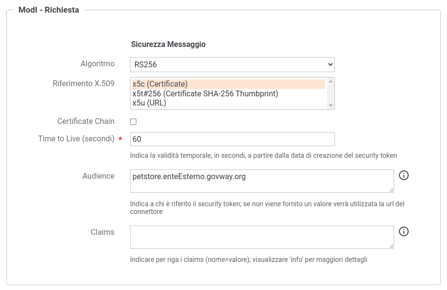

.. _scenari_fruizione_rest_modipa_auth_configurazione:

Configurazione
--------------

.. note::

  Per operare con la govwayConsole in modo conforme a quanto previsto dalla specifica del Modello di Interoperabilità si deve attivare, nella testata dell'interfaccia, il Profilo di Interoperabilità "ModI". Si suggerisce inoltre di selezionare il soggetto 'Ente' per visualizzare solamente le configurazioni di interesse allo scenario e nascondere le configurazioni "di servizio" necessarie ad implementare la controparte.

  .. figure:: ../../../_figure_scenari/modipa_profilo.png
   :scale: 80%
   :align: center
   :name: modipa_profilo_f_fig

   Profilo ModI della govwayConsole

**Registrazione API**

Viene registrata l'API "PetStoreAuth" con il relativo descrittore OpenAPI 3. Vengono selezionati i pattern "ID_AUTH_CHANNEL_02" (sicurezza canale) e "ID_AUTH_REST_01" (sicurezza messaggio) nella sezione "ModI" (:numref:`modipa_profili_api_fr_fig`).

.. figure:: ../../../_figure_scenari/modipa_profili_api.png
 :scale: 80%
 :align: center
 :name: modipa_profili_api_fr_fig

 Configurazione Pattern ModI "ID_AUTH_REST_01" sulla API

**Applicativo**

Si configura l'applicativo mittente indicando, nella sezione ModI, i parametri del keystore necessari affinché Govway possa produrre il token di sicurezza firmando per conto dell'applicativo (:numref:`modipa_applicativo_fruitore_fig`).
Alla registrazione dell'applicativo vengono associate credenziali 'basic' che consentono a GovWay di identificarlo.

 Configurazione applicativo fruitore

**Fruizione**

Si registra la fruizione "PetStoreAuth", relativa all'API precedentemente inserita, indicando i dati specifici nella sezione "ModI Richiesta" (:numref:`modipa_fruizione_richiesta_fig`). In particolare è possibile specificare l'audience atteso dall'erogatore e il tempo di validità del token.

 Configurazione richiesta della fruizione

La sezione "ModI Risposta" definisce i criteri per la validazione dei messaggi di risposta, come la posizione del token di sicurezza e il truststore per l'autenticazione dell'erogatore (:numref:`modipa_fruizione_risposta_fig`).

 Configurazione risposta della fruizione

