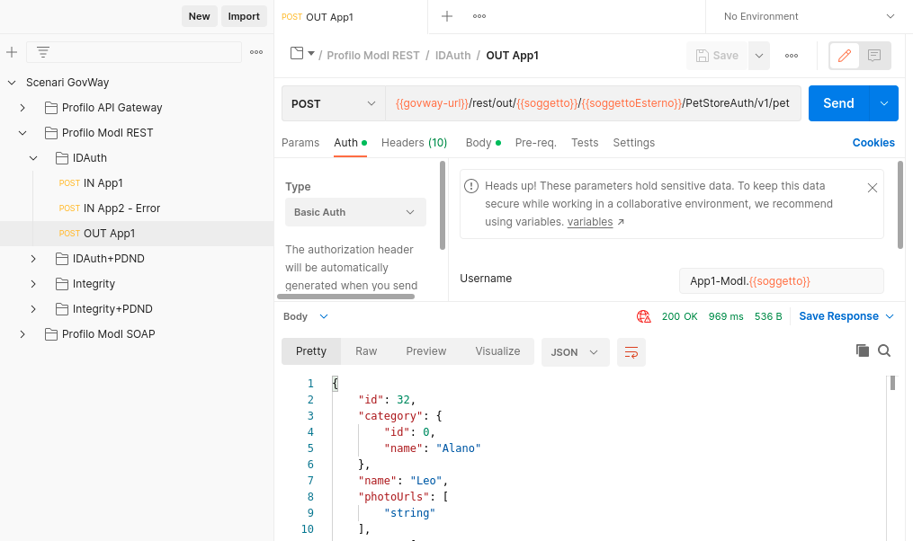
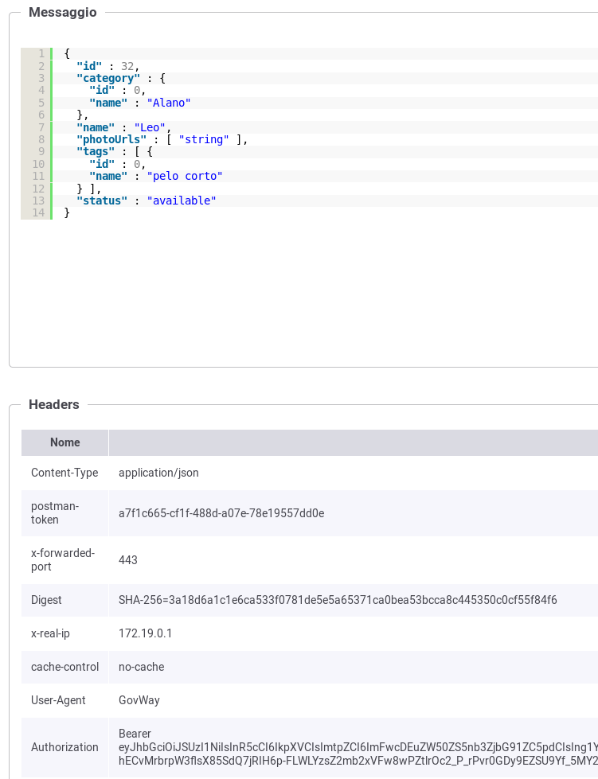
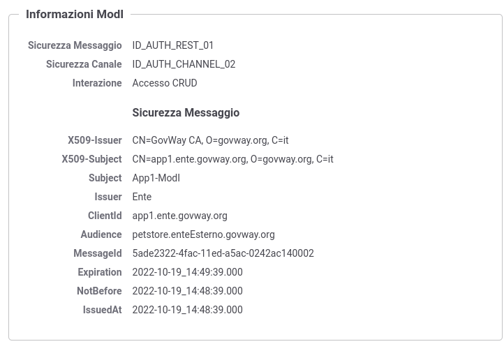
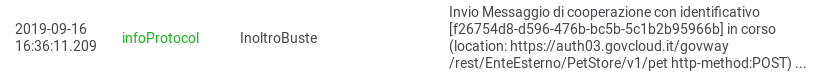

.. _scenari_fruizione_rest_modipa_auth_esecuzione:

Esecuzione
----------

.. note::

  Al fine di avere una consultazione immediata delle informazioni di interesse per lo scenario si consiglia di impostare, nella console 'govwayMonitor', nel menù in alto a destra il Profilo di Interoperabilità 'ModI'. Si suggerisce inoltre di selezionare il soggetto 'Ente' per visualizzare solamente le transazioni di interesse allo scenario e ignorare le transazioni "di servizio" necessarie ad implementare la controparte.

  .. figure:: ../../../_figure_scenari/modipa_profilo_monitor.png
   :scale: 80%
   :align: center
   :name: modipa_profilo_monitor_f_fig

   Profilo ModI della govwayMonitor

L'esecuzione dello scenario si basa sui seguenti elementi:

- una API REST di esempio (PetStore) definita con pattern di interazione 'CRUD' e pattern di sicurezza "ID_AUTH_CHANNEL_02" e "ID_AUTH_REST_01";
- un'istanza Govway per la gestione del profilo ModI nel dominio del fruitore;
- un client che invoca la risorsa "POST /pet" con un messaggio di esempio diretto alla fruzione configurata su Govway.

Per eseguire e verificare lo scenario si può utilizzare il progetto Postman a corredo con la request "Profilo ModI REST - IDAuth - OUT App1" che è stata preconfigurata per il funzionamento con le caratteristiche descritte sopra.

 Pattern IDAuth - Fruizione API REST, esecuzione da Postman

Dopo aver eseguito la "Send" e verificato il corretto esito dell'operazione è possibile andare a verificare cosa è accaduto nelle diverse fasi dell'esecuzione andando a consultare la console 'govwayMonitor'.

1. Il messaggio di richiesta inviato dal fruitore viene elaborato da Govway che, tramite la configurazione della firma digitale associata all'applicativo mittente, è in grado di produrre il token di sicurezza da inviare con la richiesta all'erogatore. Da govwayMonitor si può visualizzare il messaggio di richiesta in uscita che è il medesimo di quello in entrata con la differenza che è stato aggiunto il token di sicurezza tra gli header HTTP (:numref:`modipa_fruizione_messaggio_richiesta_fig`).

 Messaggio di richiesta in uscita (con token di sicurezza inserito nell'header HTTP)

2. L'header e il payload del token sono identici a quelli visualizzati nello scenario di erogazione REST, relativamente al messaggio in ingresso (:numref:`modipa_jwtio_header_fig` e :numref:`modipa_jwtio_payload_fig`).
   Le informazioni inserite nel token vengono anche tracciate e sono visibili sulla govwayMonitor, andando a consultare la traccia del messaggio di richiesta (:numref:`modipa_traccia_richiesta_fruitore_fig`). Nella sezione "Sicurezza Messaggio" sono riportate le informazioni estratte dal token di sicurezza presente nel messaggio.

 Traccia della richiesta generata dal fruitore

3. Lo scambio del messaggio con il dominio erogatore (comunicazione interdominio) avviene in accordo al pattern "ID_AUTH_CHANNEL_02" e quindi con protocollo SSL e autenticazione client. Dal dettaglio della transazione si possono consultare i messaggi diagnostici dove è visibile la fase di apertura della connessione SSL (:numref:`modipa_ssl_auth_fruitore_fig`).

 Sicurezza canale "ID_AUTH_CHANNEL_02" sulla fruizione

4. Govway riceve la risposta dell'erogatore, dalla quale estrae il token di sicurezza al fine di effettuare i relativi controlli di validità e conservare la traccia. Consultando la traccia relativa alla trasmissione della risposta, sono visibili tra le altre informazioni i dati di autenticazione dell'erogatore e i riferimenti temporali.

**Conformità ai requisiti ModI**

I requisiti iniziali, legati alla comunicazione basata su uno scenario ModI, sono verificati dalle seguenti evidenze:

1. la trasmissione è basata sul pattern "ID_AUTH_CHANNEL_02", riguardo la sicurezza canale, come evidenziato nei messaggi diangostici dalla presenza degli elementi dell'handshake SSL e relativi dati dei certificati scambiati (:numref:`modipa_ssl_auth_fruitore_fig`);

2. la sicurezza messaggio applicata è quella dei pattern "ID_AUTH_REST_01", come ampiamente mostrato nelle tracce dei messaggi di richiesta e risposta, dove sono presenti i certificati degli applicativi e le firme dei payload (e le relative validazioni).
