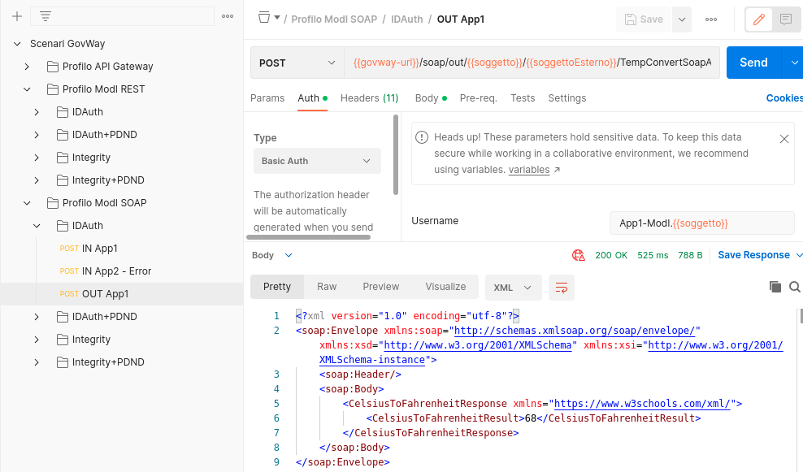

.. _scenari_fruizione_soap_modipa_auth_esecuzione:

Esecuzione
----------

.. note::

  Al fine di avere una consultazione immediata delle informazioni di interesse per lo scenario si consiglia di impostare, nella console 'govwayMonitor', nel menù in alto a destra il Profilo di Interoperabilità 'ModI'. Si suggerisce inoltre di selezionare il soggetto 'Ente' per visualizzare solamente le transazioni di interesse allo scenario e ignorare le transazioni "di servizio" necessarie ad implementare la controparte.

  .. figure:: ../../../_figure_scenari/modipa_profilo_monitor.png
   :scale: 80%
   :align: center
   :name: modipa_profilo_monitor_f_soap_fig

   Profilo ModI della govwayMonitor

L'esecuzione dello scenario si basa sui seguenti elementi:

- una API SOAP di esempio (Credit Card Verification) definita con pattern di interazione Bloccante e pattern di sicurezza "ID_AUTH_CHANNEL_02" e "ID_AUTH_SOAP_01";
- un'istanza Govway per la gestione del profilo ModI nel dominio del fruitore;
- un client del dominio gestito che invoca l'azione di esempio "CheckCC" sulla fruzione configurata su Govway.

Per eseguire e verificare lo scenario si può utilizzare il progetto Postman a corredo con la request "Profilo ModI SOAP - IDAuth - OUT App1" che è stata preconfigurata per il funzionamento con le caratteristiche descritte sopra.

 Pattern IDAuth - Fruizione API SOAP, esecuzione da Postman

Dopo aver eseguito la "Send" e verificato il corretto esito dell'operazione è possibile andare a verificare cosa è accaduto, nel corso dell'elaborazione della richiesta, andando a consultare la console 'govwayMonitor'.

1. Il messaggio di richiesta inviato dal fruitore viene elaborato da Govway che, tramite la configurazione della firma digitale associata all'applicativo mittente, è in grado di produrre l'header WS-Security da inserire nella richiesta inviata all'erogatore. Da govwayMonitor si può visualizzare il messaggio di richiesta in uscita, analogo a quanto già visto in :numref:`modipa_erogazione_messaggio_richiesta_soap_fig`.

2. Per verificare l'utilizzo del canale SSL, in accordo al pattern "ID_AUTH_CHANNEL_02", si procede come già illustrato per :ref:`scenari_fruizione_rest_modipa_auth_esecuzione`.

3. Govway riceve la risposta dell'erogatore, dalla quale estrae il token di sicurezza al fine di effettuare i relativi controlli di validità e conservare la traccia. Consultando la traccia relativa alla trasmissione della risposta, sono visibili tra le altre informazioni i dati di autenticazione dell'erogatore e i riferimenti temporali.

**Conformità ai requisiti ModI**

La verifica dei requisiti ModI per questo scenario non differisce da quanto già descritto in :ref:`scenari_fruizione_rest_modipa_auth_esecuzione`.
