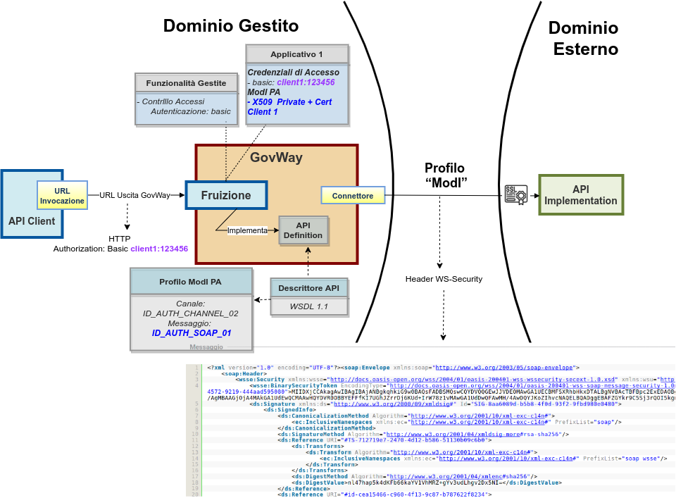

.. _scenari_fruizione_soap_modipa_auth:

Fruizione API SOAP
======================

**Obiettivo** 

Fruire di un servizio SOAP, definito tramite una interfaccia WSDL, accessibile in accordo al pattern di sicurezza 'ID_AUTH_SOAP_01' descritto nella sezione :ref:`modipa_idar01`.

**Sintesi**

Mostriamo in questa sezione come procedere per l'integrazione di un applicativo con un servizio SOAP erogato nel rispetto della normativa italiana alla base dell'interoperabilità tra i sistemi della pubblica amministrazione. In particolare andiamo ad illustrare lo scenario, tra quelli prospettati nel Modello di Interoperabilità di AGID, che prevede il trust del certificato X.509 in modo da assicurare sia a livello di canale che a livello di messaggio l'autenticazione e autorizzazione del fruitore.

La figura seguente descrive graficamente questo scenario.

 Fruizione di una API SOAP con profilo 'ModI', pattern ID_AUTH_SOAP_01

Le caratteristiche principali di questo scenario sono:

1. un applicativo fruitore che dialoga con il servizio erogato in modalità ModI in accordo ad una API condivisa;
2. la comunicazione diretta verso il dominio erogatore veicolata su un canale gestito con il pattern di sicurezza canale "ID_AUTH_CHANNEL_02";
3. l'autenticità della comunicazione tra fruitore ed erogatore è garantita tramite sicurezza a livello messaggio con pattern "ID_AUTH_SOAP_01".

.. toctree::
    :maxdepth: 2

    esecuzione
    configurazione
