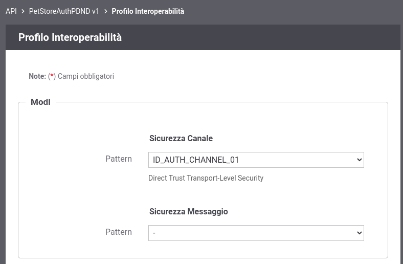
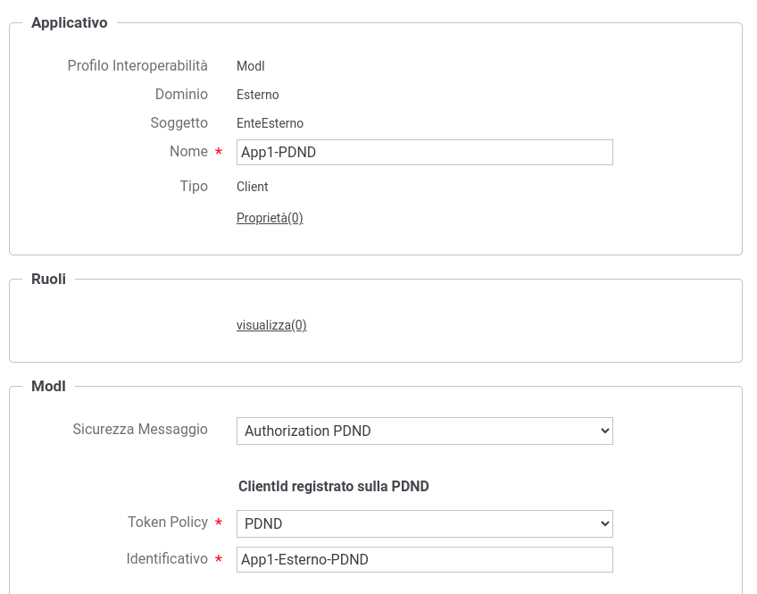
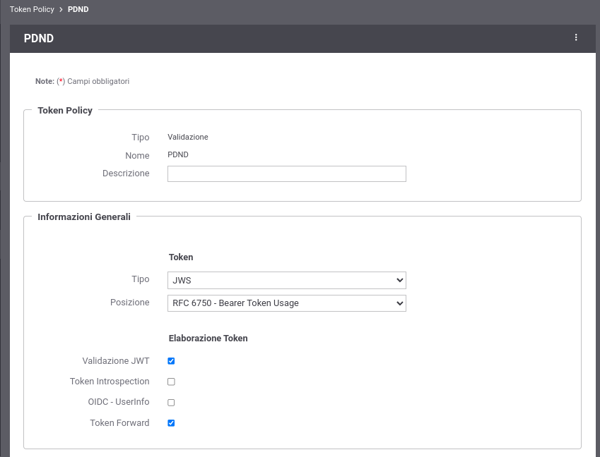
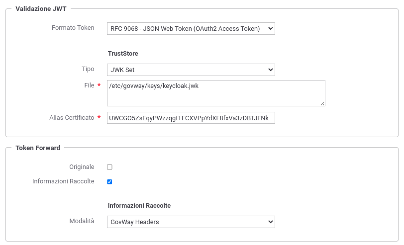
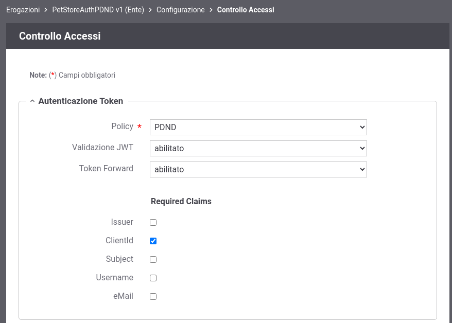
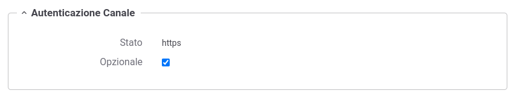
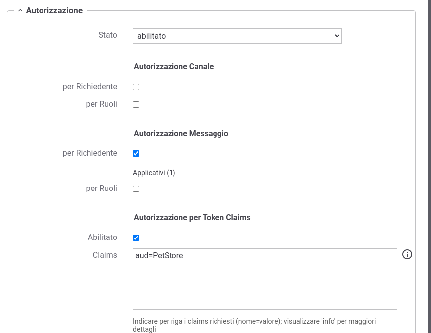
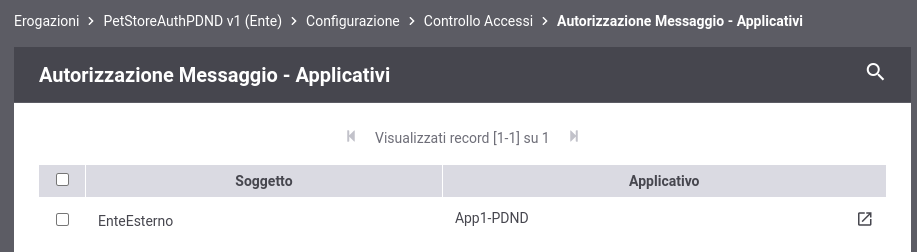

.. _scenari_erogazione_rest_modipa_auth_pdnd_configurazione:

Configurazione
--------------

.. note::

  Per operare con la govwayConsole in modo conforme a quanto previsto dalla specifica del Modello di Interoperabilità si deve attivare, nella testata dell'interfaccia, il Profilo di Interoperabilità 'ModI'. Si suggerisce inoltre di selezionare il soggetto 'Ente' per visualizzare solamente le configurazioni di interesse allo scenario e nascondere le configurazioni "di servizio" necessarie ad implementare la controparte.

  .. figure:: ../../../_figure_scenari/modipa_profilo.png
   :scale: 80%
   :align: center
   :name: modipa_profilo_pdnd_fig

   Profilo ModI della govwayConsole

**Registrazione API**

Viene registrata l'API "PetStoreAuthPDND" con il relativo descrittore OpenAPI 3. Viene selezionato il solo pattern "ID_AUTH_CHANNEL_01" (sicurezza canale) mentre non deve essere selezionato alcun pattern di sicurezza messaggio nella sezione "ModI" poichè la gestione del token avverrà tramite validazione di un token OAuth attivato sull'erogazione (:numref:`modipa_profili_api_pdnd_fig`).

 Configurazione Pattern ModI con "ID_AUTH_CHANNEL_01" senza sicurezza messaggio

**Applicativo Esterno**

È opzionalmente possibile registrare l'applicativo esterno che corrisponde al fruitore del servizio. Questa scelta può essere fatta in base al tipo di autorizzazione che si è impostata sui fruitori. Vediamo i seguenti casi:

- Se si desidera autorizzare qualsiasi fruitore proveniente dalla PDND, questo passo può anche essere omesso. La validazione del token è sufficiente a stabilire che il fruitore ha ottenuto un voucher dalla PDND valido per il servizio invocato.
- In alternativa è possibile configurare una autorizzazione puntuale procedendo alla registrazione degli applicativi fornendo i singoli 'client_id' necessari all'identificazione (:numref:`modipa_applicativo_esterno_pdnd_fig`). Questo scenario è quello preconfigurato.

 Configurazione applicativo esterno (fruitore)

**Token Policy PDND**

Con il prodotto viene fornita built-in la token policy 'PDND' (:numref:`modipa_erogazione_policy_token_pdnd1`) da finalizzare nella sezione 'TrustStore' nei seguenti aspetti (:numref:`modipa_erogazione_policy_token_pdnd2`):

- File: deve essere indicato un path su file system che contiene il certificato di firma della PDND ottenibile tramite la url '.../.well-known/jwks.json' fornita dalla PDND stessa;

- Alias Certificato: deve contenere l’alias (il kid) della chiave pubblica utilizzata dalla PDND per firmare i token rilasciati, corrispondente al valore del claim 'kid' presente nel JWKSet configurato al punto precedente;

- Token Forward: deve essere eventualmente configurata la modalità di forward delle informazioni presenti nel token verso il backend, utile nel nostro scenario per far arrivare il valore del claim 'purposeId' al backend nell'header HTTP 'GovWay-Token-PurposeId'.

 Token Policy PDND (Dati Generali)

 Token Policy PDND (Aspetti da Configurare)

**Erogazione**

Si registra l'erogazione "PetStoreAuthPDND", relativa all'API precedentemente inserita, abilitando la validazione del token ricevuto dalla PDND tramite la omonima policy (:numref:`modipa_erogazione_validazione_pdnd_token_fig`).

 Controllo degli Accessi - Autenticazione Token

Si può notare nella sezione 'Autenticazione Canale' del Controllo degli Accessi come l'autenticazione https sia opzionale per essere aderenti al pattern di sicurezza canale "ID_AUTH_CHANNEL_01" (:numref:`modipa_erogazione_canale_pdnd_token_fig`).

 Controllo degli Accessi - Autenticazione Canale

Nella sezione 'Autorizzazione' si può invece vedere come nella voce 'Autorizzazione per Token Claims' vi sia configurato il valore del claim 'aud' atteso.

Se si è scelto inoltre di registrare gli applicativi esterni, fruitori del servizio, saranno specificati i singoli applicativi fruitori autorizzati ad effettuare richieste al servizio erogato. Questo scenario è quello preconfigurato come mostrato nelle figure :numref:`modipa_auth_pdnd_config_fig` e :numref:`modipa_auth_pdnd_applicativi_fig`.

 Controllo accessi con autorizzazione dell'audience e degli applicativi esterni

 Lista degli applicativi esterni autorizzati

