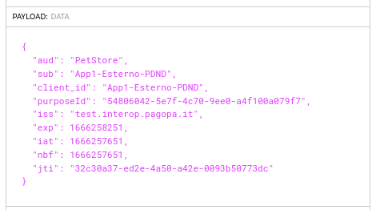

.. _scenari_erogazione_rest_modipa_auth_pdnd_esecuzione:

Esecuzione
----------

.. note::

  Al fine di avere una consultazione immediata delle informazioni di interesse per lo scenario si consiglia di impostare, nella console 'govwayMonitor', nel menù in alto a destra il Profilo di Interoperabilità 'ModI'. Si suggerisce inoltre di selezionare il soggetto 'Ente' per visualizzare solamente le transazioni di interesse allo scenario e ignorare le transazioni "di servizio" necessarie ad implementare la controparte.

  .. figure:: ../../../_figure_scenari/modipa_profilo_monitor.png
   :scale: 80%
   :align: center
   :name: modipa_profilo_monitor_pdnd_fig

   Profilo ModI della govwayMonitor

L'esecuzione dello scenario si basa sui seguenti elementi:

- una API REST di esempio (PetStore) definita con pattern di interazione 'CRUD' e pattern di sicurezza "ID_AUTH_CHANNEL_01" e "ID_AUTH_REST_01 via PDND";
- un'istanza Govway per la gestione del profilo ModI nel dominio dell'erogatore;
- un'authorization server che simula la PDND;
- un client del dominio esterno che invoca la risorsa "POST /pet" dell'erogazione esposta da Govway;
- il server PetStore di esempio che riceve le richieste inoltrate dal Govway e produce le relative risposte. Per questo scenario viene utilizzato il server disponibile on line all'indirizzo 'https://petstore.swagger.io/'.

Per eseguire e verificare lo scenario si può utilizzare il progetto Postman a corredo con la request "Profilo ModI REST - IDAuth+PDND - IN App1" che è stata preconfigurata per il funzionamento con le caratteristiche descritte sopra.

 Pattern IDAuth+PDND - Erogazione API REST, esecuzione da Postman

Dopo aver eseguito la "Send" e verificato il corretto esito dell'operazione è possibile andare a verificare cosa è accaduto, nel corso dell'elaborazione della richiesta, andando a consultare la console 'govwayMonitor'.

1. Dal dettaglio della richiesta si può visualizzare il messaggio che è stato inviato dal fruitore, come in :numref:`modipa_erogazione_messaggio_richiesta_pdnd_fig`. Come si nota, al payload JSON è associato un insieme di header HTTP tra i quali "Authorization", che contiene il token di sicurezza che il fruitore ha ottenuto dalla PDND.

.. figure:: ../../../_figure_scenari/modipa_erogazione_messaggio_richiesta.png
 :scale: 80%
 :align: center
 :name: modipa_erogazione_messaggio_richiesta_pdnd_fig

 Messaggio inviato dal fruitore

2. Grazie alle configurazioni presenti nell'erogazione, ed in particolare all'indicazione che il token ricevuto deve essere validato tramite Token Policy PDND, GovWay è in grado di validare i dati di sicurezza ricevuti (:numref:`modipa_pdnd_validazione_token`) e decodificare il token. 

.. figure:: ../../../_figure_scenari/modipa_pdnd_validazione_token.png
 :scale: 60%
 :align: center
 :name: modipa_pdnd_validazione_token

 Evidenza diagnostica della validazione del token

3. Analizzando il token ricevuto nella sezione header (:numref:`modipa_jwtio_header_pdnd_fig`) si può notare che non viene riportata l'identità del fruitore tramite certificato X.509 come avveniva per il pattern ID_AUTH_REST_01 descritto nella scenario :ref:`scenari_erogazione_rest_modipa_auth_esecuzione`. L'identità del fruitore è presente nella sezione payload (:numref:`modipa_jwtio_payload_pdnd_fig`) all'interno del claim *client_id*, insieme ai riferimenti temporali (iat, nbf, exp) e all'audience (aud). Da notare inoltre la presenza del claim 'purposeId' che indica la finalità per cui il fruitore sta fruendo del servizio.

.. figure:: ../../../_figure_scenari/modipa_jwtio_header_pdnd.png
 :scale: 80%
 :align: center
 :name: modipa_jwtio_header_pdnd_fig

 Sezione "Header" del Token PDND

 Sezione "Payload" del Token PDND

.. note::

  Il token ritornato dall'authorization server demo che simula la PDND contiene ulteriori claims che possono essere ignorati poichè non utili alla descrizione dello scenario e non presenti in un token PDND reale.

4. Il messaggio ricevuto dal Govway viene quindi validato, sulla base della configurazione realizzata, verificando in questo caso l'identità del fruitore, la validità temporale, la corrispondenza dell'audience ricevuto con quello atteso. Solo in caso di superamento dell'intero processo di validazione, il messaggio viene inoltrato al servizio erogatore.
Se il processo di validazione del token ha successo è possibile consultare i dati interni al token ricevuto tramite la console come mostrato nelle figure :numref:`modipa_pdnd_dati_token` e :numref:`modipa_pdnd_dati_token2`.

.. figure:: ../../../_figure_scenari/modipa_pdnd_dati_token.png
 :scale: 80%
 :align: center
 :name: modipa_pdnd_dati_token

 Dati principali presenti nel Token PDND

 Claim presenti nel Token PDND

5. Esaminando il messaggio inoltrato al backend è possibile vedere come tra gli header HTTP inoltrati vi sia l'header 'GovWay-Token-PurposeId' contenente il valore del claim 'purposeId' presente nel token ricevuto dalla PDND (:numref:`modipa_pdnd_http_purposeId`). 

 Header HTTP 'GovWay-Token-PurposeId' inoltrato al backend

6. Lo scenario è preconfigurato per autorizzare puntualmente l'applicativo 'App1-ModI' identificato grazie al claim 'client_id' presente all'interno del token. È possibile utilizzare il progetto Postman a corredo con la request "Profilo ModI REST - IDAuth+PDND - IN App2 - Error" per verificare che una richiesta proveniente da un differente applicativo non viene autorizzata.

 Pattern IDAuth+PDND - Erogazione API REST - Autorizzazione negata, esecuzione da Postman

**Conformità ai requisiti ModI**

I requisiti iniziali, legati alla comunicazione basata su uno scenario ModI, sono verificati dalle seguenti evidenze:

1. la sicurezza messaggio applicata è quella dei pattern "ID_AUTH_REST_01 via PDND" come ampiamente mostrato precedentemente dove sono stati mostrati i token validati e i criteri autorizzativi;

2. l'identificazione del fruitore avviene rispetto al claim 'client_id' presente all'interno del token. È stato anche mostrato come sia possibile configurare criteri autorizzativi puntuali.
