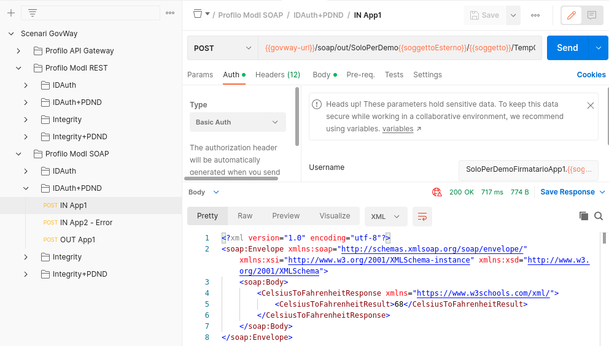

.. _scenari_erogazione_soap_modipa_auth_pdnd_esecuzione:

Esecuzione
----------

.. note::

  Al fine di avere una consultazione immediata delle informazioni di interesse per lo scenario si consiglia di impostare, nella console 'govwayMonitor', nel menù in alto a destra il Profilo di Interoperabilità 'ModI'. Si suggerisce inoltre di selezionare il soggetto 'Ente' per visualizzare solamente le transazioni di interesse allo scenario e ignorare le transazioni "di servizio" necessarie ad implementare la controparte.

  .. figure:: ../../../_figure_scenari/modipa_profilo_monitor.png
   :scale: 80%
   :align: center
   :name: modipa_profilo_monitor_soap_pdnd_fig

   Profilo ModI della govwayMonitor

L'esecuzione dello scenario si basa sui seguenti elementi:

- una API SOAP di esempio (Temperature Conversion) definita con pattern di interazione Bloccante e pattern di sicurezza "ID_AUTH_CHANNEL_01" e "ID_AUTH_REST_01 via PDND";
- un'istanza Govway per la gestione del profilo ModI nel dominio dell'erogatore;
- un'authorization server che simula la PDND;
- un client del dominio esterno che invoca l'azione di esempio "CelsiusToFahrenheit" dell'erogazione esposta da Govway;
- il server 'Temperature Conversion' di esempio che riceve le richieste inoltrate dal Govway e produce le relative risposte. Per questo scenario viene utilizzato il server disponibile on line all'indirizzo 'https://www.w3schools.com/xml/tempconvert.asmx'.

Per eseguire e verificare lo scenario si può utilizzare il progetto Postman a corredo con la request "Profilo ModI SOAP - IDAuth+PDND - IN App1" che è stata preconfigurata per il funzionamento con le caratteristiche descritte sopra.

 Pattern IDAuth+PDND - Erogazione API SOAP, esecuzione da Postman

Dopo aver eseguito la "Send" e verificato il corretto esito dell'operazione è possibile andare a verificare cosa è accaduto, nel corso dell'elaborazione della richiesta, andando a consultare la console govwayMonitor.

Le verifiche da effettuare sono le medesime di quelle descritte nello scenario :ref:`scenari_erogazione_rest_modipa_auth_pdnd_esecuzione`. 

Lo scenario è preconfigurato per autorizzare puntualmente l'applicativo 'App1-ModI' identificato grazie al claim 'client_id' presente all'interno del token. È possibile utilizzare il progetto Postman a corredo con la request "Profilo ModI SOAP - IDAuth+PDND - IN App2 - Error" per verificare che una richiesta proveniente da un differente applicativo non viene autorizzata.

**Conformità ai requisiti ModI**

La verifica dei requisiti ModI per questo scenario non differisce da quanto già descritto in :ref:`scenari_erogazione_rest_modipa_auth_pdnd_esecuzione`.
