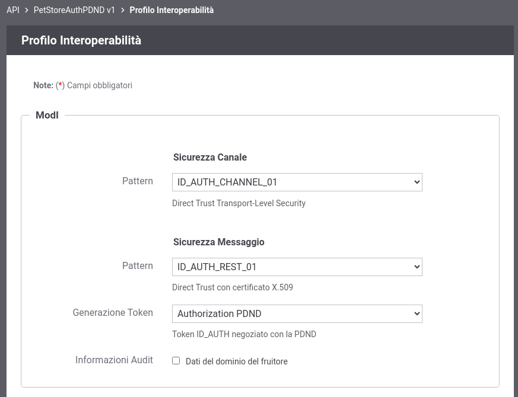

.. _scenari_fruizione_rest_modipa_auth_pdnd_configurazione:

Configurazione
--------------

.. note::

  Per operare con la govwayConsole in modo conforme a quanto previsto dalla specifica del Modello di Interoperabilità si deve attivare, nella testata dell'interfaccia, il Profilo di Interoperabilità "ModI". Si suggerisce inoltre di selezionare il soggetto 'Ente' per visualizzare solamente le configurazioni di interesse allo scenario e nascondere le configurazioni "di servizio" necessarie ad implementare la controparte.

  .. figure:: ../../../_figure_scenari/modipa_profilo.png
   :scale: 80%
   :align: center
   :name: modipa_profilo_f_pdnd_fig

   Profilo ModI della govwayConsole

**Registrazione API**

Viene registrata l'API "PetStoreAuthPDND" con il relativo descrittore OpenAPI 3. Vengono selezionati i pattern "ID_AUTH_CHANNEL_01" (sicurezza canale) e "ID_AUTH_REST_01" (sicurezza messaggio) nella sezione "ModI"  indicando nel campo "Generazione Token" il valore "Authorization PDND" (:numref:`modipa_profili_api_pdnd_fig`).

 Configurazione Pattern ModI con "ID_AUTH_CHANNEL_01" senza sicurezza messaggio

**Applicativo**

Si configura l'applicativo mittente indicando, nella sezione ModI, i parametri del keystore e i parametri di identificazione sulla PDND necessari affinché Govway possa produrre il token di sicurezza firmando per conto dell'applicativo (:numref:`modipa_applicativo_fruitore_pdnd1_fig` e :numref:`modipa_applicativo_fruitore_pdnd2_fig`).
Alla registrazione dell'applicativo vengono associate credenziali 'basic' che consentono a GovWay di identificarlo.

 Configurazione applicativo fruitore (Dati Generali)

 Configurazione applicativo fruitore (Configurazione ModI)

**Token Policy PDND**

Per la configurazione delle fruizioni con un pattern di sicurezza via PDND è necessario registrare una Token Policy di Negoziazione del tipo descritto nella sezione ':ref:`tokenNegoziazionePolicy_pdnd`'. 

Una volta effettuata la registrazione della Token Policy, per utilizzarla in una fruizione è sufficiente associarla al connettore della fruizione come descritto nella sezione :ref:`avanzate_connettori_tokenPolicy`. 

Di seguito vengono riportate tutte le informazioni più importanti della policy:

- Tipo: SignedJWT;

- PDND: flag attivato;

- URL: endpoint esposto dalla PDND su cui è possibile richiedere lo stacco del voucher;

  .. figure:: ../../../_figure_scenari/modipa_applicativo_fruitore_pdnd_policy_negoziazione1.png
    :scale: 50%
    :align: center
    :name: modipa_applicativo_fruitore_pdnd_policy_negoziazione1

    Token Policy di Negoziazione PDND (Endpoint)

- JWT Keystore: parametri di accesso al keystore contenente la chiave privata corrispondente alla chiave pubblica caricata sulla PDND durante la registrazione dell'applicativo client. I parametri variano in funzione del tipo di keystore selezionato e nello scenario preconfigurato è stata scelta la modalità 'Definito nell'applicativo ModI' nella quale il keystore utilizzato per firmare l'asserzione JWT inviata alla PDND sarà quello definito nell'applicativo ModI richiedente (:numref:`modipa_applicativo_fruitore_pdnd_policy_negoziazione2`).

.. note::

  Questa modalità consente di definire un'unica TokenPolicy di negoziazione utilizzabile da più applicativi richiedenti ognuno configurato con la propria coppia di chiavi di firma e i relativi identificativi 'client_id' e 'kid'.

- JWT Signature: algoritmo di firma

- JWT Header: 

  - Type (typ): lasciare il valore 'JWT';

  - Key Id (kid): deve essere indicato l'identificativo univoco (KID) associato al certificato caricato sulla PDND e ottenuto al termine della registrazione dell'applicativo client. Può essere fornito tramite differenti modalità e nello scenario preconfigurato è stata scelta la modalità 'Definito nell'applicativo ModI' nella quale il valore del KID viene configurato sull'applicativo richiedente (:numref:`modipa_applicativo_fruitore_pdnd_policy_negoziazione2`).
             
  .. figure:: ../../../_figure_scenari/modipa_applicativo_fruitore_pdnd_policy_negoziazione2.png
    :scale: 60%
    :align: center
    :name: modipa_applicativo_fruitore_pdnd_policy_negoziazione2

    Token Policy di Negoziazione PDND (Keystore definito nell'applicativo ModI)

- JWT Payload:

  l'identificativo univoco dell'applicativo client ('*client_id*' o '*sub*') ottenuto al termine della registrazione dell'applicativo sulla PDND deve essere indicato nei seguenti campi:

  - Client ID

  - Issuer

  - Subject

  Nello scenario preconfigurato è stato però scelta la modalità alternativa in cui il ClientID ottenuto dalla PDND deve essere configurato sull'applicativo richiedente e la token policy viene configurata per utilizzare tale valore (:numref:`modipa_applicativo_fruitore_pdnd_policy_negoziazione3`). 

  Gli altri campi presenti nella sezione 'JWT Payload' rappresentano (:numref:`modipa_applicativo_fruitore_pdnd_policy_negoziazione3`):

  - Audience: indica il servizio di stacco del voucher della PDND. Il valore, fornito dalla PDND, è indipendente dal servizio per cui si vuole richiedere un voucher e varia solamente in funzione dell'ambiente di validazione o produzione della PDND stessa;

  - Identifier: consente di configurare la modalità di valorizzazione del claim 'jti' presente all'interno del token di richiesta inviato alla PDND. Si suggerisce di valorizzare il campo con la keyword '${transaction:id}' al fine di utilizzare l'identificativo di transazione della richiesta;

  - Time to Live (secondi): consente di indicare la durate del token di richiesta inviato alla PDND (es. 100 sec);

  - Purpose ID: identificativo univoco della finalità per cui si intende fruire di un servizio. Il valore può essere fornito staticamente o può contenere una keyword risolta a runtime in modo da valorizzare il claim purposeId con un valore prelevato dai dati della richiesta o dalla configurazione della fruizione. Nello scenario preconfigurato il purposeId viene indicato dall'applicativo richiedente tramite l'header HTTP 'X-Purpose-Id'.

  - Informazioni Sessione: consente di valorizzare il claim 'sessionInfo' previsto dalla PDND. La valorizzazione può essere statica o formata da parti dinamiche risolte a runtime dal Gateway (per maggiori dettagli :ref:`valoriDinamici`).

  .. figure:: ../../../_figure_scenari/modipa_applicativo_fruitore_pdnd_policy_negoziazione3.png
    :scale: 60%
    :align: center
    :name: modipa_applicativo_fruitore_pdnd_policy_negoziazione3

    Token Policy di Negoziazione PDND (JWT Payload)

- Dati Richiesta:

  - Resource: indica l'audience/url del servizio per cui si vuole richiedere un voucher; nello scenario preconfigurato il valore viene preso dalla proprietà 'PDND-resource' della fruizione configurata.

  - Client ID: deve essere indicato il medesimo valore inserito nel campo 'Client ID' della sezione 'JWT Payload'; nello scenario preconfigurato viene infatti utilizzato il valore configurato sull'applicativo richiedente.

  .. figure:: ../../../_figure_scenari/modipa_applicativo_fruitore_pdnd_policy_negoziazione4.png
    :scale: 60%
    :align: center
    :name: modipa_applicativo_fruitore_pdnd_policy_negoziazione4
   
    Token Policy di Negoziazione PDND (Dati Richiesta) 

**Fruizione**

Si registra la fruizione "PetStoreAuthPDND", relativa all'API precedentemente inserita, indicando l'utilizzo della token policy di negoziazione sul connettore (:numref:`modipa_fruizione_pdnd_connettore_token_policy_fig`).

 Associazione della Token Policy di Negoziazione al connettore

Tra le proprietà della fruizione viene definita la proprietà 'PDND-resource' contenente il valore da inserire nella richiesta di voucher effettuata alla PDND che identifica il servizio per cui si sta richiedendo il token (:numref:`modipa_fruizione_pdnd_proprieta_resource_fig`).

.. figure:: ../../../_figure_scenari/modipa_fruizione_pdnd_proprieta_resource.png
 :scale: 80%
 :align: center
 :name: modipa_fruizione_pdnd_proprieta_resource_fig

 Proprietà 'PDND-resource'

