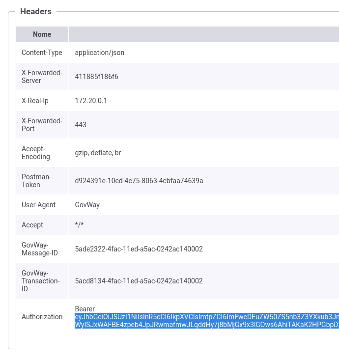

.. _scenari_fruizione_rest_modipa_auth_pdnd_esecuzione:

Esecuzione
----------

.. note::

  Al fine di avere una consultazione immediata delle informazioni di interesse per lo scenario si consiglia di impostare, nella console 'govwayMonitor', nel menù in alto a destra il Profilo di Interoperabilità 'ModI'. Si suggerisce inoltre di selezionare il soggetto 'Ente' per visualizzare solamente le transazioni di interesse allo scenario e ignorare le transazioni "di servizio" necessarie ad implementare la controparte.

  .. figure:: ../../../_figure_scenari/modipa_profilo_monitor.png
   :scale: 80%
   :align: center
   :name: modipa_profilo_monitor_pdnd_f_fig

   Profilo ModI della govwayMonitor

L'esecuzione dello scenario si basa sui seguenti elementi:

- una API REST di esempio (PetStore) definita con pattern di interazione 'CRUD' e pattern di sicurezza "ID_AUTH_CHANNEL_01" e "ID_AUTH_REST_01 via PDND";
- un'istanza Govway per la gestione del profilo ModI nel dominio del fruitore;
- un'authorization server che simula la PDND;
- un client che invoca la risorsa "POST /pet" con un messaggio di esempio diretto alla fruzione configurata su Govway.

Per eseguire e verificare lo scenario si può utilizzare il progetto Postman a corredo con la request "Profilo ModI REST - IDAuth+PDND - OUT App1" che è stata preconfigurata per il funzionamento con le caratteristiche descritte sopra.

 Pattern IDAuth+PDND - Fruizione API REST, esecuzione da Postman

Dopo aver eseguito la "Send" e verificato il corretto esito dell'operazione è possibile andare a verificare cosa è accaduto nelle diverse fasi dell'esecuzione andando a consultare la console 'govwayMonitor'.

1. Il messaggio di richiesta inviato dal fruitore viene elaborato da Govway che, tramite la configurazione della firma digitale associata all'applicativo mittente, è in grado di produrre un token di sicurezza da inviare alla PDND con il quale ottenere indietro un voucher spendibile per il servizio desiderato. Tramite la console è possibile esaminare sia l'asserzione JWT inviata alla PDND (:numref:`modipa_fruizione_pdnd_token_fig`) che l'access token ottenuto dalla PDND (:numref:`modipa_fruizione_pdnd_token2_fig`).

 Evidenza dell'asserzione JWT inviata alla PDND

 Evidenza dell'access token ottenuto dalla PDND

2. Esaminando l'header e il payload dell'asserzione JWT inviata alla PDND (:numref:`modipa_fruizione_pdnd_asserzione_inviata_fig`) si può notare:

- Valore del claim 'kid' associato all'applicativo mittente in configurazione

- Valore del claim 'client_id' (uguale per i claim 'sub' e 'iss') associato all'applicativo mittente in configurazione

- Valore del claim 'purposeId' indicato dal client (nell'esempio Postman) tramite un header http 'X-Purpose-Id'

 Header e Payload dell'asserzione JWT inviata alla PDND

3. Analizzando l'access token ricevuto dalla PDND, nella sezione header (:numref:`modipa_jwtio_header_pdnd_fr_fig`) si può notare che non viene riportata l'identità del fruitore tramite certificato X.509 come avveniva per il pattern ID_AUTH_REST_01 descritto nella scenario :ref:`scenari_fruizione_rest_modipa_auth_esecuzione`. L'identità del fruitore è presente nella sezione payload (:numref:`modipa_jwtio_payload_pdnd_fr_fig`) all'interno del claim *client_id*, insieme ai riferimenti temporali (iat, nbf, exp) e all'audience (aud) del servizio per cui si è richiesto il voucher. Da notare inoltre la presenza del claim 'purposeId' che servirà ad indicare la finalità per cui il fruitore sta fruendo del servizio all'erogatore.

 Sezione "Header" del Token PDND

.. figure:: ../../../_figure_scenari/modipa_jwtio_payload_pdnd.png
 :scale: 80%
 :align: center
 :name: modipa_jwtio_payload_pdnd_fr_fig

 Sezione "Payload" del Token PDND

.. note::

  Il token ritornato dall'authorization server demo che simula la PDND contiene ulteriori claims che possono essere ignorati poichè non utili alla descrizione dello scenario e non presenti in un token PDND reale.

4. Tramite la console govwayMonitor si può visualizzare il messaggio di richiesta in uscita che è il medesimo di quello in entrata con la differenza che è stato aggiunto l'access token ottenuto dalla PDND tra gli header HTTP all'interno dell'header "Authorization" (:numref:`modipa_fruizione_messaggio_richiesta_pdnd_fig`).

 Messaggio di richiesta in uscita (con voucher PDND inserito nell'header HTTP)

5. Govway riceve la risposta dell'erogatore grazie al fatto che ha inviato un voucher PDND correttamente validato dall'erogatore.

**Conformità ai requisiti ModI**

I requisiti iniziali, legati alla comunicazione basata su uno scenario ModI, sono verificati dalle seguenti evidenze:

1. Viene effettuata una negoziazione del voucher PDND come mostrato nelle tracce relative ai token scambiati con la PDND.

2. L'invocazione del servizio avviene fornendo il voucher della PDND precedentemente negoziato.
