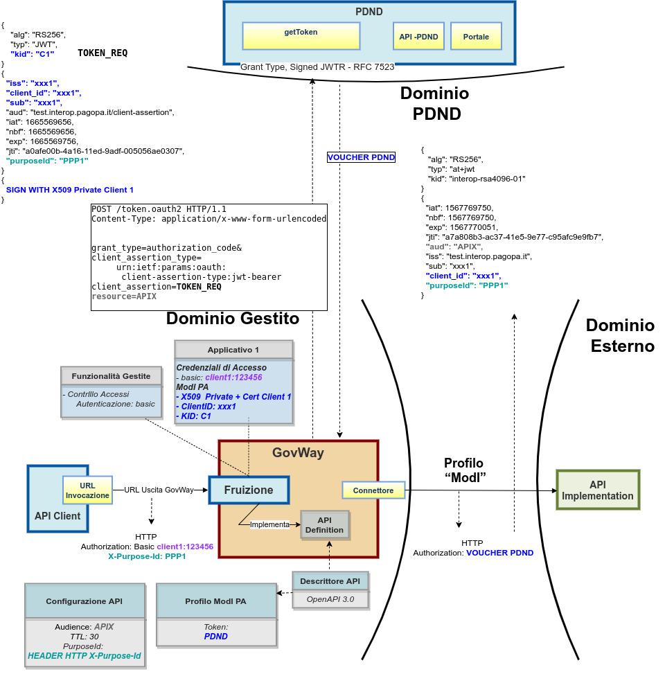

.. _scenari_fruizione_rest_modipa_auth_pdnd:

Fruizione API REST
======================

**Obiettivo** 

Fruire di un servizio REST, definito tramite una API REST (OpenAPI 3.0), accessibile in accordo al pattern di sicurezza descritto nella sezione :ref:`modipa_pdnd`.

**Sintesi**

Mostriamo in questa sezione come procedere per l'integrazione di un applicativo con un servizio REST erogato nel rispetto della normativa italiana alla base dell'interoperabilità tra i sistemi della pubblica amministrazione. In particolare andiamo ad illustrare lo scenario in cui il servizio è stato registrato sulla PDND, e il fruitore per poterlo fruire deve ottenere un voucher dalla PDND che successivamente deve inviare all'erogatore insieme alla normale richiesta di servizio.

La figura seguente descrive graficamente questo scenario.

 Fruizione di una API REST con profilo 'ModI', pattern ID_AUTH_REST_01 via PDND

Le caratteristiche principali di questo scenario sono:

1. Un applicativo fruitore che dialoga con il servizio erogato in modalità ModI in accordo ad una API condivisa registrata su PDND
2. La comunicazione diretta verso il dominio erogatore veicolata su un canale gestito con il pattern di sicurezza canale "ID_AUTH_CHANNEL_01"
3. L'autenticità della comunicazione tra fruitore ed erogatore è garantita tramite sicurezza a livello messaggio con pattern "ID_AUTH_REST_01 via PDND"

.. toctree::
    :maxdepth: 2

    esecuzione
    configurazione
