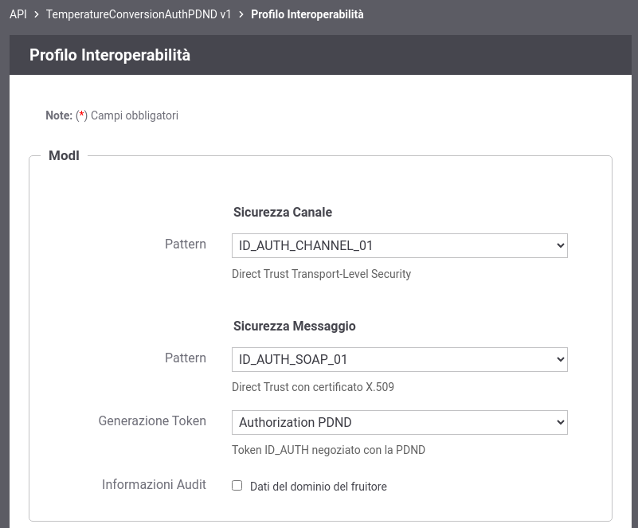

.. _scenari_fruizione_soap_modipa_auth_pdnd_configurazione:

Configurazione
--------------

.. note::

  Per operare con la govwayConsole in modo conforme a quanto previsto dalla specifica del Modello di Interoperabilità si deve attivare, nella testata dell'interfaccia, il Profilo di Interoperabilità "ModI". Si suggerisce inoltre di selezionare il soggetto 'Ente' per visualizzare solamente le configurazioni di interesse allo scenario e nascondere le configurazioni "di servizio" necessarie ad implementare la controparte.

  .. figure:: ../../../_figure_scenari/modipa_profilo.png
   :scale: 80%
   :align: center
   :name: modipa_profilo_f_soap_pdnd_fig

   Profilo ModI della govwayConsole

Il processo di configurazione per questo scenario è del tutto analogo a quello descritto per lo scenario :ref:`scenari_fruizione_rest_modipa_auth_pdnd_configurazione`. Nel seguito viene riporta solamente la differenza relativa alla registrazione dell'API. 

**Registrazione API**

Viene registrata l'API "TemperatureConversionAuthPDND" con il relativo descrittore WSDL. Vengono selezionati i pattern "ID_AUTH_CHANNEL_01" (sicurezza canale) e "ID_AUTH_SOAP_01" (sicurezza messaggio) nella sezione "ModI"  indicando nel campo "Generazione Token" il valore "Authorization PDND" (:numref:`modipa_profili_api_soap_pdnd_fr_fig`).

 Configurazione Pattern ModI con "ID_AUTH_CHANNEL_01" senza sicurezza messaggio
