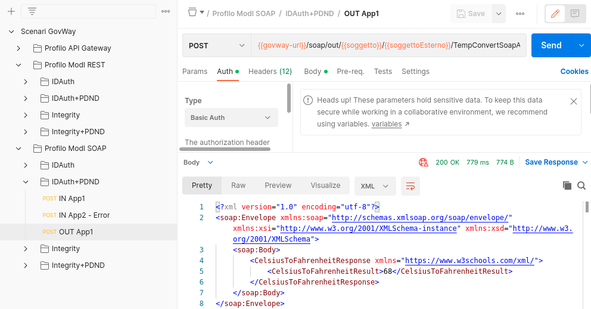

.. _scenari_fruizione_soap_modipa_auth_pdnd_esecuzione:

Esecuzione
----------

.. note::

  Al fine di avere una consultazione immediata delle informazioni di interesse per lo scenario si consiglia di impostare, nella console 'govwayMonitor', nel menù in alto a destra il Profilo di Interoperabilità 'ModI'. Si suggerisce inoltre di selezionare il soggetto 'Ente' per visualizzare solamente le transazioni di interesse allo scenario e ignorare le transazioni "di servizio" necessarie ad implementare la controparte.

  .. figure:: ../../../_figure_scenari/modipa_profilo_monitor.png
   :scale: 80%
   :align: center
   :name: modipa_profilo_monitor_f_soap_pdnd_fig

   Profilo ModI della govwayMonitor

L'esecuzione dello scenario si basa sui seguenti elementi:

- una API SOAP di esempio (Credit Card Verification) definita con pattern di interazione Bloccante e pattern di sicurezza "ID_AUTH_CHANNEL_01" e "ID_AUTH_REST_01 via PDND";
- un'istanza Govway per la gestione del profilo ModI nel dominio del fruitore;
- un'authorization server che simula la PDND;
- un client del dominio gestito che invoca l'azione di esempio "CheckCC" sulla fruzione configurata su Govway.

Per eseguire e verificare lo scenario si può utilizzare il progetto Postman a corredo con la request "Profilo ModI SOAP - IDAuth+PDND - OUT App1" che è stata preconfigurata per il funzionamento con le caratteristiche descritte sopra.

 Pattern IDAuth+PDND - Fruizione API SOAP, esecuzione da Postman

Dopo aver eseguito la "Send" e verificato il corretto esito dell'operazione è possibile andare a verificare cosa è accaduto, nel corso dell'elaborazione della richiesta, andando a consultare la console 'govwayMonitor'.

Le verifiche da effettuare sono le medesime di quelle descritte nello scenario :ref:`scenari_fruizione_rest_modipa_auth_pdnd_esecuzione`. 

**Conformità ai requisiti ModI**

La verifica dei requisiti ModI per questo scenario non differisce da quanto già descritto in :ref:`scenari_fruizione_rest_modipa_auth_pdnd_esecuzione`.
