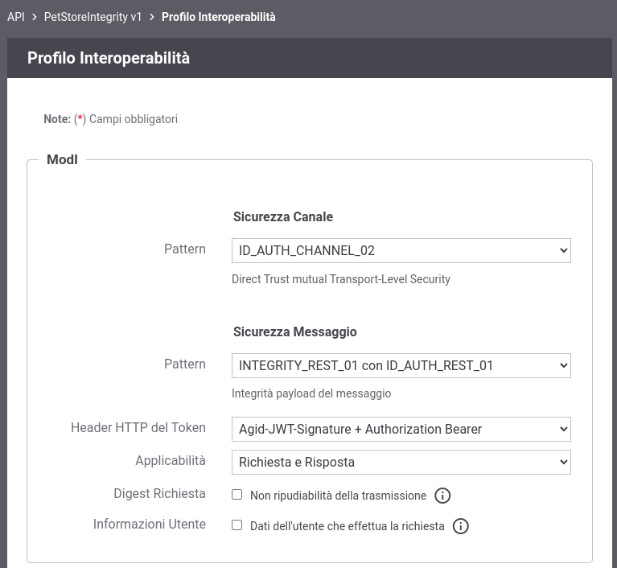
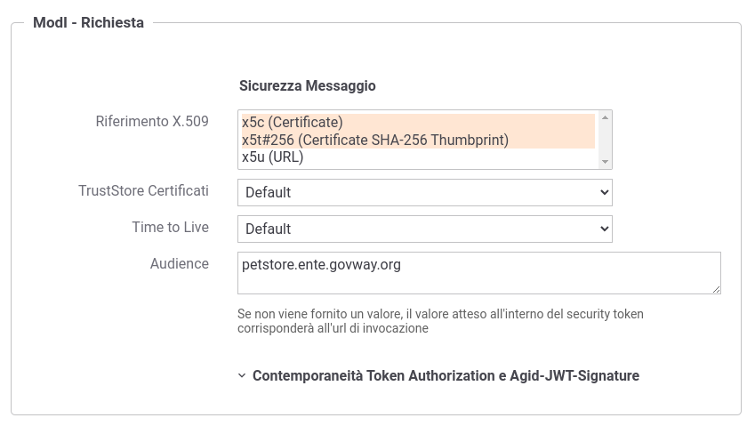
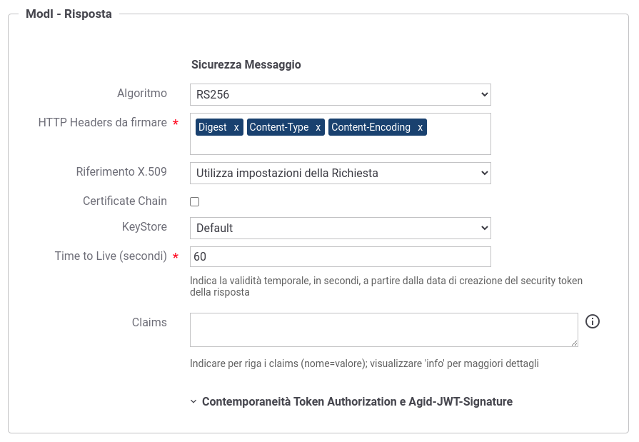

.. _scenari_erogazione_rest_modipa_integrity_configurazione:

Configurazione
--------------

.. note::

  Per operare con la govwayConsole in modo conforme a quanto previsto dalla specifica del Modello di Interoperabilità si deve attivare, nella testata dell'interfaccia, il Profilo di Interoperabilità 'ModI'. Si suggerisce inoltre di selezionare il soggetto 'Ente' per visualizzare solamente le configurazioni di interesse allo scenario e nascondere le configurazioni "di servizio" necessarie ad implementare la controparte.

  .. figure:: ../../../_figure_scenari/modipa_profilo.png
   :scale: 80%
   :align: center
   :name: modipa_profilo_integrity_fig

   Profilo ModI della govwayConsole

La configurazione dello scenario è del tutto analogo a quello descritto nello scenario :ref:`scenari_erogazione_rest_modipa_auth_configurazione` con le sole differenze dovuto al differente pattern di sicurezza utilizzato "INTEGRITY_REST_01 con ID_AUTH_REST_01".

**Registrazione API**

Viene registrata l'API "PetStoreIntegrity" con il relativo descrittore OpenAPI 3. Vengono selezionati i pattern "ID_AUTH_CHANNEL_02" (sicurezza canale) e "INTEGRITY_REST_01 con ID_AUTH_REST_01" (sicurezza messaggio) nella sezione "ModI" (:numref:`modipa_profili_api_integrity_fig`).

 Configurazione Pattern ModI "INTEGRITY_REST_01 con ID_AUTH_REST_01" sulla API REST

**Erogazione**

Si registra l'erogazione "PetStoreIntegrity", relativa all'API precedentemente inserita, indicando i dati specifici nella sezione "ModI Richiesta" (:numref:`modipa_erogazione_richiesta_integrity_fig`). In questo contesto vengono inseriti i dati necessari per validare le richieste in ingresso.

 Configurazione richiesta dell'erogazione

La sezione "ModI Risposta" si utilizza per indicare i parametri per la produzione del token di sicurezza da inserire nel messaggio di risposta (:numref:`modipa_erogazione_risposta_integrity_fig`).

 Configurazione risposta dell'erogazione

