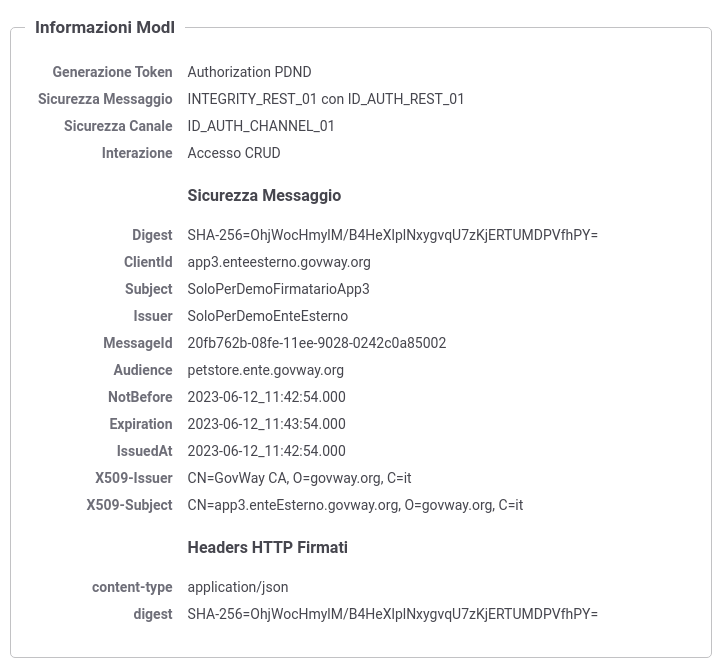

.. _scenari_erogazione_rest_modipa_integrity_esecuzione:

Esecuzione
----------

.. note::

  Al fine di avere una consultazione immediata delle informazioni di interesse per lo scenario si consiglia di impostare, nella console 'govwayMonitor', nel menù in alto a destra il Profilo di Interoperabilità 'ModI'. Si suggerisce inoltre di selezionare il soggetto 'Ente' per visualizzare solamente le transazioni di interesse allo scenario e ignorare le transazioni "di servizio" necessarie ad implementare la controparte.

  .. figure:: ../../../_figure_scenari/modipa_profilo_monitor.png
   :scale: 80%
   :align: center
   :name: modipa_profilo_monitor_integrity_fig

   Profilo ModI della govwayMonitor

L'esecuzione dello scenario è del tutto analogo a quello descritto nello scenario :ref:`scenari_erogazione_rest_modipa_auth_esecuzione` con la sola eccezione del pattern di sicurezza utilizzato che in questo scenario è "INTEGRITY_REST_01 con ID_AUTH_REST_01".

Per eseguire e verificare lo scenario si può utilizzare il progetto Postman a corredo con la request "Profilo ModI REST - Integrity - IN App1" che è stata preconfigurata per il funzionamento con le caratteristiche descritte sopra.

 Pattern Integrity - Erogazione API REST, esecuzione da Postman

Dopo aver eseguito la "Send" e verificato il corretto esito dell'operazione è possibile andare a verificare cosa è accaduto, nel corso dell'elaborazione della richiesta, andando a consultare la console 'govwayMonitor'.

Le verifiche da effettuare sono le medesime di quelle descritte nello scenario :ref:`scenari_erogazione_rest_modipa_auth_esecuzione`. Di seguito vengono riportati solo i punti salienti in cui emerge una differenza dovuta al pattern di sicurezza diverso utilizzato.

- Dal dettaglio della richiesta si può visualizzare il messaggio che è stato inviato dal fruitore, come in :numref:`modipa_erogazione_messaggio_richiesta_integrity_fig`. Come si nota, al payload JSON è associato un insieme di header HTTP tra i quali "Authorization" e "Agid-Jwt-Signature" che contengono rispettivamente il token di sicurezza per l'autenticazione e per l'integrità. È inoltre presente l'header http "Digest" che contiene il valore per la verifica dell'integrità del payload.

.. figure:: ../../../_figure_scenari/modipa_erogazione_messaggio_richiesta_integrity.png
 :scale: 80%
 :align: center
 :name: modipa_erogazione_messaggio_richiesta_integrity_fig

 Messaggio inviato dal fruitore

- Grazie alle configurazioni presenti nell'erogazione, ed in particolare alla relazione di trust stabilita con il fruitore, Govway è in grado di validare i dati di sicurezza ricevuti andando a decodificare il token. Nella fase di validazione del token si può notare come la sezione header (:numref:`modipa_jwtio_header_integrity_fig`) di entrambi i token "Authorization" e "Agid-Jwt-Signature" riportano l'identità del fruitore e il suo certificato X.509.

.. figure:: ../../../_figure_scenari/modipa_jwtio_header.png
 :scale: 80%
 :align: center
 :name: modipa_jwtio_header_integrity_fig

 Sezione "Header" del Token di sicurezza "Authorization" e "Agid-Jwt-Signature"

 I payload dei due token invece differiscono (:numref:`modipa_jwtio_payload_integrity_1_fig` e :numref:`modipa_jwtio_payload_integrity_2_fig`). In entrambi sono presenti i riferimenti temporali (iat, nbf, exp) e l'audience (aud), mentre solamente nel payload del token "Agid-Jwt-Signature" è presente il claim 'signed_headers' utilizzato per la verifica dell'integrità.

 Sezione "Payload" del Token di sicurezza "Authorization"

 Sezione "Payload" del Token di sicurezza "Agid-Jwt-Signature"

- Il messaggio ricevuto dal Govway viene quindi validato, sulla base dei pattern di sicurezza previsti nello scambio, verificando in questo caso l'identità del fruitore, la validità temporale, la corrispondenza dell'audience ricevuto con quello atteso e la corrispondenza del digest con il payload e con il valore interno al token "Agid-Jwt-Signature". Solo in caso di superamento dell'intero processo di validazione, il messaggio viene inoltrato al servizio erogatore. 
  Le evidenze del processo di validazione sono visibili sulla govwayMonitor, andando a consultare la traccia del messaggio di richiesta (:numref:`modipa_traccia_richiesta_integrity_fig`). Nella sezione "Sicurezza Messaggio" sono riportate le informazioni estratte dai token di sicurezza presenti, tra cui si può notare il digest e gli header http firmati.

 Traccia della richiesta elaborata dall'erogatore

- Lo scenario è preconfigurato per autorizzare puntualmente l'applicativo 'App1-ModI' identificato grazie al certificato X.509 presente all'interno del token. È possibile utilizzare il progetto Postman a corredo con la request "Profilo ModI REST - Integrity - IN App2 - Error" per verificare che una richiesta proveniente da un differente applicativo non viene autorizzata.

 Pattern Integrity - Erogazione API REST - Autorizzazione negata, esecuzione da Postman

**Conformità ai requisiti ModI**

I requisiti iniziali, legati alla comunicazione basata su uno scenario ModI, sono verificati dalle seguenti evidenze:

1. la trasmissione è basata sul pattern "ID_AUTH_CHANNEL_02", riguardo la sicurezza canale, come evidenziato nei messaggi diagnostici dalla presenza degli elementi dell'handshake SSL e relativi dati dei certificati scambiati (:numref:`modipa_ssl_auth_fig`);

2. la sicurezza messaggio applicata è quella dei pattern "ID_AUTH_REST_02" e "INTEGRITY_REST_01" come ampiamente mostrato nelle tracce dei messaggi di richiesta e risposta, dove sono presenti i certificati degli applicativi e le firme dei payload (e le relative validazioni);

3. l'identificazione del fruitore avviene rispetto al certificato X.509 presente all'interno del token. È stato anche mostrato come sia possibile configurare criteri autorizzativi puntuali.
