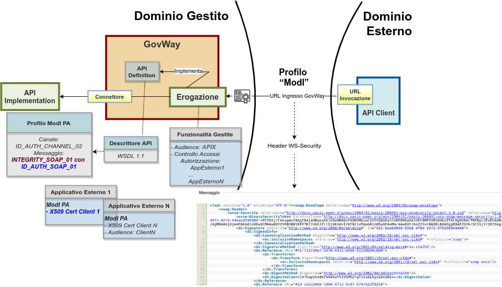

.. _scenari_erogazione_soap_modipa_integrity:

Erogazione API SOAP
=======================

**Obiettivo** 

Esporre un servizio SOAP, definito tramite una interfaccia WSDL, accessibile in accordo al pattern di sicurezza 'INTEGRITY_SOAP_01' descritto nella sezione :ref:`modipa_idar03`.

**Sintesi**

Mostriamo in questa sezione come procedere per l'esposizione di un servizio SOAP da erogare nel rispetto della normativa italiana alla base dell'interoperabilità tra i sistemi della pubblica amministrazione.  In particolare andiamo ad illustrare lo scenario, tra quelli prospettati nel Modello di Interoperabilità di AGID, che prevede oltre a garantire l'autenticazione dell'interlocutore un supporto a garanzia dell'integrità del messaggio.

La figura seguente descrive graficamente questo scenario.

 Erogazione di una API SOAP con profilo 'ModI', pattern INTEGRITY_SOAP_01 con ID_AUTH_SOAP_01

Le caratteristiche principali di questo scenario sono:

1. Un applicativo eroga un servizio, rivolto a fruitori di domini esterni, in conformità al Modello di Interoperabilità AGID
2. La comunicazione con i domini esterni avviene su un canale gestito con il pattern di sicurezza canale "ID_AUTH_CHANNEL_02"
3. L'autenticità della comunicazione tra il servizio erogato e ciascun fruitore è garantita tramite sicurezza a livello messaggio con pattern "ID_AUTH_SOAP_01"
4. L'integrità del messaggio scambiato è garantita tramite sicurezza messaggio aggiuntiva prevista nel pattern "INTEGRITY_SOAP_01"

.. toctree::
    :maxdepth: 2

    esecuzione
    configurazione
