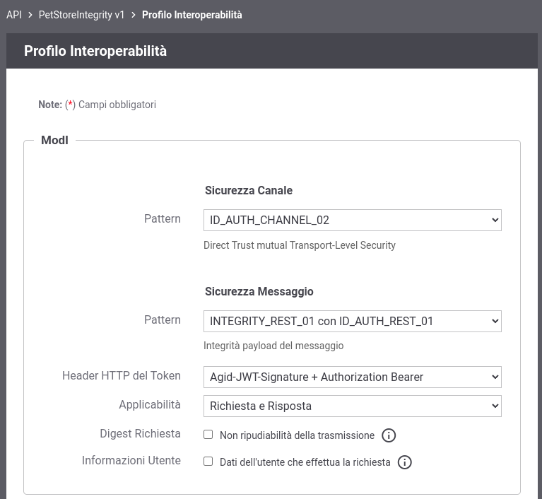
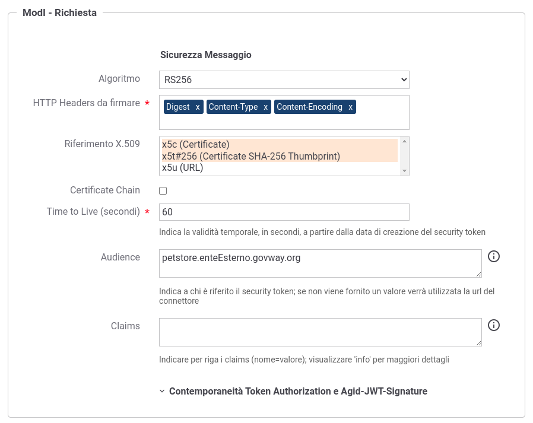
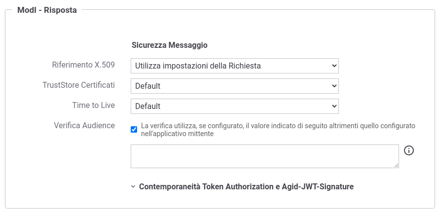

.. _scenari_fruizione_rest_modipa_integrity_configurazione:

Configurazione
--------------

.. note::

  Per operare con la govwayConsole in modo conforme a quanto previsto dalla specifica del Modello di Interoperabilità si deve attivare, nella testata dell'interfaccia, il Profilo di Interoperabilità "ModI". Si suggerisce inoltre di selezionare il soggetto 'Ente' per visualizzare solamente le configurazioni di interesse allo scenario e nascondere le configurazioni "di servizio" necessarie ad implementare la controparte.

  .. figure:: ../../../_figure_scenari/modipa_profilo.png
   :scale: 80%
   :align: center
   :name: modipa_profilo_f_integrity_fig

   Profilo ModI della govwayConsole

La configurazione dello scenario è del tutto analogo a quello descritto nello scenario :ref:`scenari_fruizione_rest_modipa_auth_configurazione` con le sole differenze dovuto al differente pattern di sicurezza utilizzato "INTEGRITY_REST_01 con ID_AUTH_REST_01".

**Registrazione API**

Viene registrata l'API "PetStoreIntegrity" con il relativo descrittore OpenAPI 3. Vengono selezionati i pattern "ID_AUTH_CHANNEL_02" (sicurezza canale) e "INTEGRITY_REST_01 con ID_AUTH_REST_01" (sicurezza messaggio) nella sezione "ModI" (:numref:`modipa_profili_api_fr_integrity_fig`).

 Configurazione Pattern ModI "INTEGRITY_REST_01 con ID_AUTH_REST_01" sulla API

**Fruizione**

Si registra la fruizione "PetStoreIntegrity", relativa all'API precedentemente inserita, indicando i dati specifici nella sezione "ModI Richiesta" (:numref:`modipa_fruizione_richiesta_integrity_fig`). In particolare è possibile specificare l'audience atteso dall'erogatore e il tempo di validità del token.

 Configurazione richiesta della fruizione

La sezione "ModI Risposta" definisce i criteri per la validazione dei messaggi di risposta, come la posizione del token di sicurezza e il truststore per l'autenticazione dell'erogatore (:numref:`modipa_fruizione_risposta_integrity_fig`).

 Configurazione risposta della fruizione

