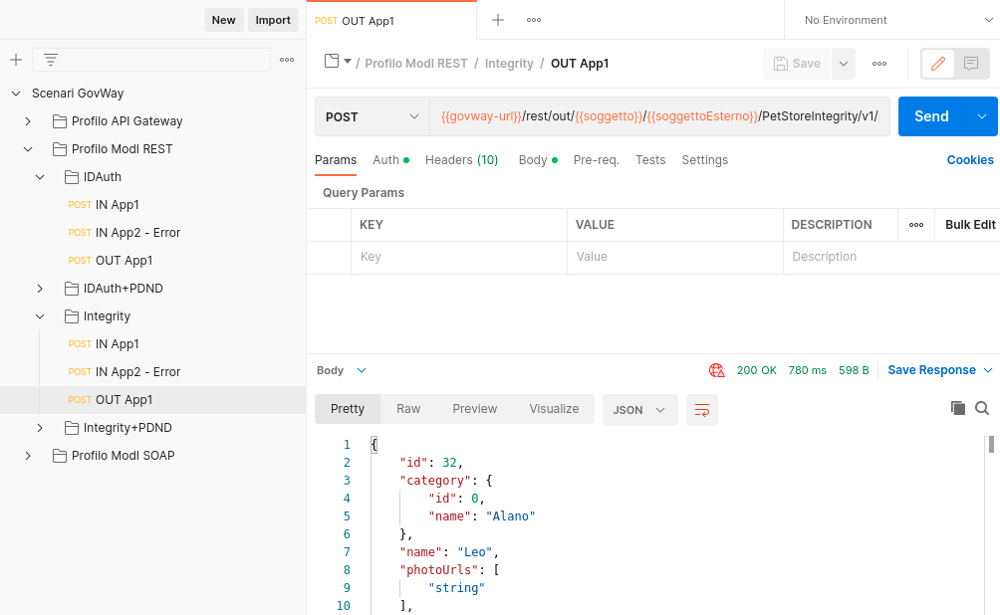
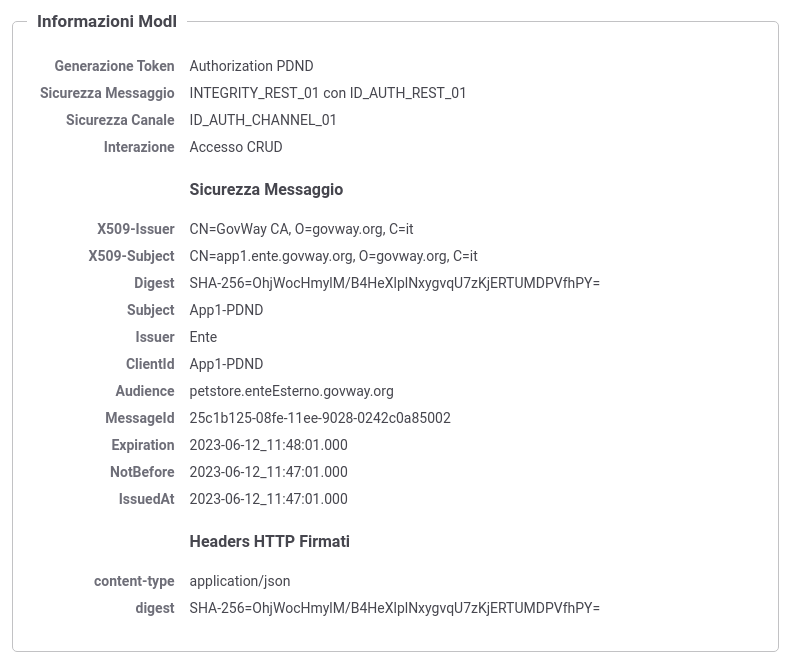

.. _scenari_fruizione_rest_modipa_integrity_esecuzione:

Esecuzione
----------

.. note::

  Al fine di avere una consultazione immediata delle informazioni di interesse per lo scenario si consiglia di impostare, nella console 'govwayMonitor', nel menù in alto a destra il Profilo di Interoperabilità 'ModI'. Si suggerisce inoltre di selezionare il soggetto 'Ente' per visualizzare solamente le transazioni di interesse allo scenario e ignorare le transazioni "di servizio" necessarie ad implementare la controparte.

  .. figure:: ../../../_figure_scenari/modipa_profilo_monitor.png
   :scale: 80%
   :align: center
   :name: modipa_profilo_monitor_f_integrity_fig

   Profilo ModI della govwayMonitor

L'esecuzione dello scenario è del tutto analogo a quello descritto nello scenario :ref:`scenari_fruizione_rest_modipa_auth_esecuzione` con la sola eccezione del pattern di sicurezza utilizzato che in questo scenario è "INTEGRITY_REST_01 con ID_AUTH_REST_01".

Per eseguire e verificare lo scenario si può utilizzare il progetto Postman a corredo con la request "Profilo ModI REST - Integrity - OUT App1" che è stata preconfigurata per il funzionamento con le caratteristiche descritte sopra.

 Pattern Integrity - Fruizione API REST, esecuzione da Postman

Dopo aver eseguito la "Send" e verificato il corretto esito dell'operazione è possibile andare a verificare cosa è accaduto nelle diverse fasi dell'esecuzione andando a consultare la console 'govwayMonitor'.

Le verifiche da effettuare sono le medesime di quelle descritte nello scenario :ref:`scenari_fruizione_rest_modipa_auth_esecuzione`. Di seguito vengono riportati solo i punti salienti in cui emerge una differenza dovuta al pattern di sicurezza diverso utilizzato.

- Il messaggio di richiesta inviato dal fruitore viene elaborato da Govway che, tramite la configurazione della firma digitale associata all'applicativo mittente, è in grado di produrre il token di sicurezza da inviare con la richiesta all'erogatore. Da govwayMonitor si può visualizzare il messaggio di richiesta in uscita che è il medesimo di quello in entrata con la differenza che sono stati aggiunti gli header HTTP "Authorization" e "Agid-Jwt-Signature" che contengono rispettivamente il token di sicurezza per l'autenticazione e per l'integrità. È inoltre presente l'header http "Digest" che contiene il valore utilizzabile dall'erogatore per la verifica dell'integrità del payload. (:numref:`modipa_fruizione_messaggio_richiesta_integrity_fig`).

.. figure:: ../../../_figure_scenari/modipa_erogazione_messaggio_richiesta_integrity.png
 :scale: 80%
 :align: center
 :name: modipa_fruizione_messaggio_richiesta_integrity_fig

 Messaggio di richiesta in uscita (con token di sicurezza inseriti nell'header HTTP)

- L'header e i payload dei token sono identici a quelli visualizzati nello scenario di erogazione REST, relativamente al messaggio in ingresso (:numref:`modipa_jwtio_header_integrity_fig`, :numref:`modipa_jwtio_payload_integrity_1_fig` e :numref:`modipa_jwtio_payload_integrity_2_fig`).
  Le informazioni inserite nel token vengono anche tracciate e sono visibili sulla govwayMonitor, andando a consultare la traccia del messaggio di richiesta (:numref:`modipa_traccia_richiesta_fruitore_integrity_fig`). Nella sezione "Sicurezza Messaggio" sono riportate le informazioni estratte dai token di sicurezza, tra cui si può notare il digest e gli header http firmati.

 Traccia della richiesta generata dal fruitore

**Conformità ai requisiti ModI**

I requisiti iniziali, legati alla comunicazione basata su uno scenario ModI, sono verificati dalle seguenti evidenze:

1. la trasmissione è basata sul pattern "ID_AUTH_CHANNEL_02", riguardo la sicurezza canale, come evidenziato nei messaggi diangostici dalla presenza degli elementi dell'handshake SSL e relativi dati dei certificati scambiati (:numref:`modipa_ssl_auth_fruitore_fig`);

2. la sicurezza messaggio applicata è quella dei pattern "ID_AUTH_REST_02" e "INTEGRITY_REST_01", come ampiamente mostrato nelle tracce dei messaggi di richiesta e risposta, dove sono presenti i certificati degli applicativi e le firme dei payload (e le relative validazioni).
