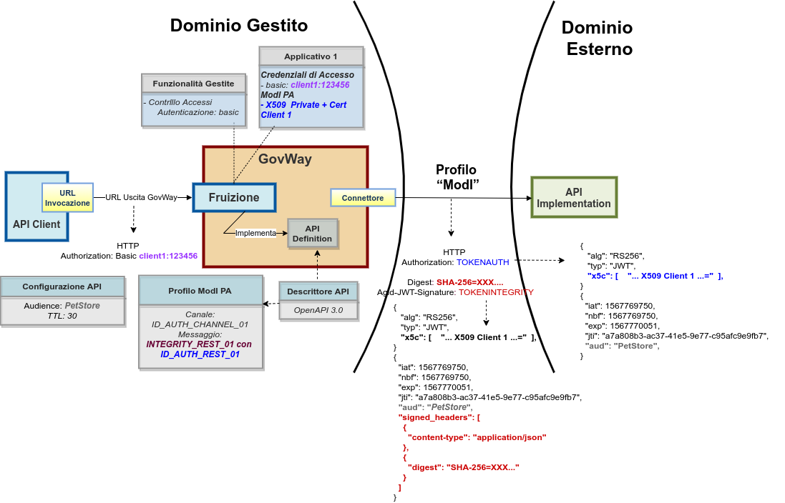

.. _scenari_fruizione_rest_modipa_integrity:

Fruizione API REST
======================

**Obiettivo** 

Fruire di un servizio REST, definito tramite una API REST (OpenAPI 3.0), accessibile in accordo al pattern di sicurezza 'INTEGRITY_REST_01' descritto nella sezione :ref:`modipa_idar03`.

**Sintesi**

Mostriamo in questa sezione come procedere per l'integrazione di un applicativo con un servizio REST erogato nel rispetto della normativa italiana alla base dell'interoperabilità tra i sistemi della pubblica amministrazione. In particolare andiamo ad illustrare lo scenario, tra quelli prospettati nel Modello di Interoperabilità di AGID, che prevede oltre a garantire l'autenticazione dell'interlocutore un supporto a garanzia dell'integrità del messaggio.

La figura seguente descrive graficamente questo scenario.

 Fruizione di una API REST con profilo 'ModI', pattern INTEGRITY_REST_01 con ID_AUTH_REST_01

Le caratteristiche principali di questo scenario sono:

1. un applicativo fruitore che dialoga con il servizio erogato in modalità ModI in accordo ad una API condivisa;
2. la comunicazione diretta verso il dominio erogatore veicolata su un canale gestito con il pattern di sicurezza canale "ID_AUTH_CHANNEL_02";
3. l'autenticità della comunicazione tra fruitore ed erogatore è garantita tramite sicurezza a livello messaggio con pattern "ID_AUTH_REST_01";
4. l'integrità del messaggio scambiato è garantita tramite sicurezza messaggio aggiuntiva prevista nel pattern "INTEGRITY_REST_01".

.. toctree::
    :maxdepth: 2

    esecuzione
    configurazione
