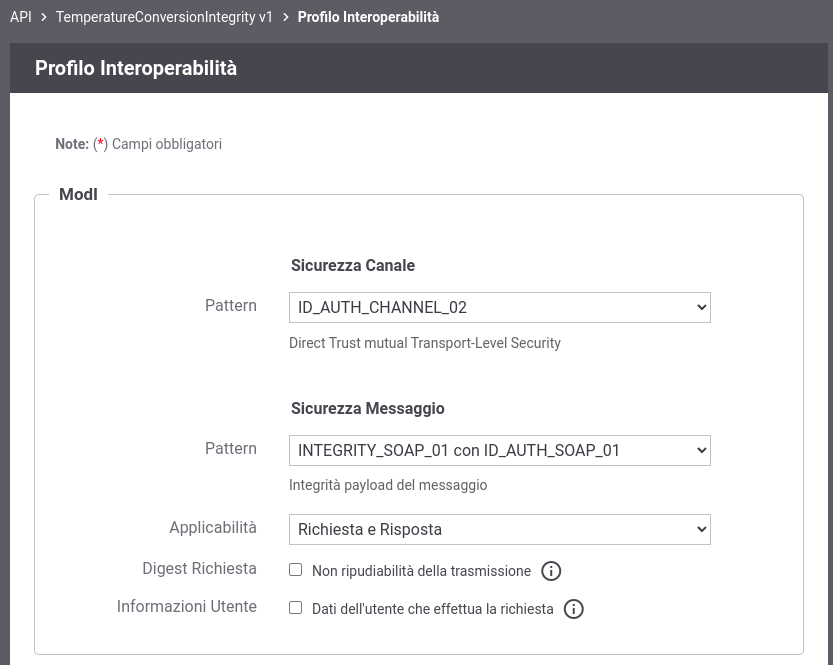

.. _scenari_fruizione_soap_modipa_integrity_configurazione:

Configurazione
--------------

.. note::

  Per operare con la govwayConsole in modo conforme a quanto previsto dalla specifica del Modello di Interoperabilità si deve attivare, nella testata dell'interfaccia, il Profilo di Interoperabilità "ModI". Si suggerisce inoltre di selezionare il soggetto 'Ente' per visualizzare solamente le configurazioni di interesse allo scenario e nascondere le configurazioni "di servizio" necessarie ad implementare la controparte.

  .. figure:: ../../../_figure_scenari/modipa_profilo.png
   :scale: 80%
   :align: center
   :name: modipa_profilo_f_soap_integrity_fig

   Profilo ModI della govwayConsole

La configurazione dello scenario è del tutto analogo a quello descritto nello scenario :ref:`scenari_fruizione_soap_modipa_auth_configurazione` con le sole differenze dovuto al differente pattern di sicurezza utilizzato "INTEGRITY_SOAP_01 con ID_AUTH_SOAP_01".

**Registrazione API**

Viene registrata l'API "CreditCardVerificationIntegrity" con il relativo descrittore WSDL. Vengono selezionati i pattern "ID_AUTH_CHANNEL_02" (sicurezza canale) e "INTEGRITY_SOAP_01 con ID_AUTH_SOAP_01"  (sicurezza messaggio) nella sezione "ModI" (:numref:`modipa_profili_api_soap_integrity_fr_fig`).

 Configurazione Pattern ModI "INTEGRITY_SOAP_01 con ID_AUTH_SOAP_01"  sulla API SOAP

**Fruizione**

Si registra la fruizione SOAP 'LuhnCheckerSoapIntegrity', relativa all'API precedentemente inserita, indicando i dati specifici nella sezione "ModI Richiesta" (:numref:`modipa_fruizione_richiesta_soap_integrity_fig`).

   .. figure:: ../../../_figure_scenari/modipa_fruizione_richiesta_soap.png
    :scale: 80%
    :align: center
    :name: modipa_fruizione_richiesta_soap_integrity_fig

    Configurazione richiesta della fruizione

La sezione "ModI Risposta" definisce i criteri per la validazione dei messaggi di risposta (:numref:`modipa_fruizione_risposta_soap_integrity_fig`).

   .. figure:: ../../../_figure_scenari/modipa_fruizione_risposta_soap.png
    :scale: 80%
    :align: center
    :name: modipa_fruizione_risposta_soap_integrity_fig

    Configurazione risposta della fruizione
