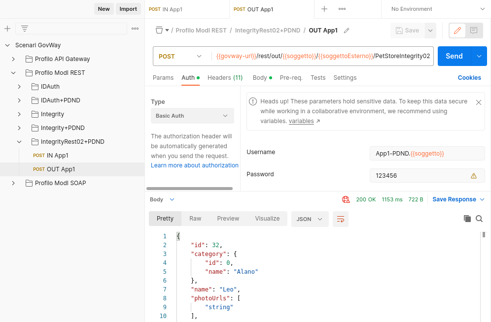
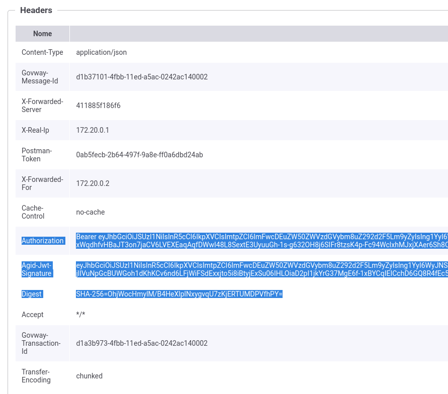
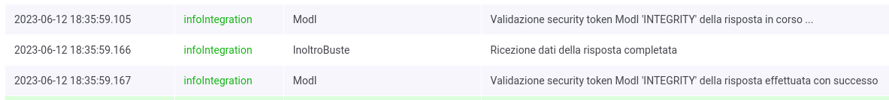
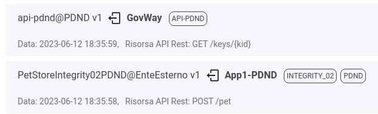

.. _scenari_fruizione_rest_modipa_integrity_02_esecuzione:

Esecuzione
----------

.. note::

  Al fine di avere una consultazione immediata delle informazioni di interesse per lo scenario si consiglia di impostare, nella console 'govwayMonitor', nel menù in alto a destra il Profilo di Interoperabilità 'ModI'. Si suggerisce inoltre di selezionare il soggetto 'Ente' per visualizzare solamente le transazioni di interesse allo scenario e ignorare le transazioni "di servizio" necessarie ad implementare la controparte.

  .. figure:: ../../../_figure_scenari/modipa_profilo_monitor.png
   :scale: 80%
   :align: center
   :name: modipa_profilo_monitor_f_integrity_02_fig

   Profilo ModI della govwayMonitor

L'esecuzione dello scenario è del tutto analogo a quello descritto nello scenario :ref:`scenari_fruizione_rest_modipa_auth_pdnd_esecuzione` con la sola eccezione del pattern di sicurezza aggiuntivo utilizzato in questo scenario: "INTEGRITY_REST_02".

Per eseguire e verificare lo scenario si può utilizzare il progetto Postman a corredo con la request "Profilo ModI REST - IntegrityRest02+PDND - OUT App1" che è stata preconfigurata per il funzionamento con le caratteristiche descritte sopra.

 Pattern IntegrityRest02+PDND - Fruizione API REST, esecuzione da Postman

Dopo aver eseguito la "Send" e verificato il corretto esito dell'operazione è possibile andare a verificare cosa è accaduto nelle diverse fasi dell'esecuzione andando a consultare la console 'govwayMonitor'.

Le verifiche da effettuare sono le medesime di quelle descritte nello scenario :ref:`scenari_fruizione_rest_modipa_auth_pdnd_esecuzione`. Di seguito vengono riportati solo i punti salienti in cui emerge una differenza dovuta al pattern di sicurezza diverso utilizzato.

- Il messaggio di richiesta inviato dal fruitore viene elaborato da Govway che, tramite la configurazione della firma digitale associata all'applicativo mittente, è in grado di produrre un token di sicurezza da inviare alla PDND con il quale ottenere indietro un voucher spendibile per il servizio desiderato. Questa parte è stata ampiamente mostrata nella scenario :ref:`scenari_fruizione_rest_modipa_auth_pdnd_esecuzione`.

  Oltre al token della PDND, GovWay produce un ulteriore token di sicurezza "Agid-JWT-Signature" previsto dal pattern "INTEGRITY_REST_02". Da govwayMonitor si può visualizzare il messaggio di richiesta in uscita che è il medesimo di quello in entrata con la differenza che sono stati aggiunti gli header HTTP "Authorization" e "Agid-Jwt-Signature" che contengono rispettivamente il token ottenuto dalla PDND e il token dell'integrità. È inoltre presente l'header http "Digest" che contiene il valore utilizzabile dall'erogatore per la verifica dell'integrità del payload. (:numref:`modipa_fruizione_messaggio_richiesta_integrity_02_fig`).

 Messaggio di richiesta in uscita (con token di sicurezza inseriti nell'header HTTP)

- L'header e i payload del token "Agid-JWT-Signature" sono identici a quelli già visualizzati nello scenario di erogazione REST, relativamente al messaggio in ingresso (:numref:`modipa_jwtio_header_integrity02_fig` e :numref:`modipa_jwtio_payload_integrity02_fig`).
  Le informazioni inserite nel token vengono anche tracciate e sono visibili sulla govwayMonitor, andando a consultare la traccia del messaggio di richiesta (:numref:`modipa_traccia_richiesta_fruitore_integrity_02_fig`). Nella sezione "Sicurezza Messaggio" sono riportate le informazioni estratte dai token di sicurezza, tra cui si può notare il digest e gli header http firmati.

.. figure:: ../../../_figure_scenari/modipa_traccia_richiesta_fruitore_integrity02.png
 :scale: 80%
 :align: center
 :name: modipa_traccia_richiesta_fruitore_integrity_02_fig

 Traccia della richiesta generata dal fruitore

- Vengono inoltre validati anche gli header "Agid-Jwt-Signature" e "Digest" presenti nella risposta rispetto al pattern 'INTEGRITY_REST_02' indicato nella configurazione dell'API (:numref:`modipa_pdnd_integrity_token_response_1`). La validazione del token di integrità della risposta viene effettuata scaricando la chiave pubblica, corrispondente al kid presente nel token, tramite le :ref:`modipa_passiPreliminari_api_pdnd`. Nello storico delle transazioni è possibile vedere come GovWay durante la gestione della richiesta di fruizione scaturisca un'ulteriore chiamata verso la PDND per ottenere la chiave pubblica (:numref:`modipa_pdnd_integrity_token_2`). La chiave pubblica una volta prelevata dalla PDND verrà aggiunta in una cache locale e le successive richieste non provocheranno ulteriori chiamate verso la PDND.

 Evidenza diagnostica della validazione del token di integrità della risposta

 Evidenza diagnostica della chiamata verso la PDND per ottenere la chiave pubblica con cui è stato firmato il token integrity di risposta

.. note::

  Le informazioni ottenute tramite le :ref:`modipa_passiPreliminari_api_pdnd` (chiavi pubbliche JWK) vengono salvate su cache locali. Al fine di forzare nuove invocazioni verso la "PDND simulata" è necessario attendere un minuto rispetto a precedenti invocazioni ed effettuare il reset delle cache locali di GovWay accedendo alla sezione :ref:`strumenti_runtime` della console di gestione '*govwayConsole*' e cliccando sul link '*Svuota tutte le Cache*'.

**Conformità ai requisiti ModI**

I requisiti iniziali, legati alla comunicazione basata su uno scenario ModI, sono verificati dalle seguenti evidenze:

1. Viene effettuata una negoziazione del voucher PDND come mostrato nelle tracce relative ai token scambiati con la PDND.

2. L'invocazione del servizio avviene fornendo il voucher della PDND precedentemente negoziato.

3. Vengono inoltre prodotti gli header http "Agid-Jwt-Signature" e "Digest" previsti dal pattern di sicurezza "INTEGRITY_REST_02"

4. La validazione del token di integrità della risposta viene effettuata scaricando la chiave pubblica, corrispondente al kid presente nel token, tramite le :ref:`modipa_passiPreliminari_api_pdnd`.
