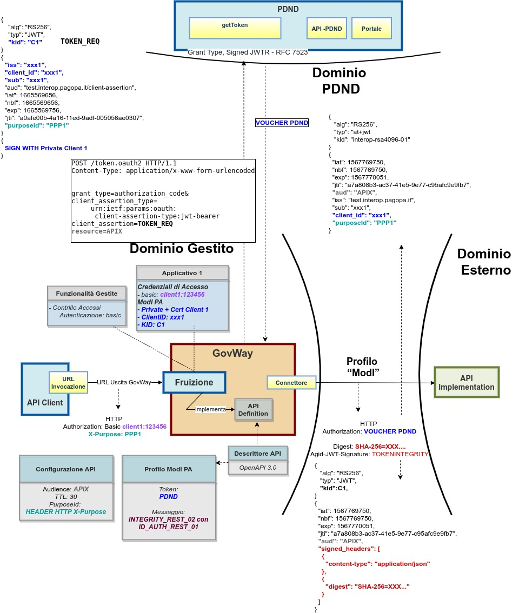
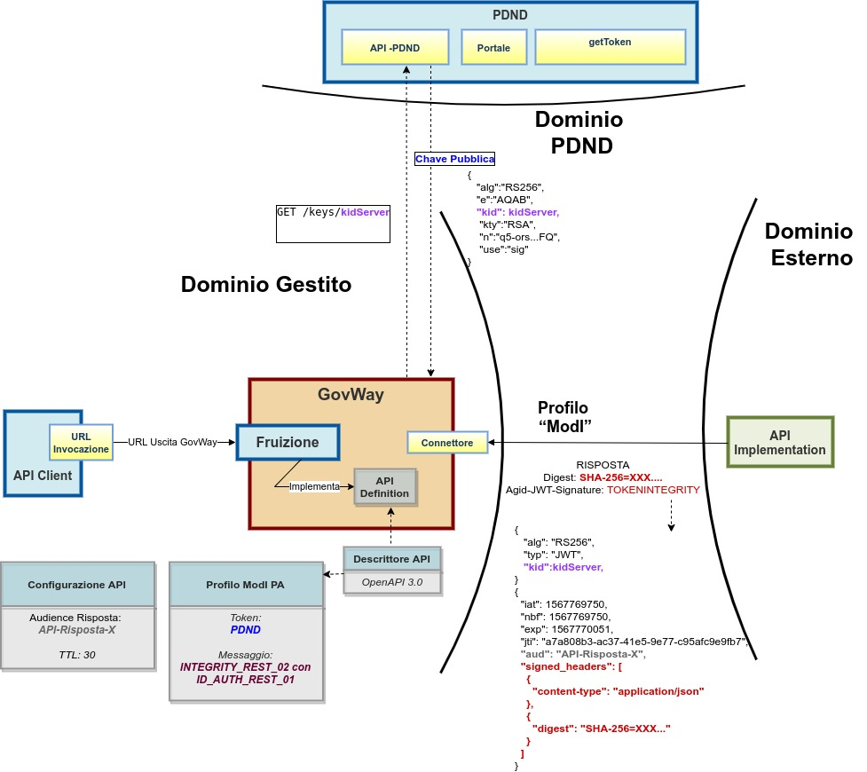

.. _scenari_fruizione_rest_modipa_integrity_02:

Fruizione API REST
======================

**Obiettivo** 

Fruire di un servizio REST, definito tramite una API REST (OpenAPI 3.0), accessibile in accordo al pattern di sicurezza descritto nella sezione :ref:`modipa_idar04`.

**Sintesi**

Mostriamo in questa sezione come procedere per l'integrazione di un applicativo con un servizio REST erogato nel rispetto della normativa italiana alla base dell'interoperabilità tra i sistemi della pubblica amministrazione. In particolare andiamo ad illustrare lo scenario in cui il servizio è stato registrato sulla PDND, e il fruitore per poterlo fruire deve ottenere un voucher dalla PDND che successivamente deve inviare all'erogatore insieme alla normale richiesta di servizio. Oltre al voucher il fruitore devo anche presentare il token di sicurezza "Agid-JWT-Signature" previsto dal pattern "INTEGRITY_REST_02" a garanzia dell'integrità del messaggio.

La figura seguente descrive graficamente questo scenario.

 Fruizione di una API REST con profilo 'ModI', pattern INTEGRITY_REST_02 e pattern ID_AUTH_REST_01 via PDND

Nella figura ':numref:`fruizione_modipa_integrity_02_risposta_fig`' viene raffigurato lo scenario di fruizione durante la fase di validazione del token di risposta tramite un truststore dinamico in cui GovWay utilizza le :ref:`modipa_passiPreliminari_api_pdnd` per ottenere la chiave pubblica necessaria a validare il token di risposta.

 Fruizione con Profilo di Interoperabilità 'ModI', pattern 'INTEGRITY_REST_02': utilizzo delle API PDND per ottenere la chiave pubblica per validare la risposta

Le caratteristiche principali di questo scenario sono:

1. Un applicativo fruitore che dialoga con il servizio erogato in modalità ModI in accordo ad una API condivisa e pubblicata su PDND.
2. La comunicazione diretta verso il dominio erogatore veicolata su un canale gestito con il pattern di sicurezza canale "ID_AUTH_CHANNEL_01"
3. L'autenticità della comunicazione tra il servizio erogato e ciascun fruitore è garantita tramite sicurezza a livello messaggio con pattern "ID_AUTH_REST_01 via PDND".
4. L'integrità del messaggio scambiato è garantita tramite sicurezza messaggio aggiuntiva prevista nel pattern "INTEGRITY_REST_02"
5. La validazione del token di integrità della risposta viene effettuata scaricando la chiave pubblica, corrispondente al kid presente nel token, tramite le :ref:`modipa_passiPreliminari_api_pdnd`.

.. toctree::
    :maxdepth: 2

    esecuzione
    configurazione
