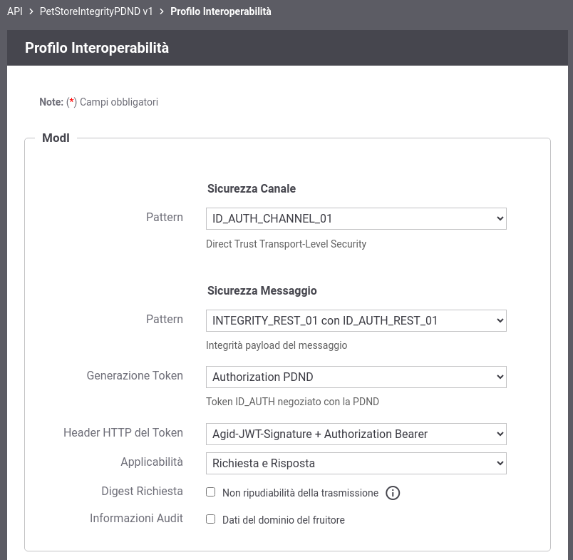
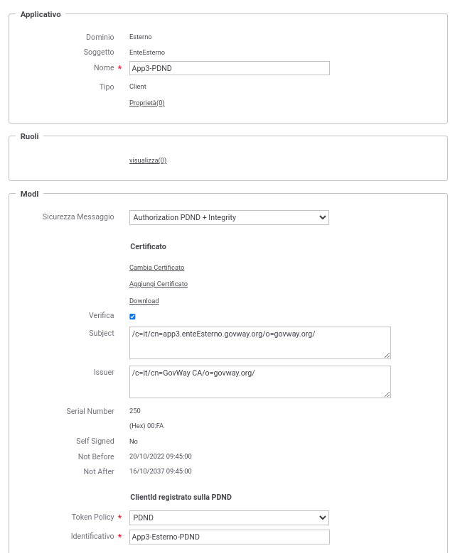
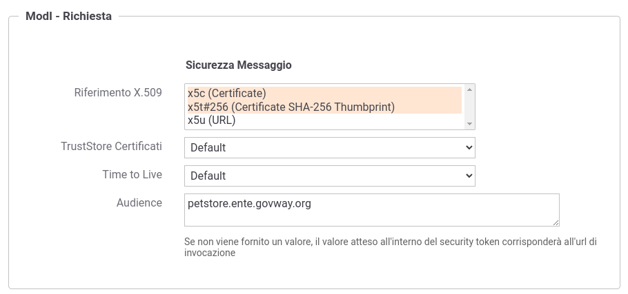
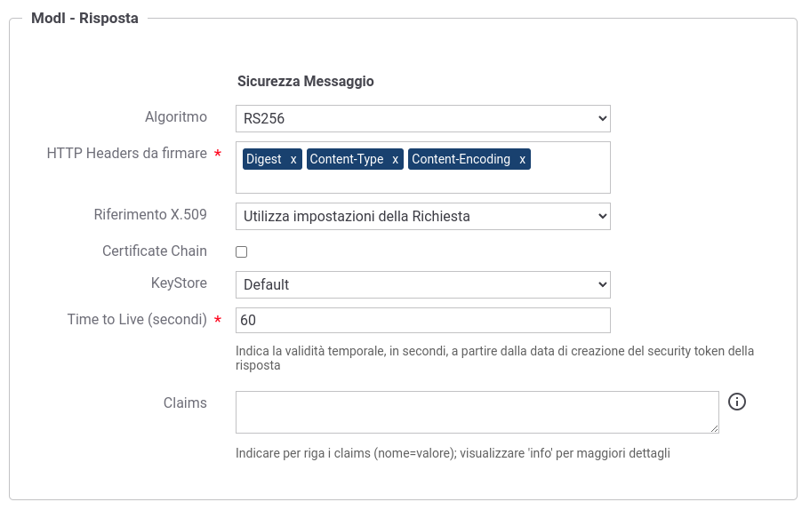

.. _scenari_erogazione_rest_modipa_integrity_pdnd_configurazione:

Configurazione
--------------

.. note::

  Per operare con la govwayConsole in modo conforme a quanto previsto dalla specifica del Modello di Interoperabilità si deve attivare, nella testata dell'interfaccia, il Profilo di Interoperabilità 'ModI'. Si suggerisce inoltre di selezionare il soggetto 'Ente' per visualizzare solamente le configurazioni di interesse allo scenario e nascondere le configurazioni "di servizio" necessarie ad implementare la controparte.

  .. figure:: ../../../_figure_scenari/modipa_profilo.png
   :scale: 80%
   :align: center
   :name: modipa_profilo_integrity_pdnd_fig

   Profilo ModI della govwayConsole

La configurazione dello scenario è del tutto analogo a quello descritto nello scenario :ref:`scenari_erogazione_rest_modipa_auth_pdnd_configurazione` con la sola eccezione del pattern di sicurezza aggiuntivo utilizzato in questo scenario: "INTEGRITY_REST_01".

**Registrazione API**

Viene registrata l'API "PetStoreIntegrityPDND" con il relativo descrittore OpenAPI 3. Vengono selezionati i pattern "ID_AUTH_CHANNEL_01" (sicurezza canale) e "INTEGRITY_REST_01 con ID_AUTH_REST_01" (sicurezza messaggio) nella sezione "ModI" (:numref:`modipa_profili_api_integrity_fig`). Viene inoltre indicato di utilizzare il solo header HTTP 'Agid-JWT-Signature'.

 Configurazione Pattern ModI "INTEGRITY_REST_01 con ID_AUTH_REST_01" sulla API REST con utilizzo del solo header HTTP 'Agid-JWT-Signature'

**Applicativo Esterno**

È opzionalmente possibile registrare l'applicativo esterno che corrisponde al fruitore del servizio come descritto nello scenario nello scenario :ref:`scenari_erogazione_rest_modipa_auth_pdnd_configurazione`.

La registrazione comporta l'associazione all'applicativo sia del 'client_id' necessario all'identificazione che del certificato di firma che verrà atteso nell'header HTTP 'Agid-JWT-Signature' (:numref:`modipa_applicativo_esterno_integrity_pdnd_fig`). Questo scenario è quello preconfigurato.

 Configurazione applicativo esterno (fruitore)

**Erogazione**

Nell'erogazione "PetStoreIntegrityPDND", relativa all'API precedentemente inserita, vanno indicati i dati specifici nella sezione "ModI Richiesta" (:numref:`modipa_erogazione_richiesta_integrity_pdnd_fig`) necessari per validare le richieste in ingresso relativamente al token 'Agid-JWT-Signature'.

 Configurazione richiesta dell'erogazione

La sezione "ModI Risposta" si utilizza per indicare i parametri per la produzione del token di sicurezza 'Agid-JWT-Signature' da inserire nel messaggio di risposta (:numref:`modipa_erogazione_risposta_integrity_pdnd_fig`).

 Configurazione risposta dell'erogazione

