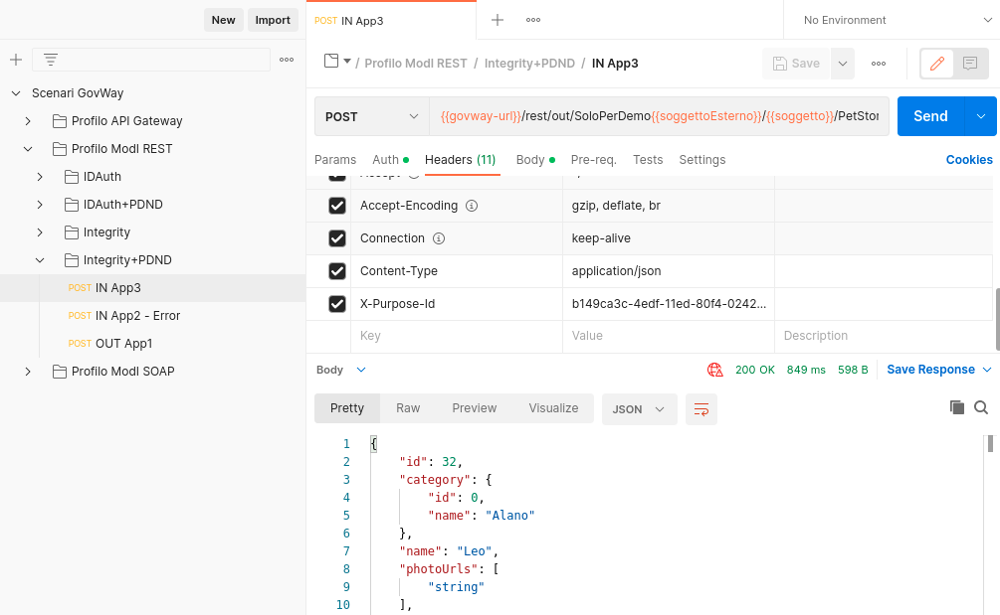
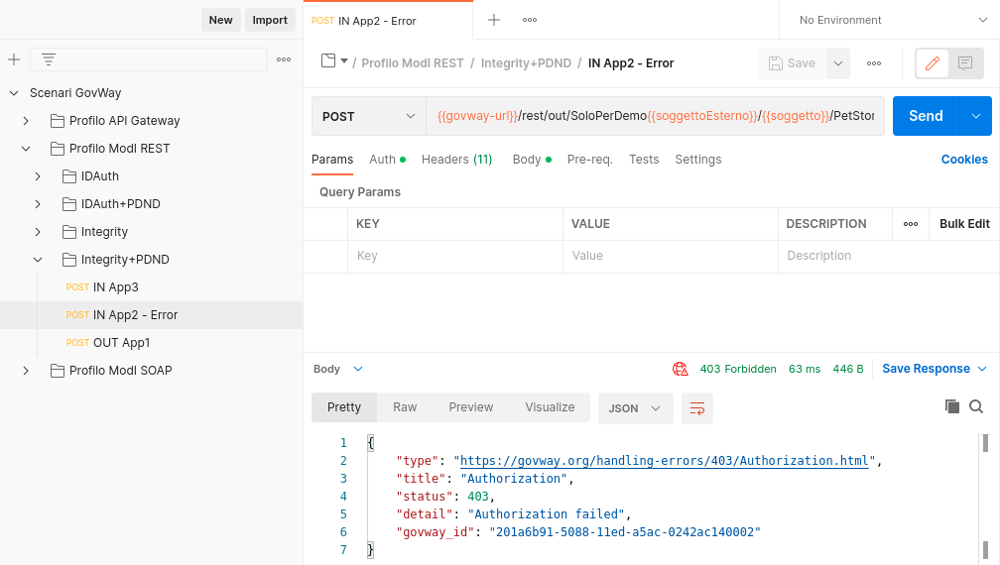

.. _scenari_erogazione_rest_modipa_integrity_pdnd_esecuzione:

Esecuzione
----------

.. note::

  Al fine di avere una consultazione immediata delle informazioni di interesse per lo scenario si consiglia di impostare, nella console 'govwayMonitor', nel menù in alto a destra il Profilo di Interoperabilità 'ModI'. Si suggerisce inoltre di selezionare il soggetto 'Ente' per visualizzare solamente le transazioni di interesse allo scenario e ignorare le transazioni "di servizio" necessarie ad implementare la controparte.

  .. figure:: ../../../_figure_scenari/modipa_profilo_monitor.png
   :scale: 80%
   :align: center
   :name: modipa_profilo_monitor_integrity_pdnd_fig

   Profilo ModI della govwayMonitor

L'esecuzione dello scenario è del tutto analogo a quello descritto nello scenario :ref:`scenari_erogazione_rest_modipa_auth_pdnd_esecuzione` con la sola eccezione del pattern di sicurezza aggiuntivo utilizzato in questo scenario: "INTEGRITY_REST_01".

Per eseguire e verificare lo scenario si può utilizzare il progetto Postman a corredo con la request "Profilo ModI REST - Integrity+PDND - IN App3" che è stata preconfigurata per il funzionamento con le caratteristiche descritte sopra.

 Pattern Integrity+PDND - Erogazione API REST, esecuzione da Postman

Dopo aver eseguito la "Send" e verificato il corretto esito dell'operazione è possibile andare a verificare cosa è accaduto, nel corso dell'elaborazione della richiesta, andando a consultare la console 'govwayMonitor'.

Le verifiche da effettuare sono le medesime di quelle descritte nello scenario :ref:`scenari_erogazione_rest_modipa_auth_pdnd_esecuzione`. Di seguito vengono riportati solo i punti salienti in cui emerge una differenza dovuta al pattern di sicurezza diverso utilizzato.

- Dal dettaglio della richiesta si può visualizzare il messaggio che è stato inviato dal fruitore, come in :numref:`modipa_erogazione_messaggio_richiesta_integrity_pdnd_fig`. Come si nota, al payload JSON è associato un insieme di header HTTP tra i quali "Authorization" e "Agid-Jwt-Signature" che contengono rispettivamente il token di sicurezza che il fruitore ha ottenuto dalla PDND e il token di integrità. È inoltre presente l'header http "Digest" che contiene il valore per la verifica dell'integrità del payload.

.. figure:: ../../../_figure_scenari/modipa_erogazione_messaggio_richiesta_integrity.png
 :scale: 80%
 :align: center
 :name: modipa_erogazione_messaggio_richiesta_integrity_pdnd_fig

 Messaggio inviato dal fruitore

- Tutte le analisi che riguardano il token di autenticazione generato dalla PDND sono le medesime descritte nello scenario :ref:`scenari_erogazione_rest_modipa_auth_pdnd_esecuzione`.

- Inoltre grazie alle configurazioni presenti nell'erogazione, ed in particolare alla relazione di trust stabilita con il fruitore, Govway è in grado di validare i dati di sicurezza ricevuti nel token "Agid-JWT-Signature". Nella fase di validazione del token si può notare come nella sezione header (:numref:`modipa_jwtio_header_integrity_pdnd_fig`) viene riportata l'identità del fruitore sotto forma di certificato X.509 a differenza di quello ottenuto dalla PDND.

.. figure:: ../../../_figure_scenari/modipa_jwtio_header.png
 :scale: 80%
 :align: center
 :name: modipa_jwtio_header_integrity_pdnd_fig

 Sezione "Header" del Token di sicurezza "Agid-Jwt-Signature"

 Nel payload del token "Agid-JWT-Signature" (:numref:`modipa_jwtio_payload_integrity_pdnd_fig`) sono invece presenti i riferimenti temporali (iat, nbf, exp), l'audience (aud) e il claim 'signed_headers' utilizzato per la verifica dell'integrità.

.. figure:: ../../../_figure_scenari/modipa_jwtio_payload_integrity.png
 :scale: 80%
 :align: center
 :name: modipa_jwtio_payload_integrity_pdnd_fig

 Sezione "Payload" del Token di sicurezza "Agid-Jwt-Signature"

- Il messaggio ricevuto dal Govway viene quindi validato, sulla base dei pattern di sicurezza previsti nello scambio, verificando in questo caso l'identità del fruitore, la validità temporale, la corrispondenza dell'audience ricevuto con quello atteso e la corrispondenza del digest con il payload e con il valore interno al token "Agid-Jwt-Signature". Solo in caso di superamento dell'intero processo di validazione, il messaggio viene inoltrato al servizio erogatore. 

  Le evidenze del processo di validazione relative al token PDND sono le medesime descritte nella scenario :ref:`scenari_erogazione_rest_modipa_auth_pdnd_esecuzione`. 

  Le evidenze del processo di validazione relativo al pattern "INTEGRITY_REST_01" sono visibili sulla govwayMonitor, andando a consultare la traccia del messaggio di richiesta (:numref:`modipa_traccia_richiesta_integrity_pdnd_fig`). Nella sezione "Sicurezza Messaggio" sono riportate le informazioni estratte dai token di sicurezza presenti, tra cui si può notare il digest e gli header http firmati.

.. figure:: ../../../_figure_scenari/modipa_traccia_richiesta_integrity.png
 :scale: 80%
 :align: center
 :name: modipa_traccia_richiesta_integrity_pdnd_fig

 Traccia della richiesta elaborata dall'erogatore

- Lo scenario è preconfigurato per autorizzare puntualmente l'applicativo 'App3-ModI' identificato grazie al claim 'client_id' presente all'interno del token della PDND. È possibile utilizzare il progetto Postman a corredo con la request "Profilo ModI REST - Integrity+PDND - IN App2 - Error" per verificare che una richiesta proveniente da un differente applicativo non viene autorizzata.

 Pattern Integrity+PDND - Erogazione API REST - Autorizzazione negata, esecuzione da Postman

**Conformità ai requisiti ModI**

I requisiti iniziali, legati alla comunicazione basata su uno scenario ModI, sono verificati dalle seguenti evidenze:

1. la sicurezza messaggio applicata è quella dei pattern "ID_AUTH_REST_01 via PDND" + "INTEGRITY_REST_01" come ampiamente mostrato precedentemente dove sono stati mostrati i token validati e i criteri autorizzativi;

2. l'identificazione del fruitore avviene rispetto al claim 'client_id' presente all'interno del token. È stato anche mostrato come sia possibile configurare criteri autorizzativi puntuali.
