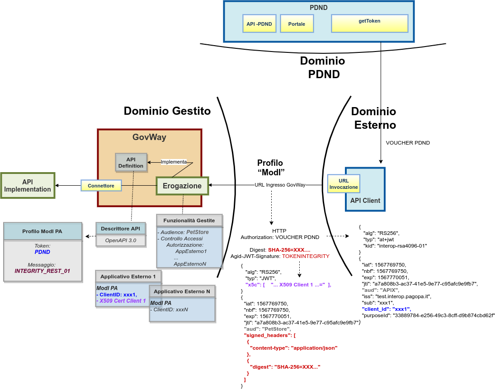

.. _scenari_erogazione_rest_modipa_integrity_pdnd:

Erogazione API REST
=======================

**Obiettivo** 

Esporre un servizio, definito tramite una API REST (OpenAPI 3.0), accessibile in accordo al pattern di sicurezza descritto nella sezione :ref:`modipa_pdnd_integrity`.

**Sintesi**

Mostriamo in questa sezione come procedere per l'esposizione di un servizio REST da erogare nel rispetto della normativa italiana alla base dell'interoperabilità tra i sistemi della pubblica amministrazione. In particolare andiamo ad illustrare lo scenario in cui un servizio è stato registrato sulla PDND, e i fruitori per poterlo fruire devono ottenere un voucher dalla PDND che successivamente devono inviare all'erogatore insieme alla normale richiesta di servizio.
Oltre al voucher devono anche presentare il token di sicurezza "Agid-JWT-Signature" previsto dal pattern "INTEGRITY_REST_01" a garanzia dell'integrità del messaggio.

La figura seguente descrive graficamente questo scenario.

 Erogazione di una API REST con profilo 'ModI', pattern INTEGRITY_REST_01 e pattern ID_AUTH_REST_01 via PDND

Le caratteristiche principali di questo scenario sono:

1. Un applicativo eroga un servizio, rivolto a fruitori di domini esterni, in conformità al Modello di Interoperabilità AGID. Il servizio viene registrato sulla PDND.
2. La comunicazione con i domini esterni avviene su un canale gestito con il pattern di sicurezza canale "ID_AUTH_CHANNEL_01"
3. L'autenticità della comunicazione tra il servizio erogato e ciascun fruitore è garantita tramite sicurezza a livello messaggio con pattern "ID_AUTH_REST_01 via PDND".
4. L'integrità del messaggio scambiato è garantita tramite sicurezza messaggio aggiuntiva prevista nel pattern "INTEGRITY_REST_01"

.. toctree::
    :maxdepth: 2

    esecuzione
    configurazione
