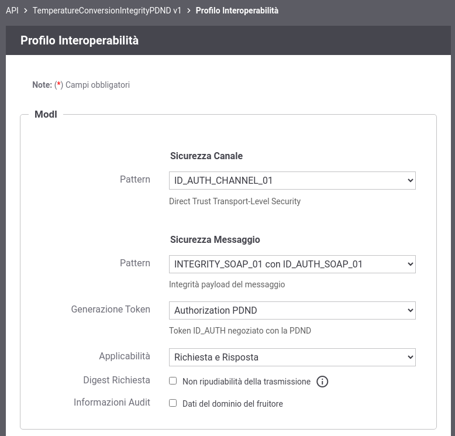

.. _scenari_erogazione_soap_modipa_integrity_pdnd_configurazione:

Configurazione
--------------

.. note::

  Per operare con la govwayConsole in modo conforme a quanto previsto dalla specifica del Modello di Interoperabilità si deve attivare, nella testata dell'interfaccia, il Profilo di Interoperabilità 'ModI'. Si suggerisce inoltre di selezionare il soggetto 'Ente' per visualizzare solamente le configurazioni di interesse allo scenario e nascondere le configurazioni "di servizio" necessarie ad implementare la controparte.

  .. figure:: ../../../_figure_scenari/modipa_profilo.png
   :scale: 80%
   :align: center
   :name: modipa_profilo_soap_integrity_pdnd_fig

   Profilo ModI della govwayConsole

Il processo di configurazione per questo scenario è del tutto analogo a quello descritto per lo scenario :ref:`scenari_erogazione_soap_modipa_auth_pdnd_configurazione` con la sola eccezione del pattern di sicurezza aggiuntivo utilizzato in questo scenario: "INTEGRITY_SOAP_01".

**Registrazione API**

Viene registrata l'API "CreditCardVerificationIntegrityPDND" con il relativo descrittore WSDL. Vengono selezionati i pattern "ID_AUTH_CHANNEL_01" (sicurezza canale) e "INTEGRITY_SOAP_01 con ID_AUTH_SOAP_01"  (sicurezza messaggio) nella sezione "ModI" (:numref:`modipa_profili_api_soap_integrity_pdnd_fig`).

 Configurazione Pattern ModI "INTEGRITY_SOAP_01 con ID_AUTH_SOAP_01" sulla API SOAP

**Erogazione**

Nell'erogazione SOAP 'LuhnCheckerSoapIntegrityPDND', relativa all'API precedentemente inserita, vanno indicati i dati specifici nella sezione "ModI Richiesta" (:numref:`modipa_erogazione_richiesta_soap_integrity_fig`) necessari per validare l'header WSSecurity previsto dal pattern "INTEGRITY_SOAP_01".

   .. figure:: ../../../_figure_scenari/modipa_erogazione_richiesta_soap_integrity_pdnd.png
    :scale: 80%
    :align: center
    :name: modipa_erogazione_richiesta_soap_integrity_pdnd_fig

    Configurazione richiesta dell'erogazione

La sezione "ModI Risposta" si utilizza per indicare i parametri per la produzione del token di sicurezza da inserire nel messaggio di risposta (:numref:`modipa_erogazione_risposta_soap_integrity_pdnd_fig`).

   .. figure:: ../../../_figure_scenari/modipa_erogazione_risposta_soap_integrity_pdnd.png
    :scale: 80%
    :align: center
    :name: modipa_erogazione_risposta_soap_integrity_pdnd_fig

    Configurazione risposta dell'erogazione
