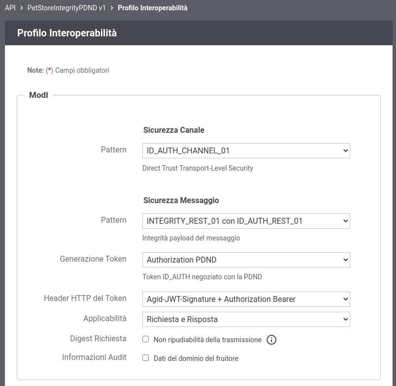
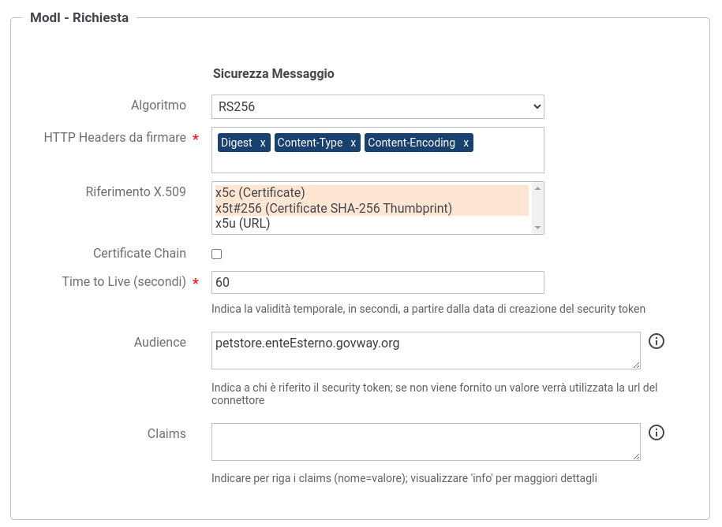
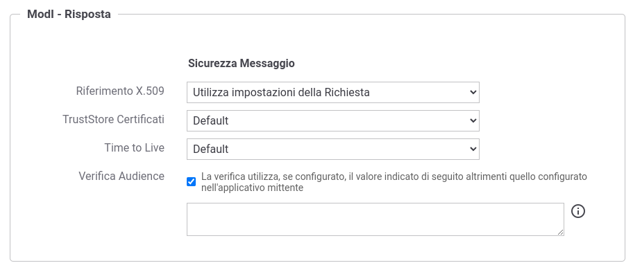

.. _scenari_fruizione_rest_modipa_integrity_pdnd_configurazione:

Configurazione
--------------

.. note::

  Per operare con la govwayConsole in modo conforme a quanto previsto dalla specifica del Modello di Interoperabilità si deve attivare, nella testata dell'interfaccia, il Profilo di Interoperabilità "ModI". Si suggerisce inoltre di selezionare il soggetto 'Ente' per visualizzare solamente le configurazioni di interesse allo scenario e nascondere le configurazioni "di servizio" necessarie ad implementare la controparte.

  .. figure:: ../../../_figure_scenari/modipa_profilo.png
   :scale: 80%
   :align: center
   :name: modipa_profilo_f_integrity_pdnd_fig

   Profilo ModI della govwayConsole

La configurazione dello scenario è del tutto analogo a quello descritto nello scenario :ref:`scenari_fruizione_rest_modipa_auth_pdnd_configurazione` con la sola eccezione del pattern di sicurezza aggiuntivo utilizzato in questo scenario: "INTEGRITY_REST_01".

**Registrazione API**

Viene registrata l'API "PetStoreIntegrityPDND" con il relativo descrittore OpenAPI 3. Vengono selezionati i pattern "ID_AUTH_CHANNEL_01" (sicurezza canale) e "INTEGRITY_REST_01 con ID_AUTH_REST_01" (sicurezza messaggio) nella sezione "ModI" (:numref:`modipa_profili_api_integrity_pdnd_fr_fig`). Viene inoltre indicato di utilizzare il solo header HTTP 'Agid-JWT-Signature'.

 Configurazione Pattern ModI "INTEGRITY_REST_01 con ID_AUTH_REST_01" sulla API REST con utilizzo del solo header HTTP 'Agid-JWT-Signature'

**Fruizione**

Nella fruizione "PetStoreIntegrityPDND", relativa all'API precedentemente inserita, vanno indicati i dati specifici nella sezione "ModI Richiesta" (:numref:`modipa_fruizione_richiesta_integrity_pdnd_fig`) necessari a generare il token 'Agid-JWT-Signature'. In particolare è possibile specificare l'audience atteso dall'erogatore e il tempo di validità del token.

 Configurazione richiesta della fruizione

La sezione "ModI Risposta" definisce i criteri per la validazione del token di sicurezza 'Agid-JWT-Signature' presente nel messaggio di risposta, come il truststore per l'autenticazione dell'erogatore (:numref:`modipa_fruizione_risposta_integrity_pdnd_fig`).

 Configurazione risposta della fruizione

