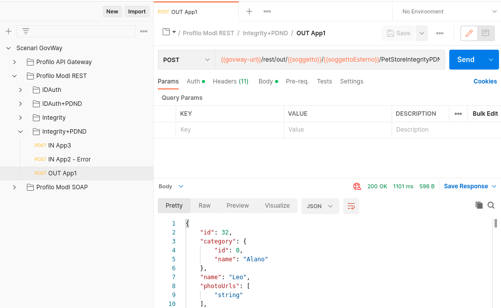
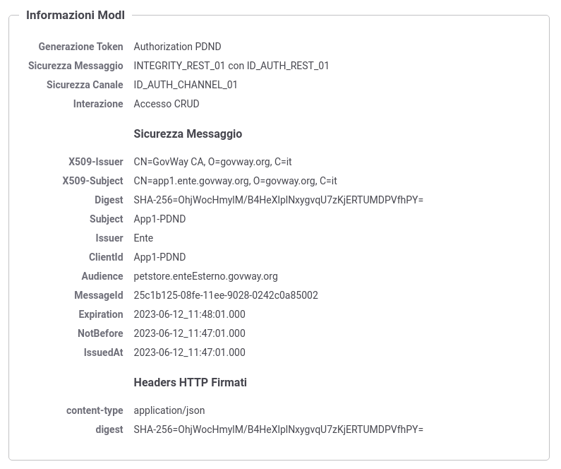

.. _scenari_fruizione_rest_modipa_integrity_pdnd_esecuzione:

Esecuzione
----------

.. note::

  Al fine di avere una consultazione immediata delle informazioni di interesse per lo scenario si consiglia di impostare, nella console 'govwayMonitor', nel menù in alto a destra il Profilo di Interoperabilità 'ModI'. Si suggerisce inoltre di selezionare il soggetto 'Ente' per visualizzare solamente le transazioni di interesse allo scenario e ignorare le transazioni "di servizio" necessarie ad implementare la controparte.

  .. figure:: ../../../_figure_scenari/modipa_profilo_monitor.png
   :scale: 80%
   :align: center
   :name: modipa_profilo_monitor_f_integrity_pdnd_fig

   Profilo ModI della govwayMonitor

L'esecuzione dello scenario è del tutto analogo a quello descritto nello scenario :ref:`scenari_fruizione_rest_modipa_auth_pdnd_esecuzione` con la sola eccezione del pattern di sicurezza aggiuntivo utilizzato in questo scenario: "INTEGRITY_REST_01".

Per eseguire e verificare lo scenario si può utilizzare il progetto Postman a corredo con la request "Profilo ModI REST - Integrity+PDND - OUT App1" che è stata preconfigurata per il funzionamento con le caratteristiche descritte sopra.

 Pattern Integrity+PDND - Fruizione API REST, esecuzione da Postman

Dopo aver eseguito la "Send" e verificato il corretto esito dell'operazione è possibile andare a verificare cosa è accaduto nelle diverse fasi dell'esecuzione andando a consultare la console 'govwayMonitor'.

Le verifiche da effettuare sono le medesime di quelle descritte nello scenario :ref:`scenari_fruizione_rest_modipa_auth_pdnd_esecuzione`. Di seguito vengono riportati solo i punti salienti in cui emerge una differenza dovuta al pattern di sicurezza diverso utilizzato.

- Il messaggio di richiesta inviato dal fruitore viene elaborato da Govway che, tramite la configurazione della firma digitale associata all'applicativo mittente, è in grado di produrre un token di sicurezza da inviare alla PDND con il quale ottenere indietro un voucher spendibile per il servizio desiderato. Questa parte è stata ampiamente mostrata nella scenario :ref:`scenari_fruizione_rest_modipa_auth_pdnd_esecuzione`.

  Oltre al token della PDND, GovWay produce un ulteriore token di sicurezza "Agid-JWT-Signature" previsto dal pattern "INTEGRITY_REST_01". Da govwayMonitor si può visualizzare il messaggio di richiesta in uscita che è il medesimo di quello in entrata con la differenza che sono stati aggiunti gli header HTTP "Authorization" e "Agid-Jwt-Signature" che contengono rispettivamente il token ottenuto dalla PDND e il token dell'integrità. È inoltre presente l'header http "Digest" che contiene il valore utilizzabile dall'erogatore per la verifica dell'integrità del payload. (:numref:`modipa_fruizione_messaggio_richiesta_integrity_pdnd_fig`).

.. figure:: ../../../_figure_scenari/modipa_erogazione_messaggio_richiesta_integrity.png
 :scale: 80%
 :align: center
 :name: modipa_fruizione_messaggio_richiesta_integrity_pdnd_fig

 Messaggio di richiesta in uscita (con token di sicurezza inseriti nell'header HTTP)

- L'header e i payload del token "Agid-JWT-Signature" sono identici a quelli già visualizzati nello scenario di erogazione REST, relativamente al messaggio in ingresso (:numref:`modipa_jwtio_header_integrity_pdnd_fig` e :numref:`modipa_jwtio_payload_integrity_pdnd_fig`).
  Le informazioni inserite nel token vengono anche tracciate e sono visibili sulla govwayMonitor, andando a consultare la traccia del messaggio di richiesta (:numref:`modipa_traccia_richiesta_fruitore_integrity_pdnd_fig`). Nella sezione "Sicurezza Messaggio" sono riportate le informazioni estratte dai token di sicurezza, tra cui si può notare il digest e gli header http firmati.

 Traccia della richiesta generata dal fruitore

**Conformità ai requisiti ModI**

I requisiti iniziali, legati alla comunicazione basata su uno scenario ModI, sono verificati dalle seguenti evidenze:

1. viene effettuata una negoziazione del voucher PDND come mostrato nelle tracce relative ai token scambiati con la PDND;

2. l'invocazione del servizio avviene fornendo il voucher della PDND precedentemente negoziato;

3. vengono inoltre prodotti gli header http "Agid-Jwt-Signature" e "Digest" previsti dal pattern di sicurezza "INTEGRITY_REST_01".
