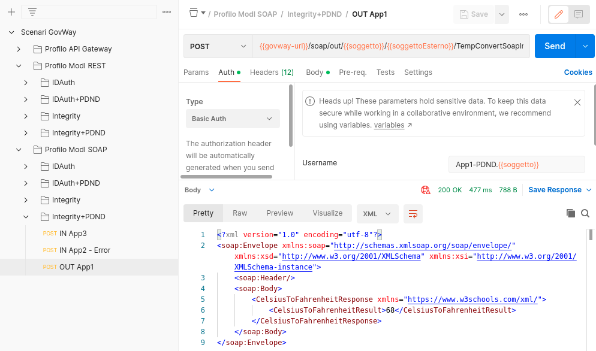

.. _scenari_fruizione_soap_modipa_integrity_pdnd_esecuzione:

Esecuzione
----------

.. note::

  Al fine di avere una consultazione immediata delle informazioni di interesse per lo scenario si consiglia di impostare, nella console 'govwayMonitor', nel menù in alto a destra il Profilo di Interoperabilità 'ModI'. Si suggerisce inoltre di selezionare il soggetto 'Ente' per visualizzare solamente le transazioni di interesse allo scenario e ignorare le transazioni "di servizio" necessarie ad implementare la controparte.

  .. figure:: ../../../_figure_scenari/modipa_profilo_monitor.png
   :scale: 80%
   :align: center
   :name: modipa_profilo_monitor_f_soap_integrity_pdnd_fig

   Profilo ModI della govwayMonitor

L'esecuzione dello scenario è del tutto analogo a quello descritto nello scenario :ref:`scenari_fruizione_soap_modipa_auth_pdnd_esecuzione` con la sola eccezione del pattern di sicurezza aggiuntivo utilizzato in questo scenario: "INTEGRITY_SOAP_01".

Per eseguire e verificare lo scenario si può utilizzare il progetto Postman a corredo con la request "Profilo ModI SOAP - Integrity+PDND - OUT App1" che è stata preconfigurata per il funzionamento con le caratteristiche descritte sopra.

 Pattern Integrity+PDND - Fruizione API SOAP, esecuzione da Postman

Dopo aver eseguito la "Send" e verificato il corretto esito dell'operazione è possibile andare a verificare cosa è accaduto, nel corso dell'elaborazione della richiesta, andando a consultare la console 'govwayMonitor'.

Le verifiche da effettuare sono le medesime di quelle descritte nello scenario :ref:`scenari_fruizione_soap_modipa_auth_pdnd_esecuzione`. Di seguito vengono riportati solo i punti salienti in cui emerge una differenza dovuta al pattern di sicurezza diverso utilizzato.

- Dal dettaglio della richiesta si può visualizzare il messaggio che è stato inviato all'erogatore, come in :numref:`modipa_fruizione_messaggio_richiesta_soap_integrity_pdnd_fig`. Come si nota, il messaggio SOAP contiene nell'header WS-Security sia il token di sicurezza (elemento "BinarySecurityToken") sia l'elemento "WSAddressing - To" e il digest del payload (elemento "DigestValue") prodotti dal fruitore con la relativa firma digitale (elemento "SignatureValue") come previsto dal pattern "INTEGRITY_SOAP_01".

 Messaggio inviato dal fruitore

**Conformità ai requisiti ModI**

La verifica dei requisiti ModI per questo scenario non differisce da quanto già descritto in :ref:`scenari_fruizione_rest_modipa_integrity_pdnd_esecuzione`.
