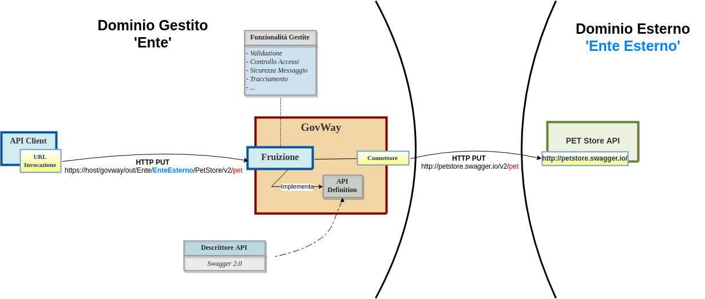
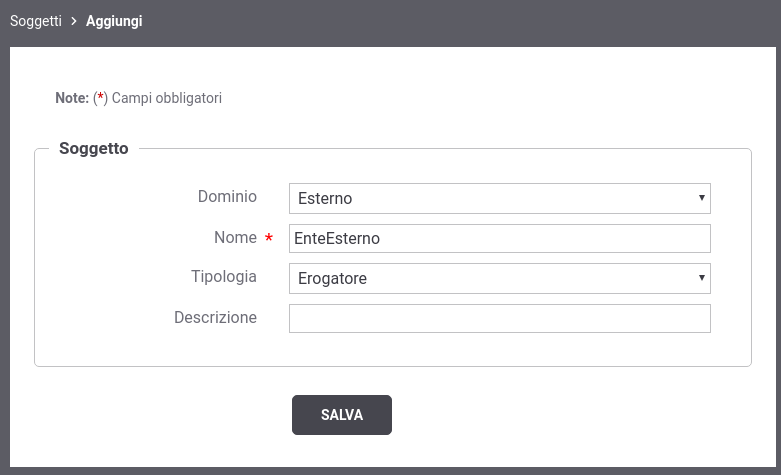
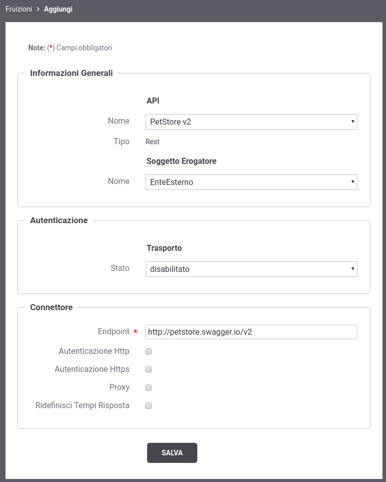
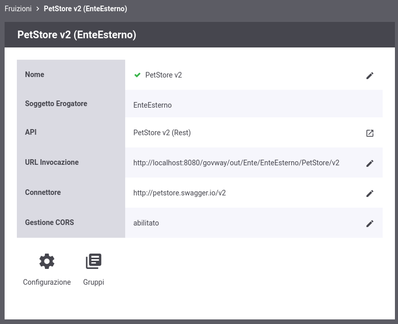

.. _fruizioneAPI:

Fruizione API
-------------

Procediamo adesso con la descrizione dei passi di configurazione
necessari, ad un applicativo client interno al dominio di gestione, per
poter fruire di una API REST esterna. L'API REST esterna utilizzata sarà
lo *Swagger Petstore* descritto in sezione :ref:`quickProfiloAPIGW` e poiché si suppone che tale
scenario sia già stato provato non è necessario registrare nuovamente
l'API.

In GovWay ad ogni dominio, interno o esterno, viene associato ad un
Soggetto. Nella sezione :ref:`quickMultitenant` viene descritto come registrare più soggetti
relativi a domini interni. In questo esempio, invece, procederemo con la
registrazione di un soggetto esterno che rappresenta il gestore del
dominio a cui appartiene il PetStore.

La fruizione di API, per questo primo esempio di utilizzo, viene
registrata in modo che sia accessibile in forma anonima da qualunque
client invocando l'url esposta da GovWay. Una rappresentazione di questo
scenario è mostrata nella :numref:`quick_fruizione_fig`.

    Fruizione di una API tramite GovWay

Per registrare l'API su Govway, utilizzando la console *govwayConsole*,
procedere come segue:

1. **Registrazione nuovo Soggetto del dominio esterno**

   Accedere alla sezione *'Soggetti'* e selezionare il pulsante
   *'Aggiungi'*. Fornire i seguenti dati:

   -  *Dominio*: selezionare la voce *'Esterno'*.

   -  *Nome*: indicare il nome del Soggetto che rappresenta il nuovo
      dominio esterno, ad esempio *'EnteEsterno'*.

   -  *Tipologia*: selezionare la voce *'Erogatore'*.

   -  *Descrizione*: opzionalmente è possibile fornire una descrizione
      generica del soggetto.

    Registrazione nuovo Soggetto

2. **Registrazione Fruizione**

   Accedere alla sezione *'Fruizioni'* e selezionare il pulsante
   *'Aggiungi'*. Fornire i seguenti dati:

   -  *API - Nome*: selezionare l'API precedentemente registrata
      *'PetStore v2'*.

   -  *Soggetto Erogatore - Nome*: selezionare il soggetto
      precedentemente registrato *'EnteEsterno'*.

   -  *Autenticazione - Stato*: per esporre l'API in modo che sia
      invocabile da qualunque client in forma anonima selezionare lo
      stato *'disabilitato'*.

   -  *Connettore - Endpoint*: indicare la *base uri* dove viene erogata
      l'API nel dominio esterno. Per il nostro esempio utilizzare la
      url:

      -  *http://petstore.swagger.io/v2*

    Registrazione di una fruizione di API

Effettuato il salvataggio, l'API erogata sarà consultabile
   all'interno dell'elenco delle fruizioni. Accedendo al dettaglio si
   potrà conoscere l'\ *url di invocazione* che deve essere comunicata
   ai client che desiderano invocare l'API.

    URL di Invocazione dell'API fruita

3. **Invocazione API tramite GovWay**

   Al termine di questi passi di configurazione il servizio REST sarà
   raggiungibile dai client utilizzando l'url di invocazione:

   -  *http://host:port/govway/out/<soggetto-dominio-interno>/EnteEsterno/PetStore/v2/<uri-risorsa>*

       **Soggetto Interno al Dominio**

       In questo esempio si suppone che il nome del soggetto fornito
       durante la fase di installazione di GovWay sia *Ente*.

   ::

       curl -v -X PUT "http://127.0.0.1:8080/govway/out/Ente/EnteEsterno/PetStore/v2/pet" \
       -H "accept: application/json" \
       -H "Content-Type: application/json" \
       -d '{
               "id": 3,
               "category": { "id": 22, "name": "dog" },
               "name": "doggie",
               "photoUrls": [ "http://image/dog.jpg" ],
               "tags": [ { "id": 23, "name": "white" } ],
               "status": "available"
       }'

   L'esito dell'aggiornamento viene confermato con un codice http 200 e
   una risposta json equivalente alla richiesta:

   ::

       HTTP/1.1 200 OK
       Access-Control-Allow-Origin: *
       Access-Control-Allow-Methods: GET, POST, DELETE, PUT
       Access-Control-Allow-Headers: Content-Type, api_key, Authorization
       Content-Type: application/json
       Transfer-Encoding: chunked
       Server: GovWay
       GovWay-Message-ID: 84e1d9a4-c181-436f-b7f0-4cabf55c370d
       GovWay-Transaction-ID: 6c13b9ac-3d60-45a6-9130-297a4d832824

       {
           "id":3,
           "category":{"id":22,"name":"dog"},
           "name":"doggie",
           "photoUrls":["http://image/dog.jpg"],
           "tags":[{"id":23,"name":"white"}],
           "status":"available"
       }

4. **Consultazione Tracce**

   Attraverso la console *govwayMonitor* è possibile consultare lo
   storico delle transazioni che sono transitate nel gateway e
   recuperare i dettagli di una singola invocazione cosi come già
   descritto nella sezione :ref:`erogazioneREST`.
