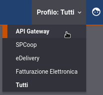

.. _quickProfiloAPIGW_introduzione:

===================
Introduzione
===================

Gli scenari applicativi che descriviamo in questa sezione mostrano come configurare
l'API Gateway per gestire qualunque generica API basata su scambio di
messaggi SOAP e REST.

**Profilo di Utilizzo delle Console**

Prima di procedere con gli scenari descritti nei successivi
paragrafi selezionare il profilo *API Gateway* nell'apposito menù
situato in alto a destra presente nell'intestazione delle console.

    Selezione del profilo **API Gateway**

.. toctree::
        :maxdepth: 2

        riferimentoRest
	riferimentoSoap
