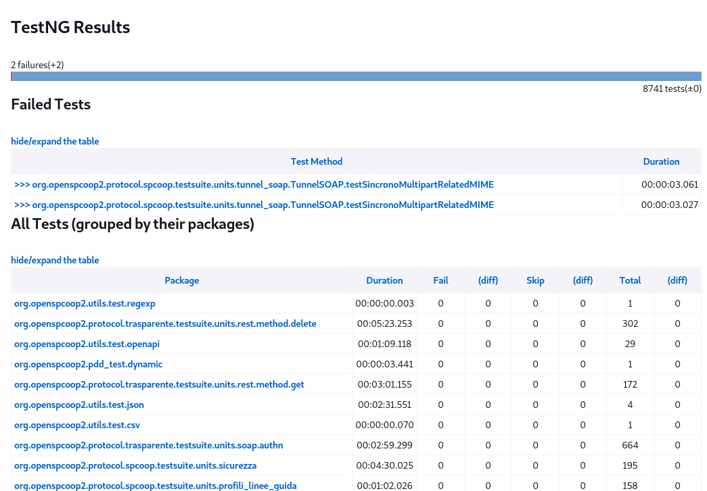
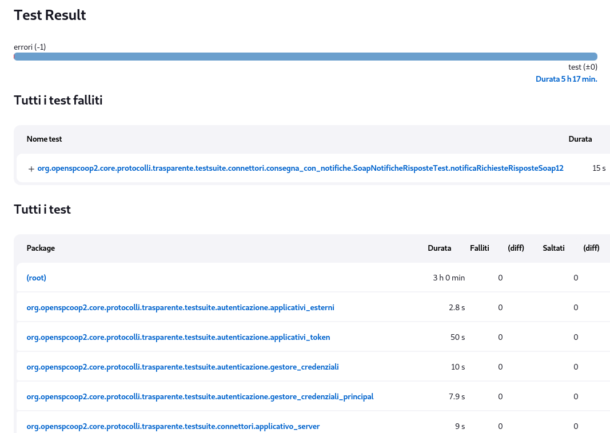
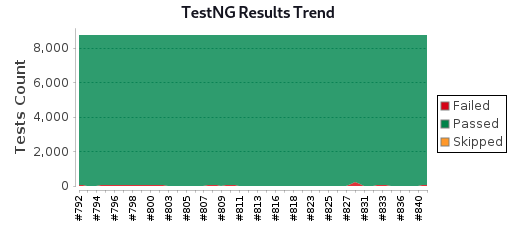
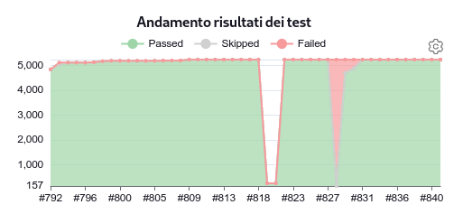
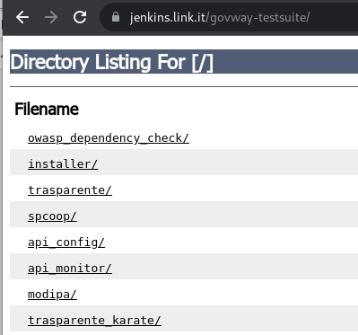

.. _releaseProcessGovWay_dynamicAnalysis_ci:

Functional tests
~~~~~~~~~~~~~~~~~~~~~~~~~~~~~~~~~~~~~~

Ad ogni commit sul `master dei sorgenti del progetto <https://github.com/link-it/govway/>`_ vengono avviati test mirati ad identificare problematiche e vulnerabilità del software.

Vengono eseguiti oltre 8.700 test realizzati con il tool `TestNG <https://testng.org/doc/>`_ ed oltre 5.300 test realizzati tramite i tool `JUnit <https://junit.org/junit4/>`_ e `Karate <https://karatelabs.github.io/karate/>`_ i cui sorgenti sono disponibili pubblicamente sul `repository dei sorgenti del progetto <https://github.com/link-it/govway/>`_ nei seguenti path:

- test che verificano le utilità di base del progetto (certificati, firma, cifratura ...) risiedono in `tools/utils/src/org/openspcoop2/utils/test <https://github.com/link-it/govway/tree/master/tools/utils/src/org/openspcoop2/utils/test>`_ e `core/src/org/openspcoop2/pdd_test <https://github.com/link-it/govway/tree/master/core/src/org/openspcoop2/pdd_test>`_;

- test mirati a verificare svariate funzionalità utilizzando il profilo di interoperabilità 'API Gateway' sono disponibili in `protocolli/trasparente/testsuite <https://github.com/link-it/govway/tree/master/protocolli/trasparente/testsuite>`_ e `protocolli/trasparente/testsuite/karate <https://github.com/link-it/govway/tree/master/protocolli/trasparente/testsuite/karate>`_;

- test che verificando il profilo di interoperabilità 'ModI' sono presenti in `protocolli/modipa/testsuite <https://github.com/link-it/govway/tree/master/protocolli/modipa/testsuite>`_;

- test che verificando il profilo di interoperabilità 'SPCoop' risiedono in `protocolli/spcoop/testsuite <https://github.com/link-it/govway/tree/master/protocolli/spcoop/testsuite>`_;

- test delle API di configurazione disponibili in `tools/rs/config/server/testsuite <https://github.com/link-it/govway/tree/master/tools/rs/config/server/testsuite>`_;

- test delle API di monitoraggio disponibili in `tools/rs/monitor/server/testsuite <https://github.com/link-it/govway/tree/master/tools/rs/config/monitor/testsuite>`_.

L'analisi produce un `report di dettaglio TestNG <https://jenkins.link.it/govway/job/GovWay/lastCompletedBuild/testngreports/>`_ e un `report di dettaglio JUnit <https://jenkins.link.it/govway/job/GovWay/lastCompletedBuild/testngreports/>`_ che si differenzia per il tool di test utilizzato (es. :numref:`dynamicAnalysis_testng_details` e :numref:`dynamicAnalysis_junit_details`). 

  TestNG: dettagli dei test

  JUnit: dettagli dei test

Nella `homepage dell'ambiente CI Jenkins di GovWay <https://jenkins.link.it/govway/job/GovWay/>`_ è anche disponibile un report che visualizza il trend delle problematiche rilevate rispetto ai commit effettuati nel tempo (es. :numref:`dynamicAnalysis_testng_trend` e :numref:`dynamicAnalysis_junit_trend`).

  TestNG Results Trend

  JUnit Results Trend

Sono inoltre disponibili `report di dettaglio in vari formati <https://jenkins.link.it/govway-testsuite/>`_ (:numref:`dynamicAnalysis_reports_elenco`). 

  Tests: report in vari formati

.. toctree::
        :maxdepth: 2
        
	utils
	apiREST
	apiSOAP
	connettori
	rateLimiting
	validazione
	responseCaching
	trasformazione
	mtom
	correlazioneApplicativa
        registrazioneMessaggi
	headerIntegrazione
	encoding
	plugins
	profiloModI
	profiloSPCoop
	apiConfig
	apiMonitor

