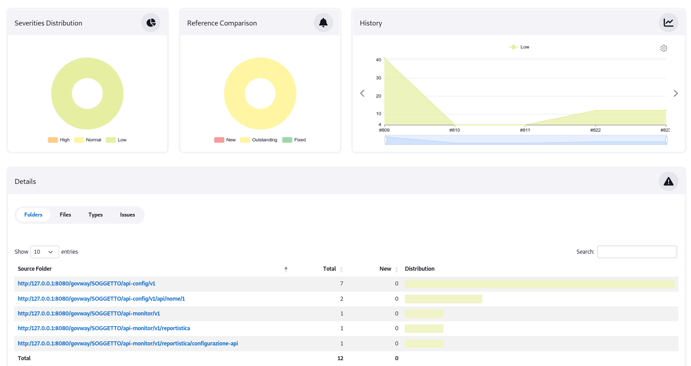
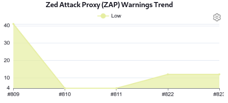
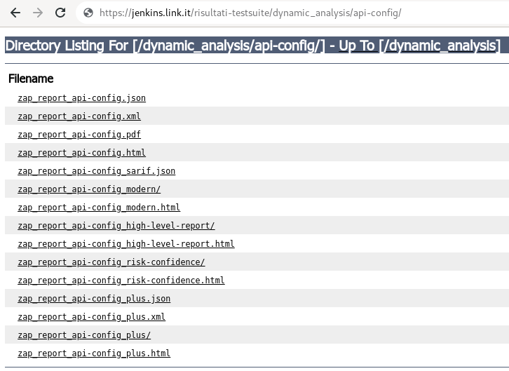
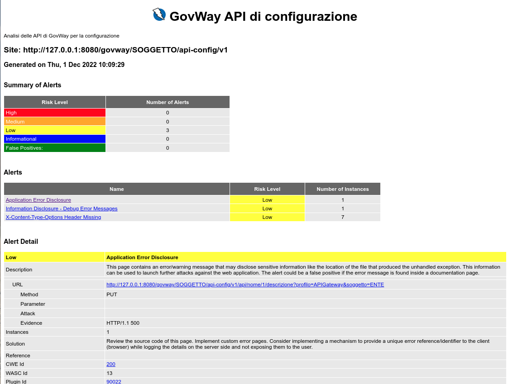

.. _releaseProcessGovWay_dynamicAnalysis_zap_ci:

OWASP ZAP Warnings Jenkins Plugin
~~~~~~~~~~~~~~~~~~~~~~~~~~~~~~~~~

Una analisi effettuata ogni volta che qualcosa viene modificato consente di rilevare immediatamente eventuali vulnerabilità introdotte.

Ad ogni commit sul `master dei sorgenti del progetto <https://github.com/link-it/govway/>`_ viene effettuata automaticamente una verifica dei sorgenti nell'ambiente di `Continuous Integration Jenkins di GovWay <https://jenkins.link.it/govway/job/GovWay/>`_. 

L'analisi produce un `report di dettaglio <https://jenkins.link.it/govway/job/GovWay/lastCompletedBuild/zap/>`_ sulle vulnerabilità trovate. Per ogni vulnerabilità identificata vengono forniti maggiori dettagli come la severità, il tipo e la url dove è stata riscontrata (es. :numref:`zap_vulnerability_details`). 

  OWASP ZAP: dettaglio di una vulnerabilità

Nella `homepage dell'ambiente CI Jenkins di GovWay <https://jenkins.link.it/govway/job/GovWay/>`_ è anche disponibile un report che visualizza il trend delle vulnerabilità rispetto ai commit effettuati nel tempo (es. :numref:`zap_vulnerability_trend`).

  OWASP ZAP Warnings Trend

Sono inoltre disponibili `report di dettaglio in vari formati <https://jenkins.link.it/govway-testsuite/dynamic_analysis/>`_ (:numref:`zap_maven_report_elenco_ci`). 

  OWASP ZAP: report in vari formati

La figura :numref:`zap_maven_report_ci` mostra un esempio di report nel formato HTML.

  OWASP ZAP: html report
