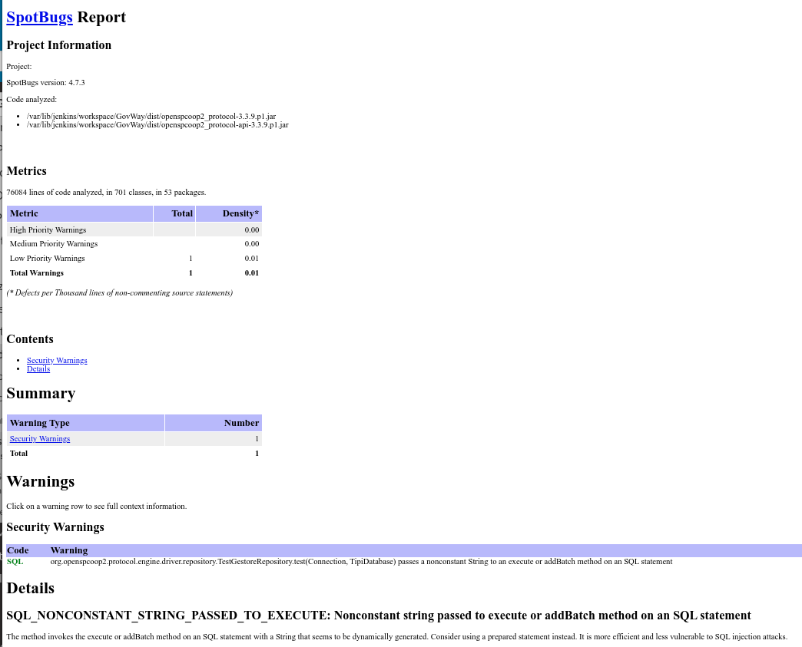

.. _releaseProcessGovWay_staticCodeAnalysis_ci:

SpotBugs Warnings Jenkins Plugin
~~~~~~~~~~~~~~~~~~~~~~~~~~~~~~~~~

Una ispezione dei sorgenti ogni volta che qualcosa viene modificato impedisce al codice di peggiorare lentamente senza che nessuno se ne accorga fino a quando non è troppo tardi. 

Per evitare il degrado ad ogni commit sul `master dei sorgenti del progetto <https://github.com/link-it/govway/>`_ viene effettuata automaticamente una verifica dei sorgenti nell'ambiente di `Continuous Integration Jenkins di GovWay <https://jenkins.link.it/govway/job/GovWay/>`_. 

L'analisi produce un `report di dettaglio <https://jenkins.link.it/govway/job/GovWay/lastCompletedBuild/spotbugs/>`_ sulle vulnerabilità trovate. Per ogni vulnerabilità identificata vengono forniti maggiori dettagli come la severità, la categoria (es. Security), il tipo (codice del pattern che identifica il bug), il package e la classe dove è stato rilevato (es. :numref:`spotbugs_vulnerability_details`). 

  SpotBugs: dettaglio di una vulnerabilità

Nella `homepage dell'ambiente CI Jenkins di GovWay <https://jenkins.link.it/govway/job/GovWay/>`_ è anche disponibile un report che visualizza il trend delle vulnerabilità rispetto ai commit effettuati nel tempo (es. :numref:`spotbugs_vulnerability_trend`).

  SpotBugs Warnings Trend

Sono inoltre disponibili `report di dettaglio in vari formati <https://jenkins.link.it/govway-testsuite/static_analysis/>`_ (:numref:`spotbugs_maven_report_elenco_ci`). 

  SpotBugs: report in vari formati

La figura :numref:`spotbugs_maven_report_ci` mostra un esempio di report nel formato HTML.

  SpotBugs: html report
