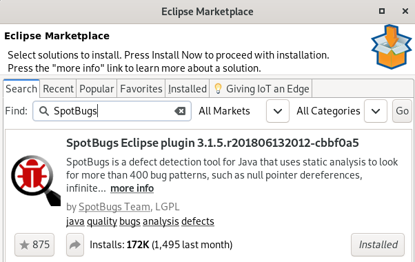
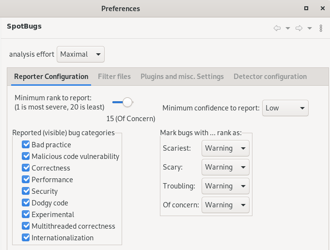
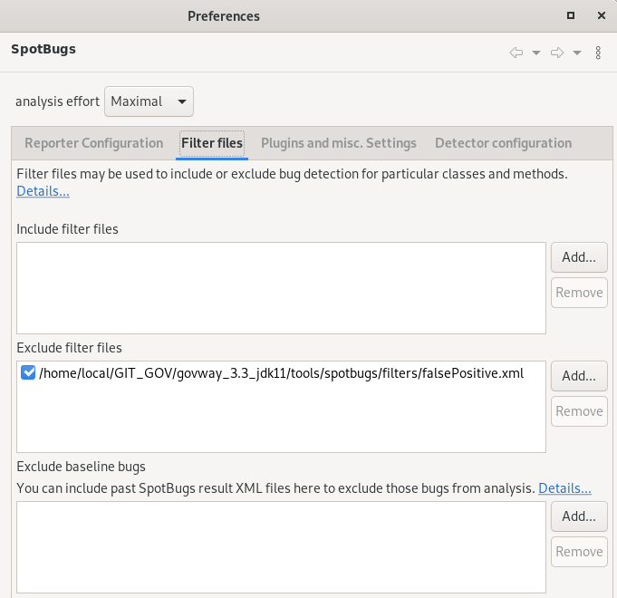
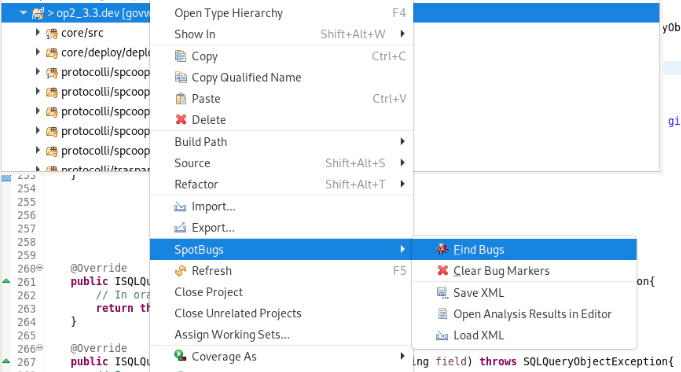
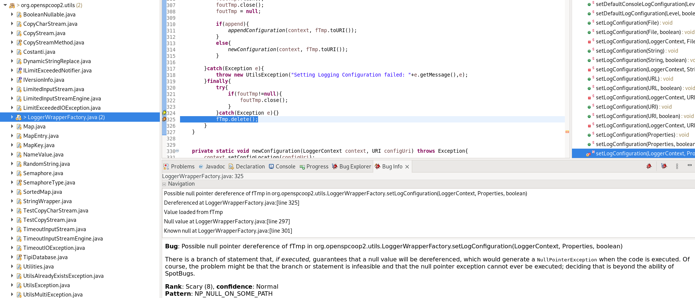

.. _releaseProcessGovWay_staticCodeAnalysis_eclipse:

SpotBugs Eclipse Plugin
~~~~~~~~~~~~~~~~~~~~~~~~

In questa sezione viene descritto come utilizzare il `plugin per Eclipse <https://spotbugs.readthedocs.io/en/latest/eclipse.html>`_ per la verifica del codice sorgente.

Come prerequisito il plugin deve essere stato installato tramite 'Eclipse Marketplace' come mostrato nella figura :numref:`SpotBugs_eclipse_markeplace`.

  SpotBugs Eclipse Plugin: marketplace

Impostare i seguenti criteri di analisi statica accedendo alla sezione "Window -> Preferences -> Java -> SpotBugs", come mostrato nella figura :numref:`SpotBugs_eclipse_config`:

- un livello 'Maximal' per il parametro 'Analysis Effort';

- un livello 'Low' per il parametro 'Minimum confidence to report';

- un 'rank' impostato al valore '15'.

  SpotBugs Eclipse Plugin: configurazione

Deve inoltre essere caricato il filtro che esclude alcuni `falsi positivi <https://github.com/link-it/govway/blob/master/tools/spotbugs/filters/falsePositive.xml>`_ come mostrato nella figura :numref:`SpotBugs_eclipse_config_falsePositive`.

  SpotBugs Eclipse Plugin: filtro

L'analisi statica dei sorgenti è adesso effettuabile selezionando il progetto 'op2_3.3.dev' con il tasto destro e cliccando sulla voce 'SpotBugs -> Find Bugs' come mostrato nella figura :numref:`SpotBugs_eclipse_find`.

  SpotBugs Eclipse Plugin: find bugs

Eventuali bug individuati vengono evidenziati sulla singola classe come ad esempio viene mostrato nella figura :numref:`SpotBugs_eclipse_bug`.

  SpotBugs Eclipse Plugin: esempio di bug
