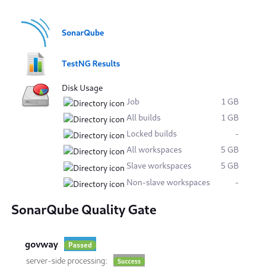

.. _releaseProcessGovWay_staticCodeAnalysis_sonarqube_ci:

SonarQube Jenkins Plugin
~~~~~~~~~~~~~~~~~~~~~~~~~~~~~~~~~

Ad ogni commit sul `master dei sorgenti del progetto <https://github.com/link-it/govway/>`_ viene effettuata automaticamente una verifica dei sorgenti nell'ambiente di `Continuous Integration Jenkins di GovWay <https://jenkins.link.it/govway/job/GovWay/>`_.

L'icona :numref:`sonarqube_ci_icon` certifica l'avvenuta integrazione con `SonarQube disponibile nell'ambiente jenkins <https://jenkins.link.it/govway-sonarqube/>`_.

  SonarQube: integrazione con jenkins

Per consultare il report relativo all'ultima scansione effettuata sui sorgenti del progetto è possibile collegarsi alla console di `SonarQube dedicato all'ambiente jenkins <https://jenkins.link.it/govway-sonarqube/>`_ con utenza e password 'govway'. Una volta effettuato il login sarà disponibile tra i progetti analizzati il progetto 'govway' (:numref:`sonarqube_ci_console`). Accedendo ai dettagli del progetto si potrà esaminare il report sulla qualità dei sorgenti relativi all'ultimo commit e globale del progetto (:numref:`sonarqube_ci_details`).

  SonarQube: console

  SonarQube: dettagli sulla qualità del software

