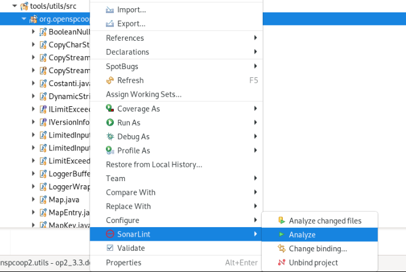

.. _releaseProcessGovWay_staticCodeAnalysis_sonarqube_eclipse:

SonarLint Eclipse Plugin
~~~~~~~~~~~~~~~~~~~~~~~~

In questa sezione viene descritto come utilizzare il `plugin per Eclipse <https://www.sonarsource.com/products/sonarlint/features/eclipse/>`_ per la verifica del codice sorgente.

Come prerequisito il plugin deve essere stato installato tramite 'Eclipse Marketplace' come mostrato nella figura :numref:`SonarQube_eclipse_markeplace`.

  SonarLint Eclipse Plugin: marketplace

Deve poi essere configurato il tool `nodejs <https://nodejs.org/>`_ versione 16 o 18 accedendo alla sezione "Window -> Preferences -> SonarLint", come mostrato nella figura :numref:`SonarQube_eclipse_config`:

  SonarLint Eclipse Plugin: configurazione nodejs

Il progetto di Eclipse contenente i sorgenti soggetti a controllo della qualità (:ref:`releaseProcessGovWay_staticCodeAnalysis_src_eclipse`) deve essere legato a SonarQube effettuando il bind come mostrato nella figure :numref:`SonarQube_eclipse_config_bind`, :numref:`SonarQube_eclipse_config_bind_type`, :numref:`SonarQube_eclipse_config_bind_url`, :numref:`SonarQube_eclipse_config_bind_auth`, :numref:`SonarQube_eclipse_config_bind_project`.

  SonarLint Eclipse Plugin: avvio fase di binding

  SonarLint Eclipse Plugin: binding verso SonarQube

  SonarLint Eclipse Plugin: binding url

  SonarLint Eclipse Plugin: binding authentication type

  SonarLint Eclipse Plugin: binding project 'govway'

L'analisi statica dei sorgenti è adesso effettuabile selezionando il progetto 'op2_3.x.dev' (:ref:`releaseProcessGovWay_staticCodeAnalysis_src_eclipse`) con il tasto destro e cliccando sulla voce 'SonarLint -> Analyze' come mostrato nella figura :numref:`SonarQube_eclipse_find`.

  SonarLint Eclipse Plugin: analyze

Eventuali bug individuati vengono evidenziati sulla singola classe come ad esempio viene mostrato nella figura :numref:`SonarQube_eclipse_bug`.

  SonarLint Eclipse Plugin: esempio di bug
