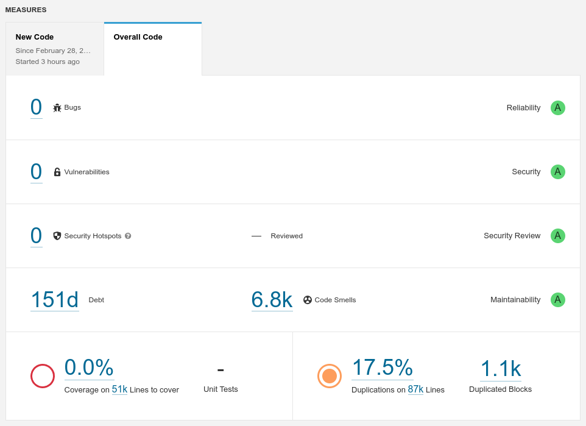

.. _releaseProcessGovWay_staticCodeAnalysis_sonarqube_maven:

SonarQube Maven Plugin
~~~~~~~~~~~~~~~~~~~~~~

Effettuato il checkout dei `dei sorgenti del progetto GovWay <https://github.com/link-it/govway/>`_, è possibile avviare manualmente l'analisi statica del codice utilizzando il seguente comando maven nella radice del progetto:

::

    mvn verify -Dsonarqube=verify -Dsonar.token=TOKEN -Dsonar.host.url=http://localhost:9000 -Dcompile=none -Dtestsuite=none -Dpackage=none -Dowasp=none

Al comando devono essere forniti i parametri per l'accesso all'ambiente SonarQube che si possiede:

	- sonar.host.url: indirizzo su cui è in ascolto SonarQube
	- sonar.token: token di autenticazione

Al termine dell'analisi viene pubblicato su SonarQube, all'interno dell progetto 'govway', un report consultabile all'indirizzo indicato nella proprietà 'sonar.host.url'.

L'analisi viene effettuata su tutti i sorgenti descritti nella sezione :ref:`releaseProcessGovWay_staticCodeAnalysis_src`. 

È possibile effettuare l'analisi di un solo modulo fornendone l'identificativo tramite la proprietà 'sonar.govway.project'. Gli identificativi dei moduli analizzati sono i seguenti: 

- utilità di base: utils-commons, utils-generic-project;

- runtime di GovWay: runtime-message, runtime-core, runtime-protocol, runtime-monitor, runtime-security, runtime-pdd;

- profili di interoperabiltà: protocol-as4, protocol-modipa, protocol-sdi, protocol-spcoop, protocol-trasparente;

- console web: web-lib-audit, web-lib-mvc, web-lib-queue, web-lib-users, web-loader, web-govwayConsole, web-govwayMonitor;

- api di configurazione e monitoraggio: rs-config, rs-monitor;

- batch: batch-statistiche, batch-runtime-repository;

- cli: cli-config-loader, cli-govway-vault.

L'esempio seguente attiva l'analisi dei sorgenti solamente per il profilo di interoperabilità 'ModI':

::

    mvn verify -Dsonarqube=verify 
               -Dtestsuite=none -Dpackage=none -Dowasp=none 
               -Dspotbugs.home=/tmp/spotbugs-4.7.3 
               -Dsonar.token=TOKEN -Dsonar.host.url=http://localhost:9000
               -Dsonar.govway.project=protocol-modipa

La figura :numref:`SonarQube_report` mostra un esempio di report.

  
  SonarQube report
