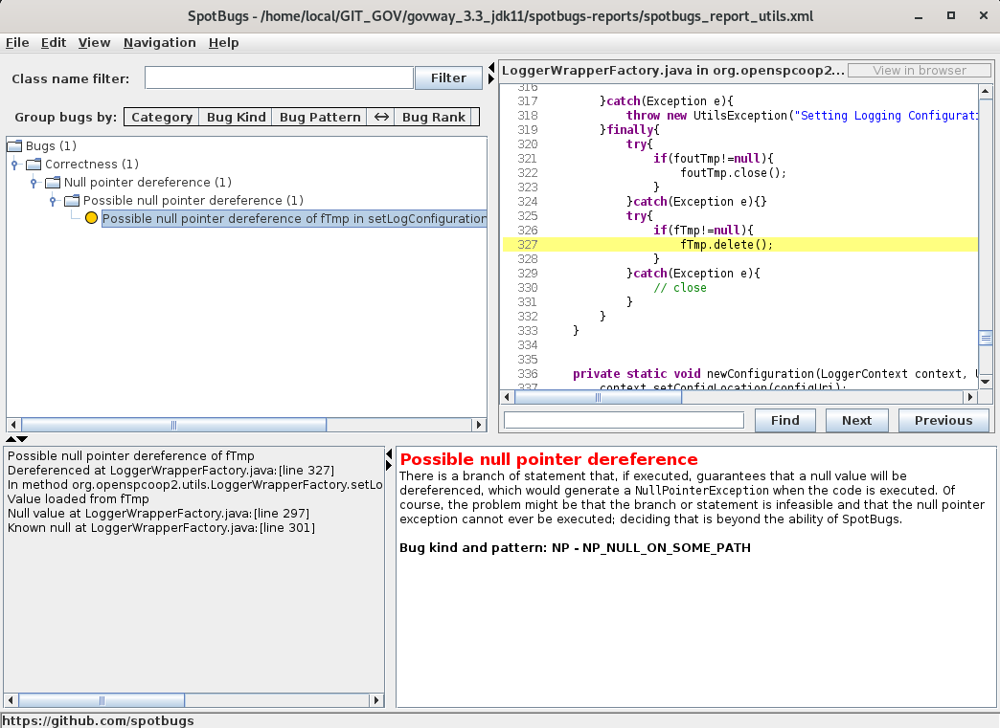

.. _releaseProcessGovWay_staticCodeAnalysis_spotbugs_maven:

SpotBugs Maven Plugin
~~~~~~~~~~~~~~~~~~~~~

Effettuato il checkout dei `dei sorgenti del progetto GovWay <https://github.com/link-it/govway/>`_, è possibile avviare manualmente l'analisi statica del codice utilizzando il seguente comando maven nella radice del progetto:

::

    mvn verify -Dspotbugs=verify -Dspotbugs.home=PATH_ASSOLUTO_TOOLS_SPOTBUGS -Dtestsuite=none -Dpackage=none -Dowasp=none

Come prerequisito all'esecuzione deve essere effettuato il download dell'ultima release del tool `SpotBugs <https://github.com/spotbugs/spotbugs/releases>`_.

Al termine dell'analisi viene prodotto un report nella directory 'spotbugs-reports' per ogni modulo analizzato.

L'analisi viene effettuata su tutti i sorgenti descritti nella sezione :ref:`releaseProcessGovWay_staticCodeAnalysis_src`. 

Gli identificativi dei moduli sono classificati come segue: 

- utilità di base: utils-commons, utils-generic-project;

- runtime di GovWay: runtime-message, runtime-core, runtime-protocol, runtime-monitor, runtime-security, runtime-pdd;

- profili di interoperabiltà: protocol-as4, protocol-modipa, protocol-sdi, protocol-spcoop, protocol-trasparente;

- console web: web-lib-audit, web-lib-mvc, web-lib-queue, web-lib-users, web-loader, web-govwayConsole, web-govwayMonitor;

- api di configurazione e monitoraggio: rs-config, rs-monitor;

- batch: batch-statistiche, batch-runtime-repository.

I reports prodotti nella directory 'spotbugs-reports' sono analizzabili tramite la `SpotBugs GUI <https://spotbugs.readthedocs.io/en/stable/gui.html>`_ avviabile tramite lo script presente in `tools/spotbugs/startSpotBugsAnalysisConsole.sh <https://github.com/link-it/govway/blob/master/tools/spotbugs/startSpotBugsAnalysisConsole.sh>`_. La figura :numref:`SpotBugs_gui` mostra un esempio di report analizzato con la console di SpotBugs.

  
  Report analizzato tramite la console di SpotBugs

Per produrre un report in un formato direttamente fruibile senza dove utilizzare la `SpotBugs GUI <https://spotbugs.readthedocs.io/en/stable/gui.html>`_ è possibile indicare il formato desiderato tramite il parametro 'spotbugs.outputType'. 

::

    mvn verify -Dspotbugs=verify -Dspotbugs.outputType=html -Dspotbugs.home=PATH_ASSOLUTO_TOOLS_SPOTBUGS -Dtestsuite=none -Dpackage=none -Dowasp=none

I formati supportati sono i seguenti:

- xml:withMessages: xml che contiene anche messaggi 'human-readable';
- html: pagina HTML con 'default.xsl' come stylesheet;
- text: formato testuale;
- emacs: formato 'Emacs error message';
- xdocs: formato xdoc XML da usare con Apache Maven.

Per evitare la verifica di alcuni moduli è possibile utilizzare la proprietà 'spotbugs.skipPackages'.   

L'esempio seguente attiva l'analisi dei sorgenti solamente per le utilità di base e i componenti di runtime di GovWay:

::

    mvn verify -Dspotbugs=verify 
               -Dtestsuite=none -Dpackage=none -Dowasp=none 
               -Dspotbugs.home=/tmp/spotbugs-4.7.3 
               -Dspotbugs.skipPackages=protocol-as4,protocol-modipa,protocol-sdi,protocol-spcoop,protocol-trasparente,web-lib-audit,web-lib-mvc,web-lib-queue,web-lib-users,web-loader,web-govwayConsole,web-govwayMonitor,rs-config,rs-monitor,batch-statistiche,batch-runtime-repository
