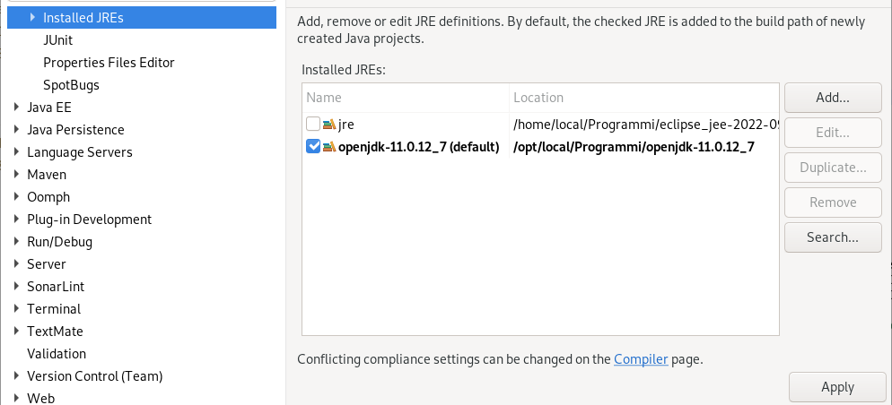
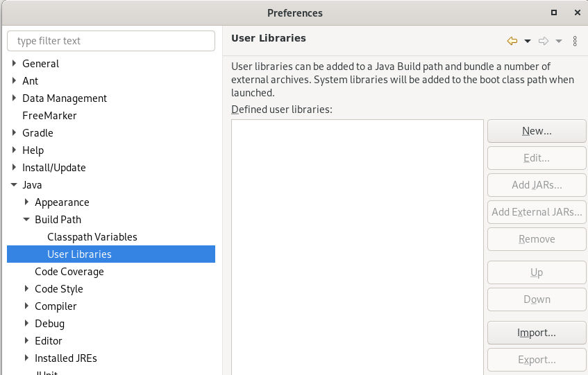
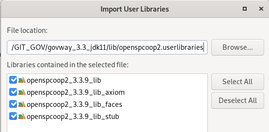
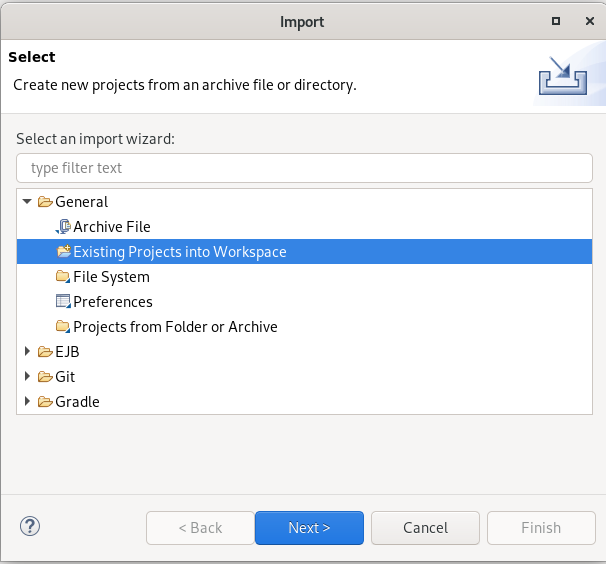
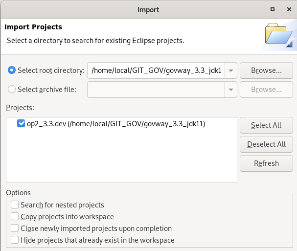
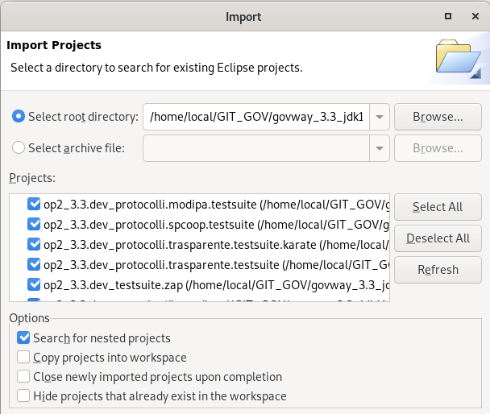
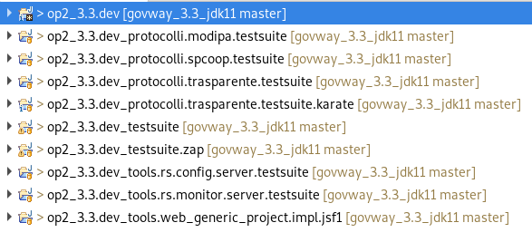

.. _releaseProcessGovWay_staticCodeAnalysis_src_eclipse:

Eclipse Project
~~~~~~~~~~~~~~~~

Nei `sorgenti del progetto GovWay <https://github.com/link-it/govway/>`_ sia i moduli utilizzati dagli archivi binari di GovWay che i componenti che realizzano i test dinamici sono sviluppati tramite progetti eclipse. Di seguito vengono fornite le indicazioni su come importarli:

- nella radice del progetto utilizzare la fase maven 'initialize' per salvare le librerie 3parti nella directory lib, tramite il comando 'mvn initialize';

- accedere alla sezione "Window -> Preferences -> Java -> Installed JREs" (:numref:`Eclipse_jre_1`) vericando che esista una jre v11 (aggiungerla se non esiste) e che sia selezionata come opzione di default (in alternativa si dovrà impostare l'utilizzo in ogni progetto importato nel seguito);

  Eclipse Project: jre libraries

- accedere alla sezione "Window -> Preferences -> Java -> Build Path -> User Libraries", come mostrato nella figura :numref:`Eclipse_lib_1`;

  Eclipse Project: import user libraries

- importare le librerie `lib/openspcoop2.userlibraries <https://github.com/link-it/govway/blob/master/lib/openspcoop2.userlibraries/>`_ e `lib/openspcoop2-testsuite.userlibraries <https://github.com/link-it/govway/blob/master/lib/openspcoop2-testsuite.userlibraries/>`_ (:numref:`Eclipse_lib_2`);

  Eclipse Project: import govway libraries

- importate le 2 librerie, accedere alla sezione "File -> Import -> General - Existing Projects into Workspace" come mostrato nella figura :numref:`Eclipse_config_1`;

  Eclipse Project: import existing project

- selezionando la directory contenente i `sorgenti del progetto GovWay <https://github.com/link-it/govway/>`_ verrà proposto il progetto eclipse 'op2_3.x.dev' (:numref:`Eclipse_config_2`);

  Eclipse Project: import project op2_3.x.dev

- durante l'import cliccando sulla voce 'Search for nested projects' verranno importati anche tutti gli altri progetti che realizzano i test dinamici descritti in :ref:`releaseProcessGovWay_dynamicAnalysis` (:numref:`Eclipse_config_3`);

  Eclipse Project: import all project

- una volta importati i progetti saranno disponibili come mostrato nella figura :numref:`Eclipse_config_4`.

  Eclipse Project: govway projects

