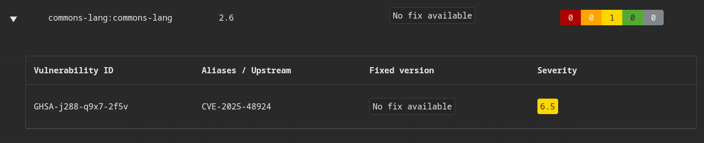
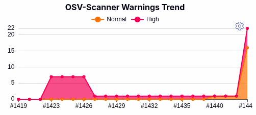
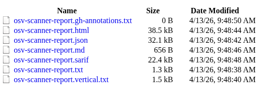
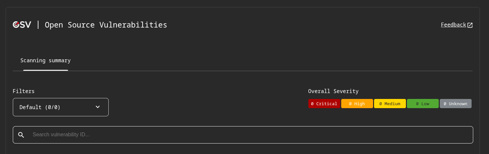

.. _releaseProcessGovWay_thirdPartyDynamicAnalysis_ci_osv:

OSV-Scanner
^^^^^^^^^^^^

L'analisi tramite OSV-Scanner produce un `report di dettaglio <https://jenkins.link.it/govway/job/GovWay/lastCompletedBuild/osv/>`_ sulle vulnerabilità trovate. Per ogni vulnerabilità identificata vengono forniti maggiori dettagli come la severità, il codice identificativo e la base dati dove di appartenenza (es. :numref:`osv_vulnerability_details`).

  OSV-Scanner: dettaglio di una vulnerabilità

Nella `homepage dell'ambiente CI Jenkins di GovWay <https://jenkins.link.it/govway/job/GovWay/>`_ è anche disponibile un report che visualizza il trend delle vulnerabilità rispetto ai commit effettuati nel tempo (es. :numref:`osv_vulnerability_trend`).

  OSV-Scanner Warnings Trend

Sono inoltre disponibili `report di dettaglio in vari formati <https://jenkins.link.it/govway-testsuite/osv_scanner/>`_ (:numref:`osv_maven_report_elenco_ci`).

  OSV-Scanner: report in vari formati

La figura :numref:`osv_maven_report_ci` mostra un esempio di report nel formato HTML.

  OSV Dependency-Check: html report
