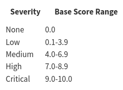

.. _releaseProcessGovWay_thirdPartyDynamicAnalysis_securityAdvisory:

Avvisi di Sicurezza
~~~~~~~~~~~~~~~~~~~~~~~~~~~~~~~

Le vulnerabilità identificate nel processo di verifica, descritto nella sezione :ref:`releaseProcessGovWay_thirdPartyDynamicAnalysis_ci`, sono classificate per severità rispetto al `CVSS 3.1 scoring system <https://nvd.nist.gov/vuln-metrics/cvss>`_ sintetizzato dalla tabella riportata nella figura :numref:`cvss30`.

  CVSS 3.1 scoring system

**Tempi di Risoluzione**

Le tempistiche di risoluzione delle vulnerabilità sono classificate rispetto alla loro severità e garantite per le versioni Enterprise del prodotto. Per la versione community i fix saranno applicati sulle prime versioni in rilascio. In caso di vulnerabilità molto impattanti saranno prodotte patch version immediate anche per le versioni community.

I tempi sono calcolati rispetto alla data di identificazione dell'impatto della vulnerabilità sul prodotto (true positive).

.. table:: Avvisi di Sicurezza: tempi di risoluzione
   :widths: 35 65
   :class: longtable
   :name: tempiRisoluzioneAvvisiSicurezza

   ============================    ==============    ==========================================
   Severità (CSSS Score)           Tempistica        Fix Version
   ============================    ==============    ==========================================
   Critical  (9.0-10.0)            10 giorni         Patch version
   High      (7.0-8.9)             20 giorni         Patch version
   Medium    (4.0 - 6.9)           45 giorni         Patch o Minor version
   Low       (3.9 or below)        n.d.              A discrezione del progetto
   ============================    ==============    ==========================================

**Elenco degli Avvisi**

Gli avvisi vengono classificati per anno di registrazione:

- :ref:`releaseProcessGovWay_thirdPartyDynamicAnalysis_securityAdvisory_2022`
- :ref:`releaseProcessGovWay_thirdPartyDynamicAnalysis_securityAdvisory_2021`

.. toctree::
        :maxdepth: 2
        
	2022/index
	2021/index

